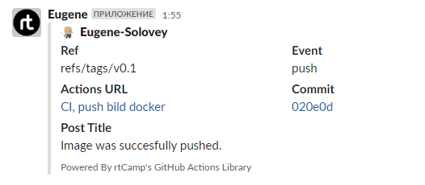

# 08.Docker.Register

## Links

[>> Docker Hub Registry <<](https://hub.docker.com/repository/docker/erixonn/docker_build/general)

[>> GitHub Container Registry <<](https://github.com/Eugene-Solovey/docker_build)

## GitHub Action File

```yaml
name: CI, push bild docker

on:
  push:
    tags: 
      - "v*.*"
jobs:
  docker:
    env:
      USER_NAME: ${{ github.actor }}
    runs-on: ubuntu-latest
    steps:
    
      - name: Checkout out the repo
        uses: actions/checkout@v3
        
      - name: Login in GitHub Registry
        uses: docker/login-action@v2
        with:
          registry: ghcr.io
          username: ${{ env.USER_NAME }}
          password: ${{ secrets.DOCKER_BUILD_LOCAL }}
      
      - name: Login in Docker-Hub
        uses: docker/login-action@v2
        with:
          username: ${{ secrets.DOCKERHUB_USERNAME }}
          password: ${{ secrets.DOCKERHUB_TOKEN }}
      - name: Build and push docker image
        uses: docker/build-push-action@v3
        with:
          context: .
          push: true
          tags: |
            erixonn/docker_build:${{ github.sha }}
            erixonn/docker_build:${{ github.run_number }}
      - name: Notification in Slack
        uses: rtCamp/action-slack-notify@v2
        if: success()
        env:
          SLACK_CHANNEL: local_notifications
          SLACK_COLOR: 'green'
          SLACK_ICON: https://github.com/rtCamp.png?size=48
          SLACK_MESSAGE: 'Image was succesfully pushed.'
          SLACK_TITLE: Post Title
          SLACK_USERNAME: Eugene
          SLACK_WEBHOOK: ${{ secrets.SLACK_WEBHOOK }}
          
      - name: Notification in Slack [rejection]
        uses: rtCamp/action-slack-notify@v2
        if: failure()
        env:
          SLACK_CHANNEL: local_notifications
          SLACK_COLOR: 'red'
          SLACK_ICON: https://github.com/rtCamp.png?size=48
          SLACK_MESSAGE: 'Image was succesfully pushed.'
          SLACK_TITLE: Post Title
          SLACK_USERNAME: Eugene
          SLACK_WEBHOOK: ${{ secrets.SLACK_WEBHOOK }}
```

## Slack Notification Img


