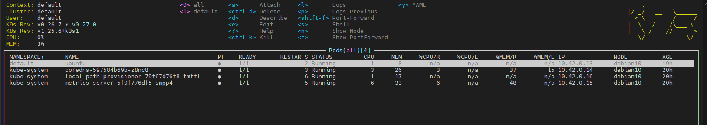
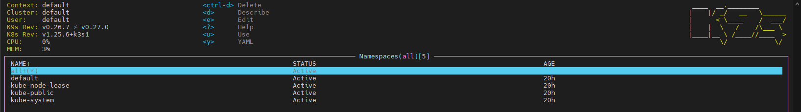
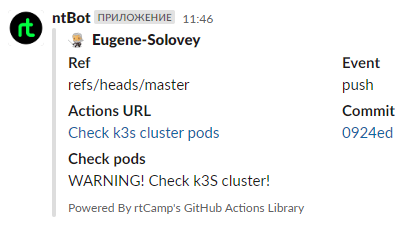

# 09. Kubernetes

## Links

[>> GitHub action workflow <<](https://github.com/Eugene-Solovey/k3s.local/actions/runs/4052280018/jobs/6971520029)

[>> GitHub action file <<](https://github.com/Eugene-Solovey/k3s.local/blob/master/.github/workflows/check-pods.yml)

## Testing and screenshots

### All pods - working

### All namespace

### Slack notification

