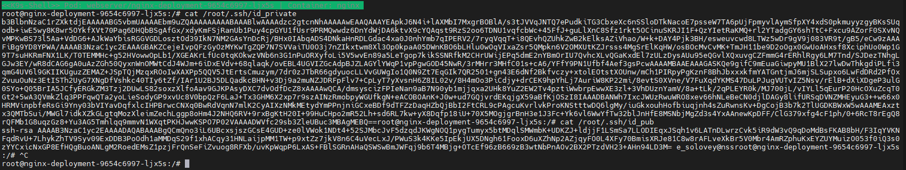

# 12.Kubernetes.Data.Security

## Links

[>> K3s manifest file <<](https://github.com/Eugene-Solovey/sa.it-academy.by/blob/md-sa2-22-22/Eugene_Solovey/12.Kubernetes.Data.Security/app.yml)


## Report

### Curl http

```bash
curl http://nginx-test.k8s-16.sa
<html><head>HOSTNAME INFO</head><body><h1>webserver-7566ffb84d-j5jlq</h1></body></html>
```

### Security


