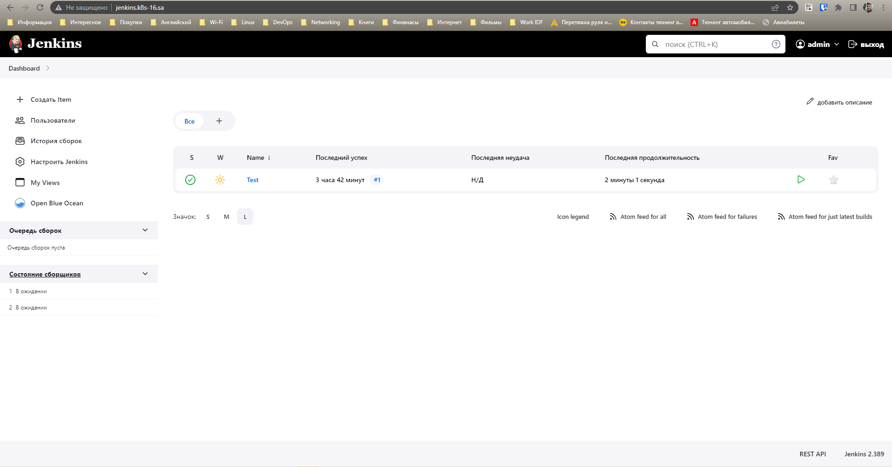

# 14.Kubernetes-application-deployment

## Create helm package for your Jenkins application

[>> Helm manifest file <<](https://github.com/Eugene-Solovey/sa.it-academy.by/blob/md-sa2-22-22/Eugene_Solovey/14.Kubernetes-application-deployment/helm-source/jenkins-app/templates/deployment.yaml)

[>> Helm values file <<](https://github.com/Eugene-Solovey/sa.it-academy.by/blob/md-sa2-22-22/Eugene_Solovey/14.Kubernetes-application-deployment/helm-source/jenkins-app/values.yaml)

## Printscreen of work Jenkins app

