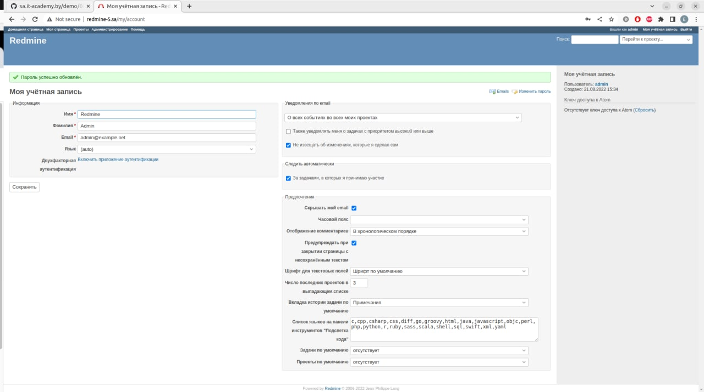

# Ansible work



```bash
evgeni@legion:~/IdeaProjects/sa.it-academy.by/Evgeni_Ermakov/08.Ansible.WS$ ansible-playbook -i inventory.yaml task.yaml
 ________________
< PLAY [redmine] >
 ----------------
        \   ^__^
         \  (oo)\_______
            (__)\       )\/\
                ||----w |
                ||     ||

 ________________________
< TASK [Gathering Facts] >
 ------------------------
        \   ^__^
         \  (oo)\_______
            (__)\       )\/\
                ||----w |
                ||     ||

Sunday 21 August 2022  20:25:49 +0300 (0:00:00.040)       0:00:00.040 ********* 
ok: [redmine_5]
 ______________
< TASK [debug] >
 --------------
        \   ^__^
         \  (oo)\_______
            (__)\       )\/\
                ||----w |
                ||     ||

Sunday 21 August 2022  20:25:51 +0300 (0:00:01.612)       0:00:01.653 ********* 
ok: [redmine_5] => {
    "msg": "192.168.201.5"
}
 _________________________________________
< TASK [mysql : MY_SQL. Install packages] >
 -----------------------------------------
        \   ^__^
         \  (oo)\_______
            (__)\       )\/\
                ||----w |
                ||     ||

Sunday 21 August 2022  20:25:51 +0300 (0:00:00.042)       0:00:01.695 ********* 
ok: [redmine_5]
 _________________________
< TASK [mysql : mysql_db] >
 -------------------------
        \   ^__^
         \  (oo)\_______
            (__)\       )\/\
                ||----w |
                ||     ||

Sunday 21 August 2022  20:25:53 +0300 (0:00:02.400)       0:00:04.096 ********* 
ok: [redmine_5]
 ___________________________
< TASK [mysql : mysql_user] >
 ---------------------------
        \   ^__^
         \  (oo)\_______
            (__)\       )\/\
                ||----w |
                ||     ||

Sunday 21 August 2022  20:25:54 +0300 (0:00:00.672)       0:00:04.769 ********* 
ok: [redmine_5]
 ____________________________________________
< TASK [redmine : Redmine. Install packages] >
 --------------------------------------------
        \   ^__^
         \  (oo)\_______
            (__)\       )\/\
                ||----w |
                ||     ||

Sunday 21 August 2022  20:25:55 +0300 (0:00:00.656)       0:00:05.426 ********* 
ok: [redmine_5]
 ____________________________________________
< TASK [redmine : Redmine. Clone repository] >
 --------------------------------------------
        \   ^__^
         \  (oo)\_______
            (__)\       )\/\
                ||----w |
                ||     ||

Sunday 21 August 2022  20:25:57 +0300 (0:00:02.211)       0:00:07.637 ********* 
ok: [redmine_5]
 ______________________________________________
< TASK [redmine : Redmine. Change permissions] >
 ----------------------------------------------
        \   ^__^
         \  (oo)\_______
            (__)\       )\/\
                ||----w |
                ||     ||

Sunday 21 August 2022  20:25:57 +0300 (0:00:00.580)       0:00:08.218 ********* 
ok: [redmine_5]
 ______________________________________________
< TASK [redmine : Redmine. Change permissions] >
 ----------------------------------------------
        \   ^__^
         \  (oo)\_______
            (__)\       )\/\
                ||----w |
                ||     ||

Sunday 21 August 2022  20:25:58 +0300 (0:00:00.630)       0:00:08.848 ********* 
ok: [redmine_5]
 __________________________________
< TASK [redmine : Config database] >
 ----------------------------------
        \   ^__^
         \  (oo)\_______
            (__)\       )\/\
                ||----w |
                ||     ||

Sunday 21 August 2022  20:25:59 +0300 (0:00:00.524)       0:00:09.372 ********* 
ok: [redmine_5]
 ____________________________________
< TASK [redmine : Redmine. Setup 01] >
 ------------------------------------
        \   ^__^
         \  (oo)\_______
            (__)\       )\/\
                ||----w |
                ||     ||

Sunday 21 August 2022  20:26:00 +0300 (0:00:00.936)       0:00:10.308 ********* 
changed: [redmine_5]
 __________________________________________________
< TASK [redmine : Session store secret generation] >
 --------------------------------------------------
        \   ^__^
         \  (oo)\_______
            (__)\       )\/\
                ||----w |
                ||     ||

Sunday 21 August 2022  20:26:04 +0300 (0:00:04.537)       0:00:14.846 ********* 
ok: [redmine_5]
 ____________________________________
< TASK [redmine : Redmine. Setup 02] >
 ------------------------------------
        \   ^__^
         \  (oo)\_______
            (__)\       )\/\
                ||----w |
                ||     ||

Sunday 21 August 2022  20:26:05 +0300 (0:00:00.513)       0:00:15.360 ********* 
changed: [redmine_5]
 ______________________________________________________
< TASK [redmine : Configuration files for virtualhost] >
 ------------------------------------------------------
        \   ^__^
         \  (oo)\_______
            (__)\       )\/\
                ||----w |
                ||     ||

Sunday 21 August 2022  20:26:16 +0300 (0:00:11.777)       0:00:27.138 ********* 
ok: [redmine_5]
 _______________________
< TASK [redmine : meta] >
 -----------------------
        \   ^__^
         \  (oo)\_______
            (__)\       )\/\
                ||----w |
                ||     ||

Sunday 21 August 2022  20:26:17 +0300 (0:00:00.891)       0:00:28.030 ********* 
 _________________________________
< TASK [add redmine to host file] >
 ---------------------------------
        \   ^__^
         \  (oo)\_______
            (__)\       )\/\
                ||----w |
                ||     ||

Sunday 21 August 2022  20:26:17 +0300 (0:00:00.032)       0:00:28.063 ********* 
changed: [redmine_5]
 ____________
< TASK [uri] >
 ------------
        \   ^__^
         \  (oo)\_______
            (__)\       )\/\
                ||----w |
                ||     ||

Sunday 21 August 2022  20:26:18 +0300 (0:00:00.518)       0:00:28.581 ********* 
ok: [redmine_5]
 ___________________
< TASK [lineinfile] >
 -------------------
        \   ^__^
         \  (oo)\_______
            (__)\       )\/\
                ||----w |
                ||     ||

Sunday 21 August 2022  20:26:18 +0300 (0:00:00.683)       0:00:29.265 ********* 
changed: [redmine_5]
 ____________
< PLAY RECAP >
 ------------
        \   ^__^
         \  (oo)\_______
            (__)\       )\/\
                ||----w |
                ||     ||

redmine_5                  : ok=17   changed=4    unreachable=0    failed=0    skipped=0    rescued=0    ignored=0   

Sunday 21 August 2022  20:26:19 +0300 (0:00:00.615)       0:00:29.881 ********* 
=============================================================================== 
redmine : Redmine. Setup 02 ---------------------------------------------------------------------------------------------------------------------------------------------------------------------------------------------------- 11.78s
redmine : Redmine. Setup 01 ----------------------------------------------------------------------------------------------------------------------------------------------------------------------------------------------------- 4.54s
mysql : MY_SQL. Install packages ------------------------------------------------------------------------------------------------------------------------------------------------------------------------------------------------ 2.40s
redmine : Redmine. Install packages --------------------------------------------------------------------------------------------------------------------------------------------------------------------------------------------- 2.21s
Gathering Facts ----------------------------------------------------------------------------------------------------------------------------------------------------------------------------------------------------------------- 1.61s
redmine : Config database ------------------------------------------------------------------------------------------------------------------------------------------------------------------------------------------------------- 0.94s
redmine : Configuration files for virtualhost ----------------------------------------------------------------------------------------------------------------------------------------------------------------------------------- 0.89s
uri ----------------------------------------------------------------------------------------------------------------------------------------------------------------------------------------------------------------------------- 0.68s
mysql : mysql_db ---------------------------------------------------------------------------------------------------------------------------------------------------------------------------------------------------------------- 0.67s
mysql : mysql_user -------------------------------------------------------------------------------------------------------------------------------------------------------------------------------------------------------------- 0.66s
redmine : Redmine. Change permissions ------------------------------------------------------------------------------------------------------------------------------------------------------------------------------------------- 0.63s
lineinfile ---------------------------------------------------------------------------------------------------------------------------------------------------------------------------------------------------------------------- 0.62s
redmine : Redmine. Clone repository --------------------------------------------------------------------------------------------------------------------------------------------------------------------------------------------- 0.58s
redmine : Redmine. Change permissions ------------------------------------------------------------------------------------------------------------------------------------------------------------------------------------------- 0.52s
add redmine to host file -------------------------------------------------------------------------------------------------------------------------------------------------------------------------------------------------------- 0.52s
redmine : Session store secret generation --------------------------------------------------------------------------------------------------------------------------------------------------------------------------------------- 0.51s
debug --------------------------------------------------------------------------------------------------------------------------------------------------------------------------------------------------------------------------- 0.04s
redmine : meta ------------------------------------------------------------------------------------------------------------------------------------------------------------------------------------------------------------------ 0.03s
Playbook run took 0 days, 0 hours, 0 minutes, 29 seconds
```
