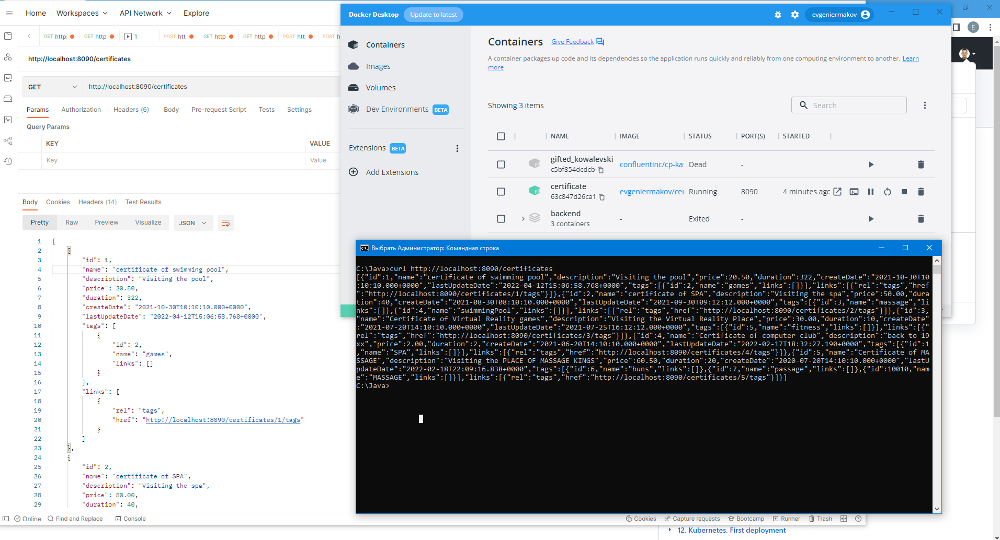

# 09. Docker

---
[DockerHub Image](https://hub.docker.com/repository/docker/evgeniermakov/certificate/tags?page=1&ordering=last_updated)
-
[GitHub Dockerfile](https://github.com/EvgeniErmakov/REST-API-certificate-advanced/blob/docker/Dockerfile)
-
[GitHub Action logs](https://github.com/EvgeniErmakov/REST-API-certificate-advanced/runs/7843426108?check_suite_focus=true)
-
[GitHub Workflow file](https://github.com/EvgeniErmakov/REST-API-certificate-advanced/actions/runs/2862533715/workflow)
-
---

## Pull and Run

``` bash
PS C:\Users\evgen\IdeaProjects\REST-API-certificate-advanced> docker pull evgeniermakov/certificate:ermakov    
ermakov: Pulling from evgeniermakov/certificate
001c52e26ad5: Pull complete
d9d4b9b6e964: Pull complete
2068746827ec: Pull complete
8510da692cda: Pull complete
b6d84395b34d: Pull complete
bf03fea6c3ad: Pull complete
c60e80676948: Pull complete
7d702fc866a0: Pull complete
588bcdc61c4c: Pull complete
Digest: sha256:95742e3a2279574e2dbccaa04e419add9d5efe0b7bf5e6595af5f10143d708ef
Status: Downloaded newer image for evgeniermakov/certificate:ermakov           
docker.io/evgeniermakov/certificate:ermakov 

PS C:\Users\evgen\IdeaProjects\REST-API-certificate-advanced> docker container run -p 127.0.0.1:8090:8090 -d --name certificate evgeniermakov/certificate:ermakov 
63c847d26ca1d4bd15790962270888014e549e86d2d66cfc79a4420def16de93

C:\Java>curl http://localhost:8090/certificates
[{"id":1,"name":"certificate of swimming pool","description":"Visiting the pool",
"price":20.50,"duration":322,"createDate":"2021-10-30T10:10:10.000+0000","lastUpdateDate":"2022-04-12T15:06:58.768+0000",
"tags":[{"id":2,"name":"games","links":[]}],"links":[{"rel":"tags","href":"http://localhost:8090/certificates/1/tags"}]},
{"id":2,"name":"certificate of SPA","description":"Visiting the spa","price":50.00,"duration":40,"createDate":"2021-08-30T08:10:10.000+0000",
"lastUpdateDate":"2021-09-30T09:12:12.000+0000","tags":[{"id":3,"name":"massage","links":[]},{"id":4,"name":"swimmingPool",
"links":[]}],"links":[{"rel":"tags","href":"http://localhost:8090/certificates/2/tags"}]},
{"id":3,"name":"Certificate of Virtual Reality games","description":"Visiting the Virtual Reality Place","price":30.00,"duration":10,
"createDate":"2021-07-20T14:10:10.000+0000","lastUpdateDate":"2021-07-25T16:12:12.000+0000",
"tags":[{"id":5,"name":"fitness","links":[]}],"links":[{"rel":"tags","href":"http://localhost:8090/certificates/3/tags"}]},
{"id":4,"name":"Certificate of computer club","description":"back to 19xx","price":2.00,"duration":2,"createDate":"2021-06-20T14:10:10.000+0000",
"lastUpdateDate":"2022-02-17T18:32:27.190+0000","tags":[{"id":1,"name":"SPA","links":[]}],"links":[{"rel":"tags","href":"http://localhost:8090/certificates/4/tags"}]},{"id":5,"name":"Certificate of MASSAGE",
"description":"Visiting the PLACE OF MASSAGE KINGS","price":60.50,"duration":20,"createDate":"2020-07-20T14:10:10.000+0000","lastUpdateDate":"2022-02-18T22:09:16.838+0000","tags":[{"id":6,"name":"buns","links":[]},
{"id":7,"name":"passage","links":[]},{"id":10010,"name":"MASSAGE","links":[]}],"links":[{"rel":"tags","href":"http://localhost:8090/certificates/5/tags"}]}]
```

---

## Requests

