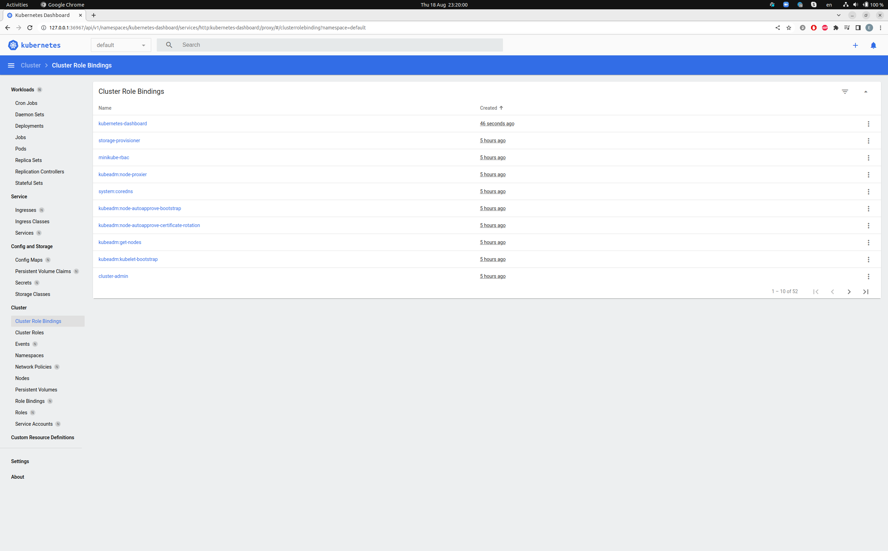

# 10. Kubernetes

## Dashboard from the workstation

``` bash
evgeni@legion:~/devops/k8s/kubectl$ minikube dashboard
```



## Commands

```
 1612  sudo apt-get update
 1613  curl -Lo minikube https://storage.googleapis.com/minikube/releases/latest/minikube-linux-amd64 \
  && chmod +x minikube
 1614  sudo mkdir -p /usr/local/bin/
 1615  sudo install minikube /usr/local/bin/
 1616  minikube start
 1617  minikube dashboard
```

## Enable plugin: ingress

``` bash 
evgeni@legion:~/devOps/k8s/kubectl$ minikube addons enable ingress
evgeni@legion:~/devOps/k8s/kubectl$ kubectl get pods -n ingress-nginx
NAME                                        READY   STATUS      RESTARTS   AGE
ingress-nginx-admission-create-crtrr        0/1     Completed   0          9m12s
ingress-nginx-admission-patch-lkz75         0/1     Completed   0          9m12s
ingress-nginx-controller-755dfbfc65-m5shn   1/1     Running     0          9m12s
evgeni@legion:~/devOps/k8s/kubectl$ minikube addons list
|-----------------------------|----------|--------------|--------------------------------|
|         ADDON NAME          | PROFILE  |    STATUS    |           MAINTAINER           |
|-----------------------------|----------|--------------|--------------------------------|
| ambassador                  | minikube | disabled     | 3rd party (Ambassador)         |
| auto-pause                  | minikube | disabled     | Google                         |
| csi-hostpath-driver         | minikube | disabled     | Kubernetes                     |
| dashboard                   | minikube | enabled ✅   | Kubernetes                     |
| default-storageclass        | minikube | enabled ✅   | Kubernetes                     |
| efk                         | minikube | disabled     | 3rd party (Elastic)            |
| freshpod                    | minikube | disabled     | Google                         |
| gcp-auth                    | minikube | disabled     | Google                         |
| gvisor                      | minikube | disabled     | Google                         |
| headlamp                    | minikube | disabled     | 3rd party (kinvolk.io)         |
| helm-tiller                 | minikube | disabled     | 3rd party (Helm)               |
| inaccel                     | minikube | disabled     | 3rd party (InAccel             |
|                             |          |              | [info@inaccel.com])            |
| ingress                     | minikube | enabled ✅   | Kubernetes                     |
| ingress-dns                 | minikube | enabled ✅   | Google                         |
| istio                       | minikube | disabled     | 3rd party (Istio)              |
| istio-provisioner           | minikube | disabled     | 3rd party (Istio)              |
| kong                        | minikube | disabled     | 3rd party (Kong HQ)            |
| kubevirt                    | minikube | disabled     | 3rd party (KubeVirt)           |
| logviewer                   | minikube | disabled     | 3rd party (unknown)            |
| metallb                     | minikube | disabled     | 3rd party (MetalLB)            |
| metrics-server              | minikube | disabled     | Kubernetes                     |
| nvidia-driver-installer     | minikube | disabled     | Google                         |
| nvidia-gpu-device-plugin    | minikube | disabled     | 3rd party (Nvidia)             |
| olm                         | minikube | disabled     | 3rd party (Operator Framework) |
| pod-security-policy         | minikube | disabled     | 3rd party (unknown)            |
| portainer                   | minikube | disabled     | 3rd party (Portainer.io)       |
| registry                    | minikube | disabled     | Google                         |
| registry-aliases            | minikube | disabled     | 3rd party (unknown)            |
| registry-creds              | minikube | disabled     | 3rd party (UPMC Enterprises)   |
| storage-provisioner         | minikube | enabled ✅   | Google                         |
| storage-provisioner-gluster | minikube | disabled     | 3rd party (Gluster)            |
| volumesnapshots             | minikube | disabled     | Kubernetes                     |
|-----------------------------|----------|--------------|--------------------------------|
```

## Run minikube with different HW options (RAM and CPU's)

``` bash 
evgeni@legion:~/devops/k8s/kubectl$ minikube start  --memory 3072 --cpus 2
😄  minikube v1.26.1 on Ubuntu 22.04
✨  Automatically selected the docker driver. Other choices: virtualbox, ssh, none, qemu2 (experimental)
📌  Using Docker driver with root privileges
👍  Starting control plane node minikube in cluster minikube
🚜  Pulling base image ...
🔥  Creating docker container (CPUs=2, Memory=3072MB) ...

🧯  Docker is nearly out of disk space, which may cause deployments to fail! (96% of capacity). You can pass '--force' to skip this check.
💡  Suggestion: 

    Try one or more of the following to free up space on the device:
    
    1. Run "docker system prune" to remove unused Docker data (optionally with "-a")
    2. Increase the storage allocated to Docker for Desktop by clicking on:
    Docker icon > Preferences > Resources > Disk Image Size
    3. Run "minikube ssh -- docker system prune" if using the Docker container runtime
🍿  Related issue: https://github.com/kubernetes/minikube/issues/9024

🐳  Preparing Kubernetes v1.24.3 on Docker 20.10.17 ...
    ▪ Generating certificates and keys ...
    ▪ Booting up control plane ...
    ▪ Configuring RBAC rules ...
🔎  Verifying Kubernetes components...
    ▪ Using image gcr.io/k8s-minikube/storage-provisioner:v5
🌟  Enabled addons: default-storageclass, storage-provisioner
🏄  Done! kubectl is now configured to use "minikube" cluster and "default" namespace by default
```

## Ansible play

``` bash
evgeni@legion:~/devops/k8s/kubectl$ ansible-playbook -i inventory/plu/hosts.yaml -b cluster.yml --ask-pass

PLAY RECAP *********************************************************************************************************************************
localhost                  : ok=3    changed=0    unreachable=0    failed=0    skipped=0    rescued=0    ignored=0   
node1                      : ok=772  changed=145  unreachable=0    failed=0    skipped=1256 rescued=0    ignored=9   
node2                      : ok=501  changed=92   unreachable=0    failed=0    skipped=734  rescued=0    ignored=2   

Thursday 18 August 2022  21:53:07 +0300 (0:00:00.048)       0:32:41.972 ******* 
=============================================================================== 
download : download_file | Validate mirrors ---------------------------------------------------------------------------------------- 69.23s
kubernetes/preinstall : Install packages requirements ------------------------------------------------------------------------------ 67.96s
kubernetes-apps/ansible : Kubernetes Apps | Lay Down CoreDNS templates ------------------------------------------------------------- 42.18s
download : download_container | Download image if required ------------------------------------------------------------------------- 31.89s
kubernetes-apps/ansible : Kubernetes Apps | Start Resources ------------------------------------------------------------------------ 31.83s
kubernetes/kubeadm : Join to cluster ----------------------------------------------------------------------------------------------- 28.54s
download : download_container | Download image if required ------------------------------------------------------------------------- 28.37s
kubernetes/control-plane : kubeadm | Initialize first master ----------------------------------------------------------------------- 26.93s
network_plugin/calico : Calico | Create calico manifests --------------------------------------------------------------------------- 25.74s
download : download_file | Download item ------------------------------------------------------------------------------------------- 24.50s
download : download_container | Download image if required ------------------------------------------------------------------------- 23.97s
bootstrap-os : Assign inventory name to unconfigured hostnames (non-CoreOS, non-Flatcar, Suse and ClearLinux, non-Fedora) ---------- 22.86s
container-engine/containerd : download_file | Download item ------------------------------------------------------------------------ 21.45s
download : download_file | Download item ------------------------------------------------------------------------------------------- 20.96s
download : download_container | Download image if required ------------------------------------------------------------------------- 20.53s
download : download_container | Download image if required ------------------------------------------------------------------------- 19.53s
download : download_container | Download image if required ------------------------------------------------------------------------- 19.20s
download : download_container | Download image if required ------------------------------------------------------------------------- 18.94s
download : download_container | Download image if required ------------------------------------------------------------------------- 18.90s
download : download_container | Download image if required ------------------------------------------------------------------------- 18.60s
```
