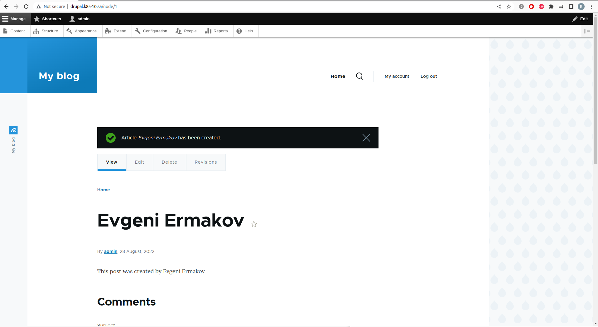
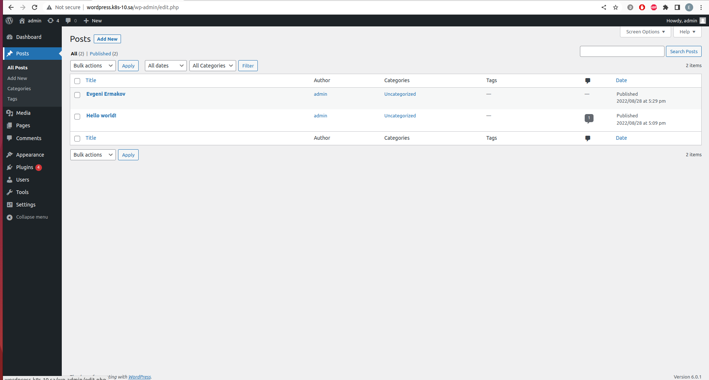

# 13.Kubernetes.Helm

Files in the attachment:
*  [wp_ingress.yaml](wp_ingress.yaml)
*  [dr_ingress.yaml](dr_ingress.yaml)
*  [database_example.yaml](mysql.yaml)

## Commands
``` bash
 helm repo add bitnami https://charts.bitnami.com/bitnami
 helm repo add nfs-subdir-external-provisioner https://kubernetes-sigs.github.io/nfs-subdir-external-provisioner/
 helm install nfs-subdir-external-provisioner nfs-subdir-external-provisioner/nfs-subdir-external-provisioner \
    --set nfs.server=192.168.37.105 \
    --set nfs.path=/mnt/IT-Academy/nfs-data/sa2-21-22/ermakov_evgeni/
    
 vim wp_ingress.yaml
 kubectl apply -f wp_ingress.yaml
 helm install ss-wordpress-ermakov  --set mariadb.enabled=false,externalDatabase.host=192.168.202.10,externalDatabase.password=wordpress,global.storageClass=nfs-client,wordpressUsername=admin,wordpressPassword=admin bitnami/wordpress
 
 vim dp_ingress.yaml
 kubectl apply -f dp_ingress.yaml
 helm install ss-drupal-ermakov --set mariadb.enabled=false,externalDatabase.host=192.168.202.10,externalDatabase.password=drupal,global.storageClass=nfs-client,drupalUsername=admin,drupalPassword=admin bitnami/drupal
```

## Wordpress



## Drupal
