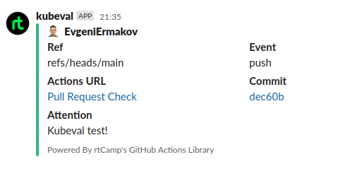

# Testing

## Kubeval

### GitHub Action

*  [kubeval.yaml](.github/workflows/kubeval.yaml)

### Screenshot



## Molecule test

``` bash
evgeni@legion:~/IdeaProjects/sa.it-academy.by/Evgeni_Ermakov/17.Testing/webserver$ molecule test
INFO     default scenario test matrix: dependency, lint, cleanup, destroy, syntax, create, prepare, converge, idempotence, side_effect, verify, cleanup, destroy
INFO     Performing prerun with role_name_check=0...
INFO     Set ANSIBLE_LIBRARY=/home/evgeni/.cache/ansible-compat/1a1637/modules:/home/evgeni/.ansible/plugins/modules:/usr/share/ansible/plugins/modules
INFO     Set ANSIBLE_COLLECTIONS_PATH=/home/evgeni/.cache/ansible-compat/1a1637/collections:/home/evgeni/.ansible/collections:/usr/share/ansible/collections
INFO     Set ANSIBLE_ROLES_PATH=/home/evgeni/.cache/ansible-compat/1a1637/roles:/home/evgeni/.ansible/roles:/usr/share/ansible/roles:/etc/ansible/roles
INFO     Running default > dependency
WARNING  Skipping, missing the requirements file.
WARNING  Skipping, missing the requirements file.
INFO     Running default > lint
INFO     Lint is disabled.
INFO     Running default > cleanup
WARNING  Skipping, cleanup playbook not configured.
INFO     Running default > destroy
INFO     Sanity checks: 'docker'

PLAY [Destroy] *****************************************************************

TASK [Destroy molecule instance(s)] ********************************************
changed: [localhost] => (item=instance1)
changed: [localhost] => (item=instance2)

TASK [Wait for instance(s) deletion to complete] *******************************
FAILED - RETRYING: [localhost]: Wait for instance(s) deletion to complete (300 retries left).
changed: [localhost] => (item=instance1)
changed: [localhost] => (item=instance2)

TASK [Delete docker networks(s)] ***********************************************

PLAY RECAP *********************************************************************
localhost                  : ok=2    changed=2    unreachable=0    failed=0    skipped=1    rescued=0    ignored=0

INFO     Running default > syntax

playbook: /home/evgeni/IdeaProjects/sa.it-academy.by/Evgeni_Ermakov/17.Testing/webserver/molecule/default/converge.yml
INFO     Running default > create

PLAY [Create] ******************************************************************

TASK [Log into a Docker registry] **********************************************
skipping: [localhost] => (item=None)
skipping: [localhost] => (item=None)
skipping: [localhost]

TASK [Check presence of custom Dockerfiles] ************************************
ok: [localhost] => (item={'image': 'quay.io/centos/centos:stream8', 'name': 'instance1', 'pre_build_image': True})
ok: [localhost] => (item={'image': 'ubuntu:20.04', 'name': 'instance2', 'pre_build_image': True})

TASK [Create Dockerfiles from image names] *************************************
skipping: [localhost] => (item={'image': 'quay.io/centos/centos:stream8', 'name': 'instance1', 'pre_build_image': True})
skipping: [localhost] => (item={'image': 'ubuntu:20.04', 'name': 'instance2', 'pre_build_image': True})

TASK [Discover local Docker images] ********************************************
ok: [localhost] => (item={'changed': False, 'skipped': True, 'skip_reason': 'Conditional result was False', 'item': {'image': 'quay.io/centos/centos:stream8', 'name': 'instance1', 'pre_build_image': True}, 'ansible_loop_var': 'item', 'i': 0, 'ansible_index_var': 'i'})
ok: [localhost] => (item={'changed': False, 'skipped': True, 'skip_reason': 'Conditional result was False', 'item': {'image': 'ubuntu:20.04', 'name': 'instance2', 'pre_build_image': True}, 'ansible_loop_var': 'item', 'i': 1, 'ansible_index_var': 'i'})

TASK [Build an Ansible compatible image (new)] *********************************
skipping: [localhost] => (item=molecule_local/quay.io/centos/centos:stream8)
skipping: [localhost] => (item=molecule_local/ubuntu:20.04)

TASK [Create docker network(s)] ************************************************

TASK [Determine the CMD directives] ********************************************
ok: [localhost] => (item={'image': 'quay.io/centos/centos:stream8', 'name': 'instance1', 'pre_build_image': True})
ok: [localhost] => (item={'image': 'ubuntu:20.04', 'name': 'instance2', 'pre_build_image': True})

TASK [Create molecule instance(s)] *********************************************
changed: [localhost] => (item=instance1)
changed: [localhost] => (item=instance2)

TASK [Wait for instance(s) creation to complete] *******************************
FAILED - RETRYING: [localhost]: Wait for instance(s) creation to complete (300 retries left).
changed: [localhost] => (item={'failed': 0, 'started': 1, 'finished': 0, 'ansible_job_id': '789752959150.19169', 'results_file': '/home/evgeni/.ansible_async/789752959150.19169', 'changed': True, 'item': {'image': 'quay.io/centos/centos:stream8', 'name': 'instance1', 'pre_build_image': True}, 'ansible_loop_var': 'item'})
changed: [localhost] => (item={'failed': 0, 'started': 1, 'finished': 0, 'ansible_job_id': '432798834463.19195', 'results_file': '/home/evgeni/.ansible_async/432798834463.19195', 'changed': True, 'item': {'image': 'ubuntu:20.04', 'name': 'instance2', 'pre_build_image': True}, 'ansible_loop_var': 'item'})

PLAY RECAP *********************************************************************
localhost                  : ok=5    changed=2    unreachable=0    failed=0    skipped=4    rescued=0    ignored=0

INFO     Running default > prepare
WARNING  Skipping, prepare playbook not configured.
INFO     Running default > converge

PLAY [Converge] ****************************************************************

TASK [Gathering Facts] *********************************************************
fatal: [instance2]: FAILED! => {"ansible_facts": {}, "changed": false, "failed_modules": {"ansible.legacy.setup": {"ansible_facts": {"discovered_interpreter_python": "/usr/bin/python"}, "failed": true, "module_stderr": "/bin/sh: 1: /usr/bin/python: not found\n", "module_stdout": "", "msg": "The module failed to execute correctly, you probably need to set the interpreter.\nSee stdout/stderr for the exact error", "rc": 127}}, "msg": "The following modules failed to execute: ansible.legacy.setup\n"}
ok: [instance1]

TASK [Include webserver] *******************************************************

TASK [webserver : deploy for debian system] ************************************
skipping: [instance1]

TASK [webserver : deploy for Centos system] ************************************
included: /home/evgeni/IdeaProjects/sa.it-academy.by/Evgeni_Ermakov/17.Testing/webserver/tasks/centos.yaml for instance1

TASK [webserver : install nginx] ***********************************************
changed: [instance1]

TASK [webserver : nginx enable] ************************************************
fatal: [instance1]: FAILED! => {"changed": false, "msg": "Service is in unknown state", "status": {}}

PLAY RECAP *********************************************************************
instance1                  : ok=3    changed=1    unreachable=0    failed=1    skipped=1    rescued=0    ignored=0
instance2                  : ok=0    changed=0    unreachable=0    failed=1    skipped=0    rescued=0    ignored=0

WARNING  Retrying execution failure 2 of: ansible-playbook --inventory /home/evgeni/.cache/molecule/webserver/default/inventory --skip-tags molecule-notest,notest /home/evgeni/IdeaProjects/sa.it-academy.by/Evgeni_Ermakov/17.Testing/webserver/molecule/default/converge.yml
CRITICAL Ansible return code was 2, command was: ['ansible-playbook', '--inventory', '/home/evgeni/.cache/molecule/webserver/default/inventory', '--skip-tags', 'molecule-notest,notest', '/home/evgeni/IdeaProjects/sa.it-academy.by/Evgeni_Ermakov/17.Testing/webserver/molecule/default/converge.yml']
WARNING  An error occurred during the test sequence action: 'converge'. Cleaning up.
INFO     Running default > cleanup
WARNING  Skipping, cleanup playbook not configured.
INFO     Running default > destroy

PLAY [Destroy] *****************************************************************

TASK [Destroy molecule instance(s)] ********************************************
changed: [localhost] => (item=instance1)
changed: [localhost] => (item=instance2)

TASK [Wait for instance(s) deletion to complete] *******************************
FAILED - RETRYING: [localhost]: Wait for instance(s) deletion to complete (300 retries left).
changed: [localhost] => (item=instance1)
changed: [localhost] => (item=instance2)

TASK [Delete docker networks(s)] ***********************************************

PLAY RECAP *********************************************************************
localhost                  : ok=2    changed=2    unreachable=0    failed=0    skipped=1    rescued=0    ignored=0

INFO     Pruning extra files from scenario ephemeral directory
```

