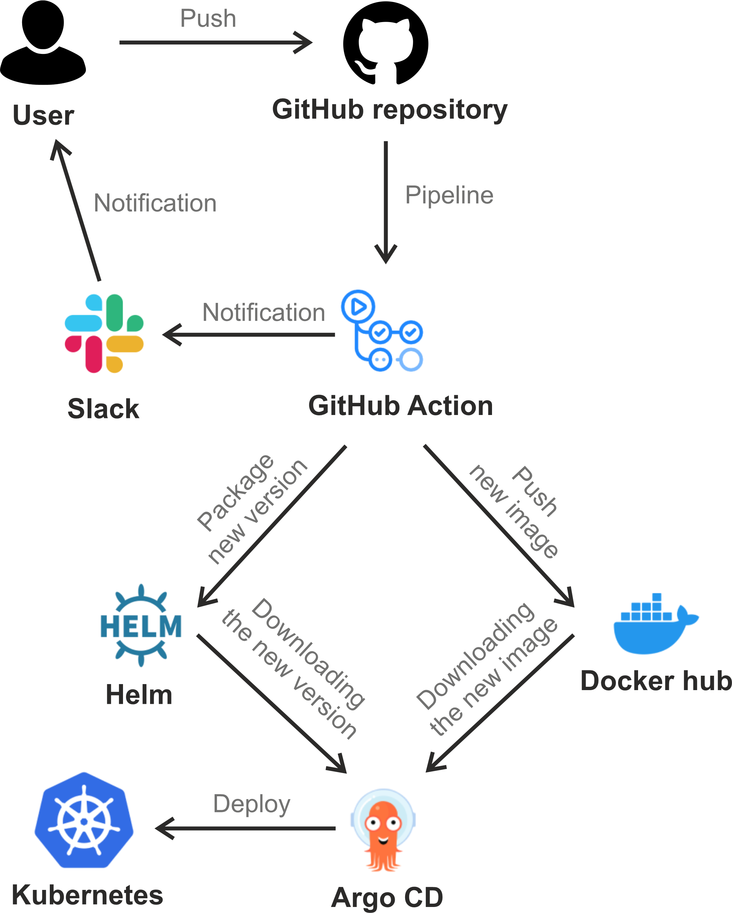

# Project report #

### Project's reporter: Evgeni Ermakov ###

### Group number: md-sa2-21-22 ###

# Description of application for deployment #

### Name of application: Wordpress ###

### Version: 5.9 ###

### The application is written in PHP ###

### Database: MariaDB ###

### Link on git repository: https://github.com/docker-library/wordpress ###

# Pipeline on picture #

# Technologies which were used in project #

Orchestration: Kubernetes

Automation tools: Github Actions, Argo-CD

Notification: Slack

Other tools: Helm, Docker

# CI/CD description #

Steps:
1) The developer push commit into gitHub repository
2) Github actions: 
   - runs tests
   - creates an image and pushes it to the Docker Hub repository
   - assigns a new version of the application
   - creates and pushes a new WordPress helm-package to the gitHub repository
   - sends notification in slack if the whole process was successful 
3) Argo CD takes the new version of the app and deploys it to Kubernetes.

Versioning is provided by the presence of helm packages, which we can manipulate via Argo-CD.

# Project repository #

[https://github.com/EvgeniErmakov/it-academy-devOps-project](https://github.com/EvgeniErmakov/it-academy-devOps-project)
