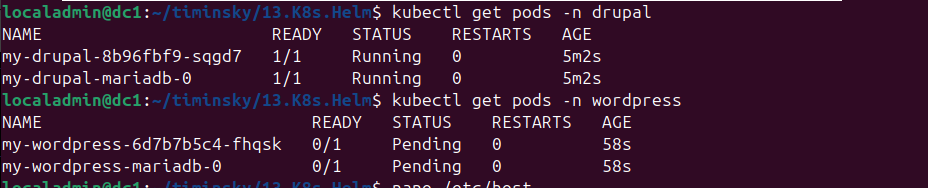
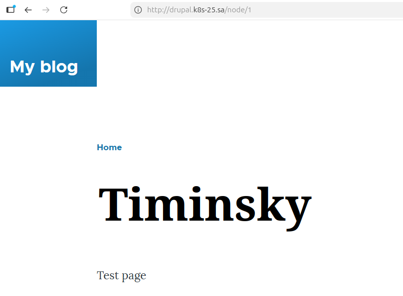
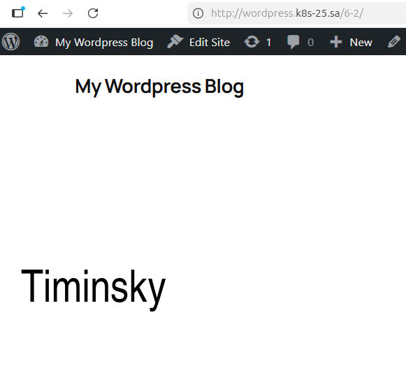

# 13. Kubernetes. Helm

```bash 
  710  curl -fsSL -o get_helm.sh https://raw.githubusercontent.com/helm/helm/main/scripts/get-helm-4
  711  chmod 700 get_helm.sh
  712  ./get_helm.sh
  713  rm get_helm.sh
  714  kubectl create namespace drupal
  715  nano drupal.yaml
  716  helm install my-drupal oci://registry-1.docker.io/bitnamicharts/drupal -n drupal -f drupal.yaml
  717  kubectl create namespace wordpress
  718  nano wordpress.yaml
  719  helm install my-wordpress oci://registry-1.docker.io/bitnamicharts/wordpress --namespace wordpress -f wordpress.yaml
  720  kubectl get pods -n drupal
  721  kubectl get pods -n wordpress
```







