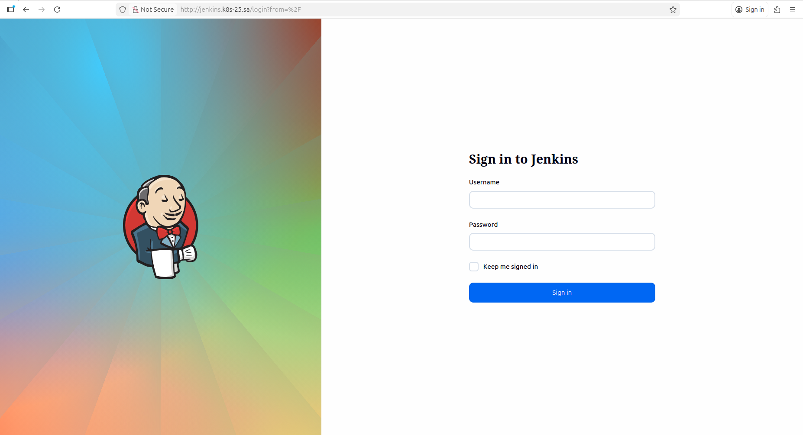

# 14. Kubernetes application deployment

## Jenkins Deployment with Helm


[Jenkins repository](https://github.com/grnre61-a11y/sa2-33-25-jenkins)

```bash 
### File streucture
kubernetes-jenkins/
├── Dockerfile
└── jenkins/
    ├── jenkins.yaml               
    └── helm-resources/
        ├── Chart.yaml              
        ├── values.yaml             
        ├── templates/
        │   ├── deployment.yaml     
        │   ├── service.yaml        
        │   ├── ingress.yaml        
        │   └── secret.yaml        
        └── jenkins-0.1.0.tgz      

### installation
 helm upgrade --install jenkins ./jenkins/helm-resources -n ci-cd --create-namespace

### Access jenkins 
http://jenkins.k8s-25.sa

### Packaging 
helm package ./jenkins/helm-resources
```


