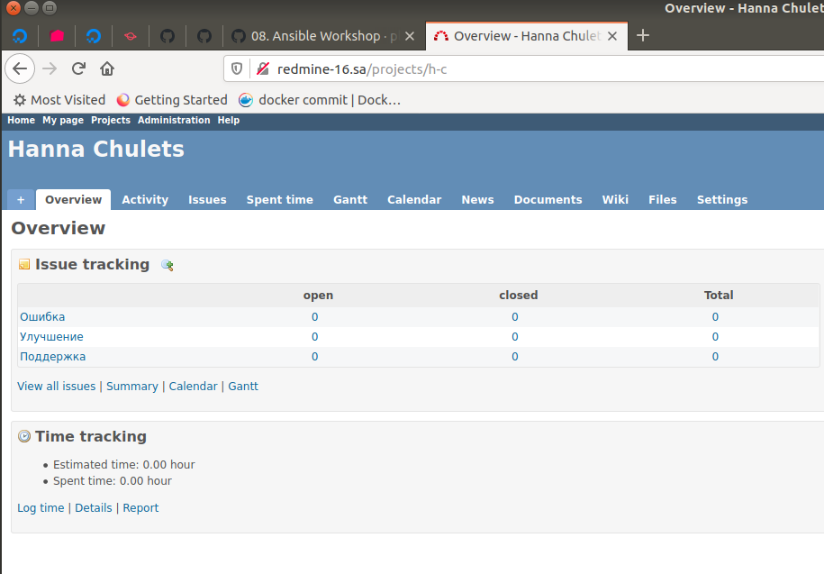

## 08. Ansible Workshop

```bash
# playbook
ann@vagrant:~/ansible$ cat deploy_redmine_mysql.yml
- hosts: work_shop_01
  pre_tasks:
  - debug:
      msg: "{{ ansible_host }}"
  roles:
    - mysql
    - redmine_alone
  tasks:
  - name: "Add {{ app_fqdn }} to host file"
    shell: echo "127.0.0.1       {{ app_fqdn }}" >> /etc/hosts
    tags:
      - test
  - uri:
      url: "http://{{ app_fqdn }}"
      return_content: yes
    register: this
    failed_when: "'Jean-Philippe Lang' not in this.content"
    tags:
      - test
  - name: Connectivity checks
    block:
      - name: Check connection
        wait_for:
          host: "{{ app_fqdn }}"
          port: '80'
          timeout: 3
        register: out
      - name: Send notification
        slack:
          token: "{{ slack_token }}"
          msg: 'Checks: successfull'
          channel: '#ansible_notification'
          username: 'ann ann'
          parse: 'full'
    rescue:
      - name: Send notification
        slack:
          token: "{{ slack_token }}"
          msg: 'Checks: failed'
          channel: '#ansible_notification'
          username: 'ann ann'
          parse: 'full'
  - lineinfile:
      path: /etc/hosts
      state: absent
      regexp: '^127.0.0.1       {{ app_fqdn }}'
    tags:
      - test
      - always
```

```bash
# how to run deployment
ann@vagrant:~/ansible$ ansible-playbook -i inventory.yml deploy_redmine_mysql.yml
```



