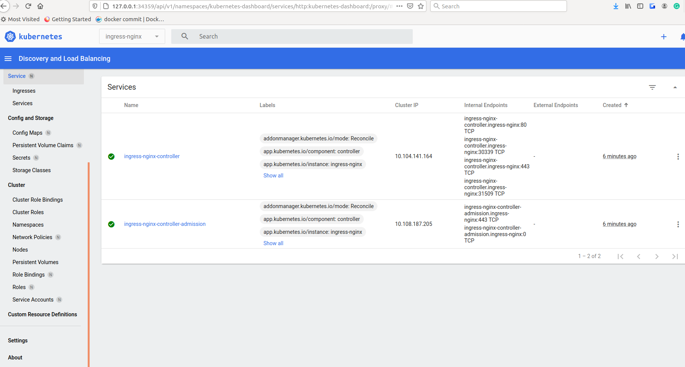

## Minikube on local machine
```bash
curl -LO https://storage.googleapis.com/minikube/releases/latest/minikube-linux-amd64
sudo install minikube-linux-amd64 /usr/local/bin/minikube

minikube start

minikube addons enable dashboard

minikube addons enable metrics-server

minikube dashboard
🤔  Verifying dashboard health ...
🚀  Launching proxy ...
🤔  Verifying proxy health ...
🎉  Opening http://127.0.0.1:34359/api/v1/namespaces/kubernetes-dashboard/services/http:kubernetes-dashboard:/proxy/ in your default browser...

minikube start --cpus='2' --memory='2g'

```


## Ansible + kubespray

Preparation

```bash
   27  apt update
   28  apt install python3-pip
   29  vim
   30  git clone https://github.com/kubernetes-sigs/kubespray.git
   31  ll
   32  cd kubespray/
   33  ll
   34  vim requirements.txt
   35  ansible --version
   36  vim requirements.txt
   37  pip3 install -r requirements.txt
   38  cp -rfp inventory/sample inventory/ec
   39  apt install sshpass
   40  declare -a IPS=(192.168.203.31 192.168.203.32)
   41  CONFIG_FILE=inventory/ec/hosts.yaml python3 contrib/inventory_builder/inventory.py ${IPS[@]}
   42  less inventory/ec/hosts.yaml
   43  vim inventory/ec/hosts.yaml
   44  cat inventory/ec/hosts.yaml
   45  ansible-playbook -i inventory/ec/hosts.yaml -u root cluster.yml --ask-pass

```

Installation
```bash

PLAY RECAP *************************************************************************************************************************************************************************************************
localhost                  : ok=4    changed=0    unreachable=0    failed=0    skipped=0    rescued=0    ignored=0   
node1                      : ok=588  changed=125  unreachable=0    failed=0    skipped=1148 rescued=0    ignored=2   
node2                      : ok=368  changed=76   unreachable=0    failed=0    skipped=632  rescued=0    ignored=1   

Wednesday 14 July 2021  21:23:01 +0000 (0:00:00.098)       0:26:28.010 ******** 
=============================================================================== 
download : download_container | Download image if required ----------------------------------------------------------------------------------------------------------------------------------------- 80.58s
download : download_container | Download image if required ----------------------------------------------------------------------------------------------------------------------------------------- 78.75s
download : download_container | Download image if required ----------------------------------------------------------------------------------------------------------------------------------------- 77.94s
kubernetes/control-plane : kubeadm | Initialize first master --------------------------------------------------------------------------------------------------------------------------------------- 77.15s
kubernetes/preinstall : Install packages requirements ---------------------------------------------------------------------------------------------------------------------------------------------- 68.29s
download : download_container | Download image if required ----------------------------------------------------------------------------------------------------------------------------------------- 64.75s
download : download_container | Download image if required ----------------------------------------------------------------------------------------------------------------------------------------- 64.31s
download : download_container | Download image if required ----------------------------------------------------------------------------------------------------------------------------------------- 62.94s
download : download_container | Download image if required ----------------------------------------------------------------------------------------------------------------------------------------- 62.23s
download : download_container | Download image if required ----------------------------------------------------------------------------------------------------------------------------------------- 61.85s
download : download_container | Download image if required ----------------------------------------------------------------------------------------------------------------------------------------- 61.53s
download : download_container | Download image if required ----------------------------------------------------------------------------------------------------------------------------------------- 58.32s
download : download_container | Download image if required ----------------------------------------------------------------------------------------------------------------------------------------- 57.95s
download : download_container | Download image if required ----------------------------------------------------------------------------------------------------------------------------------------- 57.22s
container-engine/docker : ensure docker packages are installed ------------------------------------------------------------------------------------------------------------------------------------- 54.48s
download : download_container | Download image if required ----------------------------------------------------------------------------------------------------------------------------------------- 52.94s
kubernetes/kubeadm : Join to cluster --------------------------------------------------------------------------------------------------------------------------------------------------------------- 32.33s
download : download_file | Download item ----------------------------------------------------------------------------------------------------------------------------------------------------------- 21.16s
bootstrap-os : Assign inventory name to unconfigured hostnames (non-CoreOS, non-Flatcar, Suse and ClearLinux) -------------------------------------------------------------------------------------- 21.10s
download : download_file | Download item ----------------------------------------------------------------------------------------------------------------------------------------------------------- 20.24s
root@sa-ubuntu-32:~/kubespray#
```