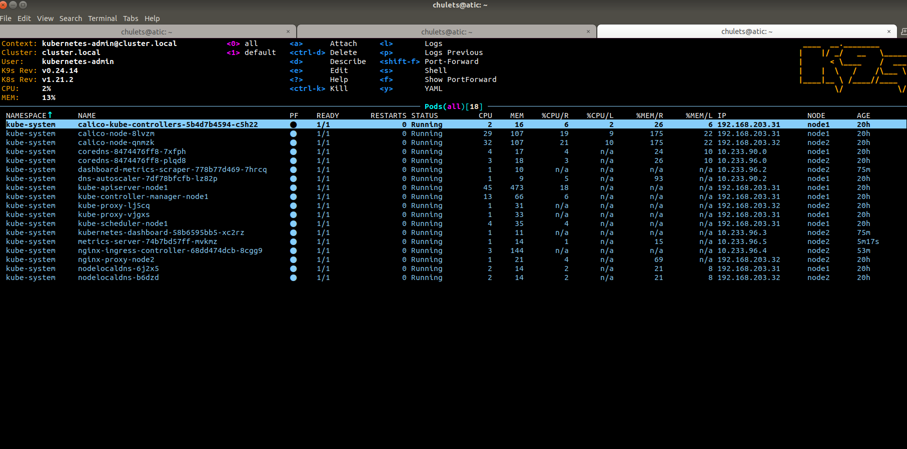

## K8s installation



## Local aliases for kubectl


```bash
#the current list of aliases
alias kgns='kubectl get namespaces'
alias kgp='kubectl get pods'
alias kgpa='kubectl get pods --all-namespaces'
alias kdel='kubectl delete'
alias kdelf='kubectl delete -f'
alias kgi='kubectl get ingress'
alias kgia='kubectl get ingress --all-namespaces'
alias kaf='kubectl apply -f'

#usage
chulets@atic:/opt/git/hometasks/sa.it-academy.by$ kgns
NAME              STATUS   AGE
default           Active   33h
kube-node-lease   Active   33h
kube-public       Active   33h
kube-system       Active   33h

chulets@atic:/opt/git/hometasks/sa.it-academy.by$ kgp
No resources found in default namespace.

chulets@atic:/opt/git/hometasks/sa.it-academy.by$ kgpa
NAMESPACE     NAME                                         READY   STATUS    RESTARTS   AGE
kube-system   calico-kube-controllers-5b4d7b4594-c5h22     1/1     Running   0          33h
kube-system   calico-node-8lvzm                            1/1     Running   0          33h
kube-system   calico-node-qnmzk                            1/1     Running   0          33h
kube-system   coredns-8474476ff8-7xfph                     1/1     Running   0          33h
kube-system   coredns-8474476ff8-plqd8                     1/1     Running   0          32h
kube-system   dashboard-metrics-scraper-778b77d469-7hrcq   1/1     Running   0          13h
kube-system   dns-autoscaler-7df78bfcfb-lz82p              1/1     Running   0          33h
kube-system   kube-apiserver-node1                         1/1     Running   0          33h
kube-system   kube-controller-manager-node1                1/1     Running   0          33h
kube-system   kube-proxy-lj5cq                             1/1     Running   0          33h
kube-system   kube-proxy-vjgxs                             1/1     Running   0          33h
kube-system   kube-scheduler-node1                         1/1     Running   0          33h
kube-system   kubernetes-dashboard-58b6595bb5-xc2rz        1/1     Running   0          13h
kube-system   metrics-server-74b7bd57ff-mvkmz              1/1     Running   0          12h
kube-system   nginx-ingress-controller-68dd474dcb-8cgg9    1/1     Running   0          13h
kube-system   nginx-proxy-node2                            1/1     Running   0          33h
kube-system   nodelocaldns-6j2x5                           1/1     Running   0          33h
kube-system   nodelocaldns-b6dzd                           1/1     Running   0          33h

chulets@atic:/opt/git/hometasks/sa.it-academy.by$ kgia
NAMESPACE     NAME                   CLASS    HOSTS                 ADDRESS         PORTS   AGE
kube-system   kubernetes-dashboard   <none>   dashboard.k8s-31.sa   10.233.22.121   80      13h

```