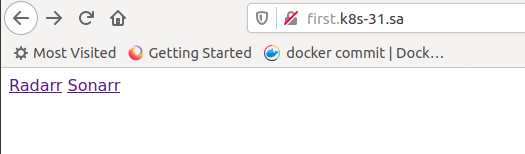
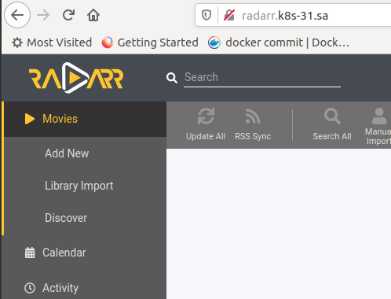
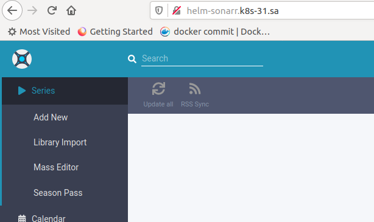
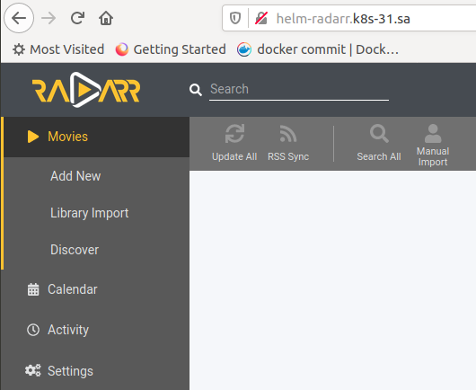

### Check ingress
```bash
[jump_sa@jump ~]$ curl --header "Host: first.k8s-31.sa" 192.168.203.31:30001
<!DOCTYPE html>
<html>
<head>
<title>Welcome to nginx!</title>
<style>
    body {
        width: 35em;
        margin: 0 auto;
        font-family: Tahoma, Verdana, Arial, sans-serif;
    }
</style>
</head>
<body>
<h1>Welcome to nginx!</h1>
<p>If you see this page, the nginx web server is successfully installed and
working. Further configuration is required.</p>

<p>For online documentation and support please refer to
<a href="http://nginx.org/">nginx.org</a>.<br/>
Commercial support is available at
<a href="http://nginx.com/">nginx.com</a>.</p>

<p><em>Thank you for using nginx.</em></p>
</body>
</html>

```
### Index.html for ngnix
```bash
#ssh root@192.168.203.31
root@node1:/mnt/test/sa2-17-21/chulets/nginx# cat index.html 
<a href="http://radarr.k8s-31.sa">Radarr</a>
<a href="http://sonarr.k8s-31.sa">Sonarr</a>
```

### Check nginx via browser








