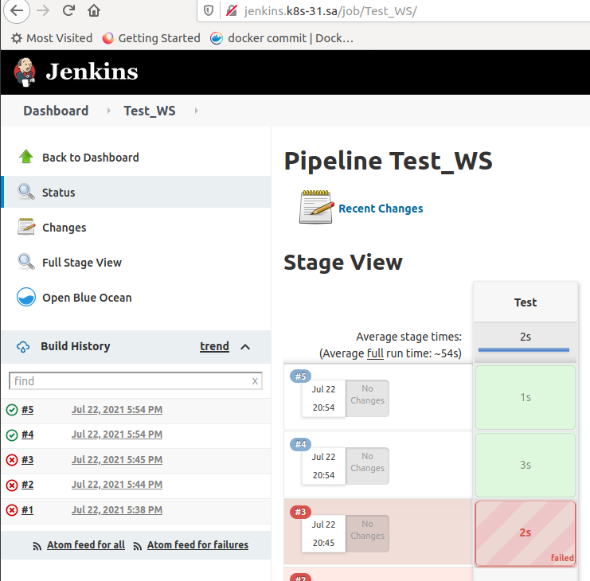

###  Bootstrap

```bash
export GITHUB_TOKEN=git_token
export GITHUB_USER=chulets
export GITHUB_REPO=flux-demo


flux bootstrap github   --owner=$GITHUB_USER   --repository=$GITHUB_REPO   --branch=main   --path=./clusters   --personal

flux create source git jenkins \
  --url=https://github.com/chulets/flux-demo.git \
  --branch=main \
  --interval=1m \
  --export > ./clusters/jenkins-source.yaml
```

### Add slack notification
kubectl -n flux-system create secret generic slack-url \
--from-literal=address=slack_token

### Jenkins success job



### Output of my task in Jenkins 

```groovy
Started by user admin
Running in Durability level: MAX_SURVIVABILITY
[Pipeline] Start of Pipeline
[Pipeline] echo
[WARNING] label option is deprecated. To use a static pod template, use the 'inheritFrom' option.
[Pipeline] podTemplate
[Pipeline] {
[Pipeline] node
Still waiting to schedule task
‘sample-app-fbmn2-7ljms’ is offline
Agent sample-app-fbmn2-7ljms is provisioned from template sample-app-fbmn2
---
apiVersion: "v1"
kind: "Pod"
metadata:
  annotations:
    buildUrl: "http://jenkins:8080/job/Test_WS/4/"
    runUrl: "job/Test_WS/4/"
  labels:
    jenkins: "slave"
    jenkins/label-digest: "e63233bec581b1d9effa6b6d4f0bca0985a05b55"
    jenkins/label: "sample-app"
  name: "sample-app-fbmn2-7ljms"
  namespace: "ci-cd"
spec:
  containers:
  - command:
    - "cat"
    image: "jfrog.it-academy.by/public/curl:spishchyk"
    imagePullPolicy: "IfNotPresent"
    name: "curltest"
    tty: true
    volumeMounts:
    - mountPath: "/home/jenkins/agent"
      name: "workspace-volume"
      readOnly: false
  - env:
    - name: "JENKINS_SECRET"
      value: "********"
    - name: "JENKINS_AGENT_NAME"
      value: "sample-app-fbmn2-7ljms"
    - name: "JENKINS_NAME"
      value: "sample-app-fbmn2-7ljms"
    - name: "JENKINS_AGENT_WORKDIR"
      value: "/home/jenkins/agent"
    - name: "JENKINS_URL"
      value: "http://jenkins:8080/"
    image: "jenkins/inbound-agent:4.3-4"
    name: "jnlp"
    resources:
      limits: {}
      requests:
        memory: "256Mi"
        cpu: "100m"
    volumeMounts:
    - mountPath: "/home/jenkins/agent"
      name: "workspace-volume"
      readOnly: false
  nodeSelector:
    kubernetes.io/os: "linux"
  restartPolicy: "Always"
  volumes:
  - emptyDir:
      medium: ""
    name: "workspace-volume"

Running on sample-app-fbmn2-7ljms in /home/jenkins/agent/workspace/Test_WS
[Pipeline] {
[Pipeline] stage
[Pipeline] { (Test)
[Pipeline] container
[Pipeline] {
[Pipeline] sh
+ curl -S https://onliner.by
  % Total    % Received % Xferd  Average Speed   Time    Time     Time  Current
                                 Dload  Upload   Total   Spent    Left  Speed

  0     0    0     0    0     0      0      0 --:--:-- --:--:-- --:--:--     0<html>
<head><title>301 Moved Permanently</title></head>
<body>
<center><h1>301 Moved Permanently</h1></center>
<hr><center>nginx</center>
</body>
</html>

100   162  100   162    0     0   4585      0 --:--:-- --:--:-- --:--:--  4628
[Pipeline] }
[Pipeline] // container
[Pipeline] }
[Pipeline] // stage
[Pipeline] }
[Pipeline] // node
[Pipeline] }
[Pipeline] // podTemplate
[Pipeline] End of Pipeline
Finished: SUCCESS
```