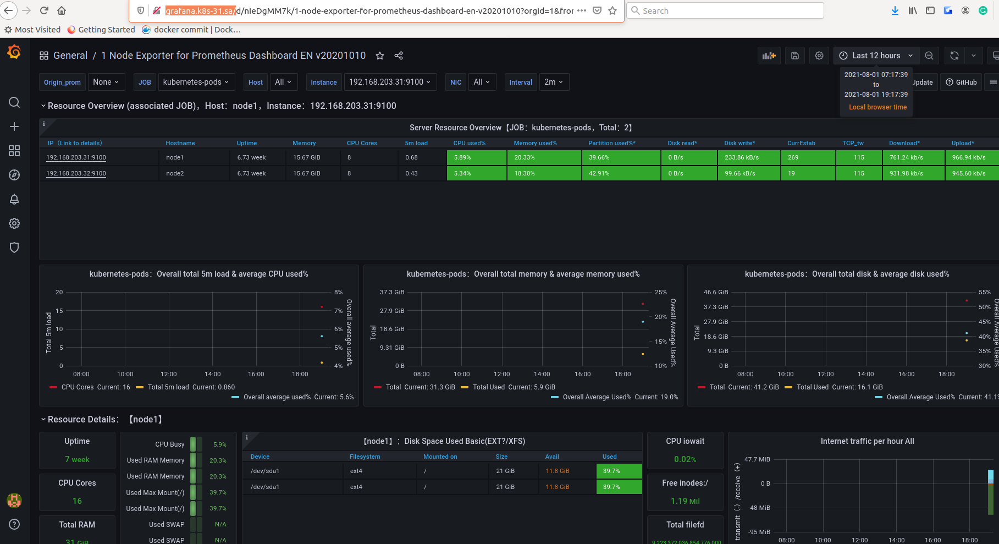

### Change slack URL for flux

```bash
# remove old
kubectl -n flux-system  delete secret slack-url

# add new
kubectl -n flux-system create secret generic slack-url \
> --from-literal=address=https://hooks.slack.com/services/XXX

```

### Prometheus and Grafana WEB UI

[Prometheus](http://prometheus.k8s-31.sa)

[Grafana](http://grafana.k8s-31.sa/)

