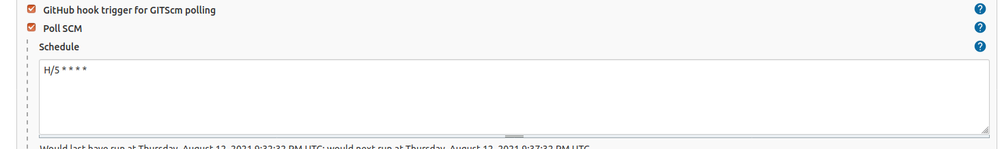
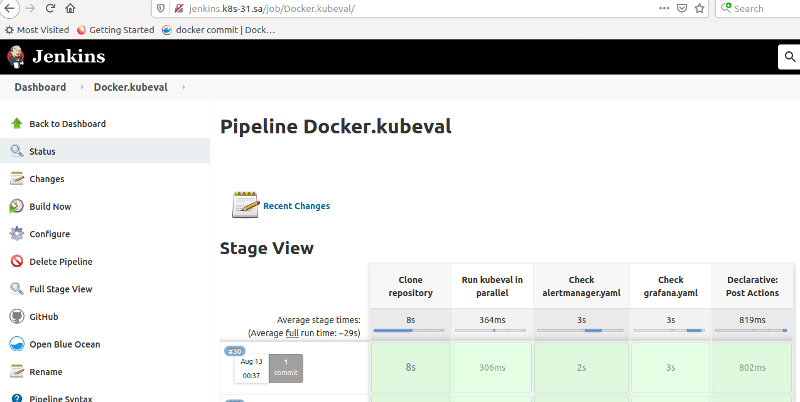
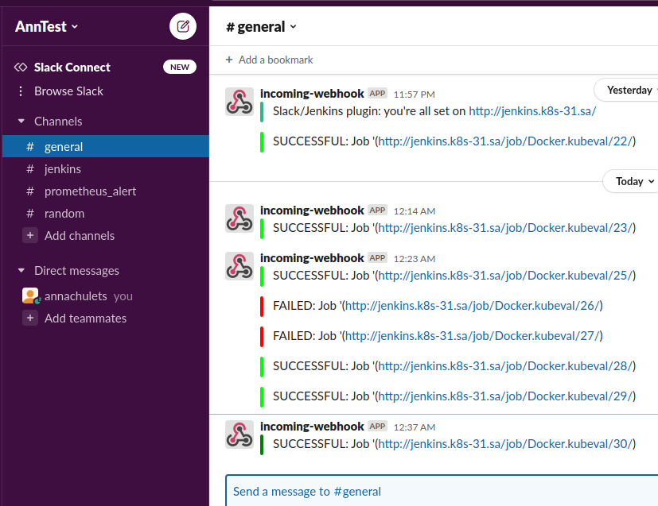

### Jenkinsfile
```groovy
pipeline {
  agent {
    kubernetes {
        containerTemplate {
        name 'kubeval'
        image 'garethr/kubeval:latest'
        ttyEnabled true
        command 'watch date'
        }
    }
  }
  stages {
    stage('Clone repository') { 
        steps { 
                git url: 'https://github.com/chulets/flux-demo.git',
                credentialsId: "github",
                branch: "main"         
        }
    }
    stage('Run kubeval in parallel') {
        parallel {
            stage('Check alertmanager.yaml') {
                steps {
                    container('kubeval') {
                    sh """#!/bin/sh
                        kubeval alertmanager.yaml
                    """
                    }
                }
            }
            stage('Check grafana.yaml') {
                steps {
                    container('kubeval') {
                    sh """#!/bin/sh
                        kubeval grafana.yaml
                    """
                    }
                }
            }
        }
    }
  }
  post {
    success {
        slackSend (color: '#008000', message: "SUCCESSFUL: Job '(${env.BUILD_URL})")
        }
    failure {
        slackSend (color: '#FF0000', message: "FAILED: Job '(${env.BUILD_URL})")
        }
    }
}
'''

### Console output

```bash
Started by an SCM change
Running in Durability level: MAX_SURVIVABILITY
[Pipeline] Start of Pipeline
[Pipeline] echo
[WARNING] containerTemplate option is deprecated, use yaml syntax to define containers.
[Pipeline] podTemplate
[Pipeline] {
[Pipeline] node
Created Pod: kubernetes ci-cd/docker-kubeval-30-wr270-tshs6-j5r0m
[Normal][ci-cd/docker-kubeval-30-wr270-tshs6-j5r0m][Scheduled] Successfully assigned ci-cd/docker-kubeval-30-wr270-tshs6-j5r0m to node2
[Normal][ci-cd/docker-kubeval-30-wr270-tshs6-j5r0m][Pulled] Container image "garethr/kubeval:latest" already present on machine
[Normal][ci-cd/docker-kubeval-30-wr270-tshs6-j5r0m][Created] Created container kubeval
[Normal][ci-cd/docker-kubeval-30-wr270-tshs6-j5r0m][Started] Started container kubeval
[Normal][ci-cd/docker-kubeval-30-wr270-tshs6-j5r0m][Pulled] Container image "jenkins/inbound-agent:4.3-4" already present on machine
[Normal][ci-cd/docker-kubeval-30-wr270-tshs6-j5r0m][Created] Created container jnlp
[Normal][ci-cd/docker-kubeval-30-wr270-tshs6-j5r0m][Started] Started container jnlp
Still waiting to schedule task
Waiting for next available executor on ‘docker-kubeval-30-wr270-tshs6-j5r0m’
Agent docker-kubeval-30-wr270-tshs6-j5r0m is provisioned from template Docker_kubeval_30-wr270-tshs6
---
apiVersion: "v1"
kind: "Pod"
metadata:
  annotations:
    buildUrl: "http://jenkins:8080/job/Docker.kubeval/30/"
    runUrl: "job/Docker.kubeval/30/"
  labels:
    jenkins: "slave"
    jenkins/label-digest: "3f6d91378f799c759b0bffb5f61f6c4e23f3fabf"
    jenkins/label: "Docker_kubeval_30-wr270"
  name: "docker-kubeval-30-wr270-tshs6-j5r0m"
spec:
  containers:
  - command:
    - "watch"
    - "date"
    image: "garethr/kubeval:latest"
    imagePullPolicy: "IfNotPresent"
    name: "kubeval"
    resources:
      limits: {}
      requests: {}
    tty: true
    volumeMounts:
    - mountPath: "/home/jenkins/agent"
      name: "workspace-volume"
      readOnly: false
  - env:
    - name: "JENKINS_SECRET"
      value: "********"
    - name: "JENKINS_AGENT_NAME"
      value: "docker-kubeval-30-wr270-tshs6-j5r0m"
    - name: "JENKINS_NAME"
      value: "docker-kubeval-30-wr270-tshs6-j5r0m"
    - name: "JENKINS_AGENT_WORKDIR"
      value: "/home/jenkins/agent"
    - name: "JENKINS_URL"
      value: "http://jenkins:8080/"
    image: "jenkins/inbound-agent:4.3-4"
    name: "jnlp"
    resources:
      limits: {}
      requests:
        memory: "256Mi"
        cpu: "100m"
    volumeMounts:
    - mountPath: "/home/jenkins/agent"
      name: "workspace-volume"
      readOnly: false
  nodeSelector:
    kubernetes.io/os: "linux"
  restartPolicy: "Never"
  volumes:
  - emptyDir:
      medium: ""
    name: "workspace-volume"

Running on docker-kubeval-30-wr270-tshs6-j5r0m in /home/jenkins/agent/workspace/Docker.kubeval
[Pipeline] {
[Pipeline] container
[Pipeline] {
[Pipeline] stage
[Pipeline] { (Clone repository)
[Pipeline] git
The recommended git tool is: NONE
using credential github
Warning: JENKINS-30600: special launcher org.csanchez.jenkins.plugins.kubernetes.pipeline.ContainerExecDecorator$1@1dcb78f1; decorates RemoteLauncher[hudson.remoting.Channel@686b0c32:JNLP4-connect connection from 10.233.96.123/10.233.96.123:44992] will be ignored (a typical symptom is the Git executable not being run inside a designated container)
Cloning the remote Git repository
Avoid second fetch
Checking out Revision 6a97d2ba4a1410ef56cc3a53e729a415deee769f (refs/remotes/origin/main)
Cloning repository https://github.com/chulets/flux-demo.git
 > git init /home/jenkins/agent/workspace/Docker.kubeval # timeout=10
Fetching upstream changes from https://github.com/chulets/flux-demo.git
 > git --version # timeout=10
 > git --version # 'git version 2.20.1'
using GIT_ASKPASS to set credentials 
 > git fetch --tags --force --progress -- https://github.com/chulets/flux-demo.git +refs/heads/*:refs/remotes/origin/* # timeout=10
 > git config remote.origin.url https://github.com/chulets/flux-demo.git # timeout=10
 > git config --add remote.origin.fetch +refs/heads/*:refs/remotes/origin/* # timeout=10
 > git rev-parse refs/remotes/origin/main^{commit} # timeout=10
 > git config core.sparsecheckout # timeout=10
 > git checkout -f 6a97d2ba4a1410ef56cc3a53e729a415deee769f # timeout=10
 > git branch -a -v --no-abbrev # timeout=10
 > git checkout -b main 6a97d2ba4a1410ef56cc3a53e729a415deee769f # timeout=10
Commit message: "test"
 > git rev-list --no-walk fa4f76d16b59353ba7a37a84b5aa14d8751aa19c # timeout=10
[Pipeline] }
[Pipeline] // stage
[Pipeline] stage
[Pipeline] { (Run kubeval in parallel)
[Pipeline] parallel
[Pipeline] { (Branch: Check alertmanager.yaml)
[Pipeline] { (Branch: Check grafana.yaml)
[Pipeline] stage
[Pipeline] { (Check alertmanager.yaml)
[Pipeline] stage
[Pipeline] { (Check grafana.yaml)
[Pipeline] container
[Pipeline] {
[Pipeline] container
[Pipeline] {
[Pipeline] sh
[Pipeline] sh
PASS - alertmanager.yaml contains a valid ConfigMap (monitoring.alertmanager-config)
PASS - alertmanager.yaml contains a valid Deployment (monitoring.alertmanager)
PASS - alertmanager.yaml contains a valid Service (monitoring.alertmanager)
PASS - alertmanager.yaml contains a valid Ingress (monitoring.alertmanager-ingress)
[Pipeline] }
PASS - grafana.yaml contains a valid ConfigMap (monitoring.grafana-datasources)
[Pipeline] // container
PASS - grafana.yaml contains a valid Deployment (monitoring.grafana)
PASS - grafana.yaml contains a valid Service (monitoring.grafana)
PASS - grafana.yaml contains a valid Ingress (monitoring.grafana-ingres)
[Pipeline] }
[Pipeline] // stage
[Pipeline] }
[Pipeline] }
[Pipeline] // container
[Pipeline] }
[Pipeline] // stage
[Pipeline] }
[Pipeline] // parallel
[Pipeline] }
[Pipeline] // stage
[Pipeline] stage
[Pipeline] { (Declarative: Post Actions)
[Pipeline] slackSend
Slack Send Pipeline step running, values are - baseUrl: https://hooks.slack.com/services, teamDomain: <empty>, channel: #general, color: #008000, botUser: false, tokenCredentialId: slack_token, notifyCommitters: false, iconEmoji: <empty>, username: <empty>, timestamp: <empty>
[Pipeline] }
[Pipeline] // stage
[Pipeline] }
[Pipeline] // container
[Pipeline] }
[Pipeline] // node
[Pipeline] }
[Pipeline] // podTemplate
[Pipeline] End of Pipeline
Finished: SUCCESS
```




