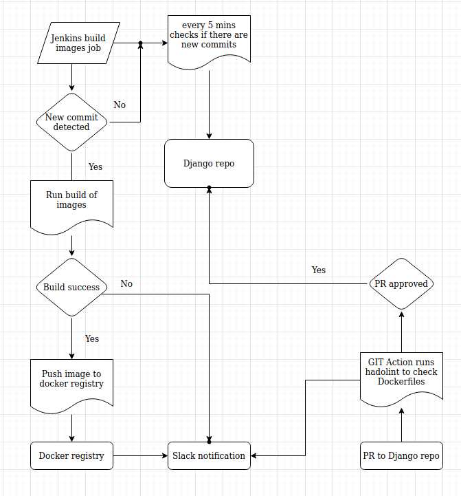

## Project's reporter: 
Hanna, Chulets

## Group number: 
md-sa2-17-21

## Description of application for deployment

    The Dockerfile is used to create the application - Django https://www.djangoproject.com.
    The programming language is the application written in - Python
    Database is used - MySQL
    Repo with Dockerfile - https://github.com/GannulkaBY/django

## Pipeline. High Level Design

## Technologies which were used in project

### Orchestration: 
Jenkins, GIT Action, Slack , Docker

### Automation tools:

Puppet, Bash, Docker 

### CI description: 
As soon as any PR and push is recieved to project GIT repo, GIT action sends a notification to Slack and runs GIT Action - Hadolint Action, that checks Dockerfile if it is correct.
Jenkins polls project GIT repository every 5 min. If a new commit is detected, Jenkins runs a job.
Job builds docker images and pushes to public docker regitsry and sends nofitication to Slack.

### Deployment flows short description:

By manually trigger, Jenkins runs a deployment. The job has 3 parameters: 

- Server (server to deploy an application. Jenkins SSH key should be on this server)
- Folder (where on the server it should deploy the application)
- Version (the version of the application. Can be checked in docker registry)

Job clones a repo with bash scripts and docker-compose.yml. Then runs a deploy.sh. This script takes care about deployment steps: 

1. If deployment from scratch
- creating of new project folder
- running docker stack deploy
- running a check if database is up (by using wait-for-mysql.sh)
- if database is up, the necessary migrations will be applied to database
- creating a super user in database

2. If upgrade of running application

- backuping of the docker-compose.yml 
- changing image versions in the docker-compose.yml 
- running docker service update with a new version of image

On the "Test connection" step job checks if the application is up: link should return http header 200.

Job sends result of the build to Slack.

### Rollback flow description and implementation:

If "Test connection" step returns any other http header except 200, job runs ./rollback.sh  - script to roll back the application to the previous version. Then again runs checking that applications is up.

## Links

[Django Dockerfile project](https://github.com/GannulkaBY/django)

[Docker Django regisry](https://hub.docker.com/r/gannagp/django)

[Django build and deploy pipelines repo](https://github.com/GannulkaBY/djang_build)

[Django deploy scripts repo](https://github.com/GannulkaBY/django_deploy)