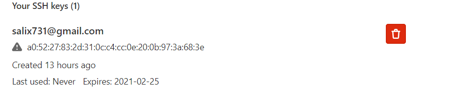

# 03. GIT hosting
---
## Links to remote repositories:


> [bitbucket.org](https://bitbucket.org/Korolev731/test_buc)

> [gitlab.com](https://gitlab.com/Korolev731/test_lab)

> [github.com](https://github.com/Korolev731/test_hub.git)


## SSH keys:





* bitbucket


* github


* gitlab


## Script:

```bash
#!/bin/bash
git push -u 1 --all
git push -u 2--all
git push -u 3 --all

```
