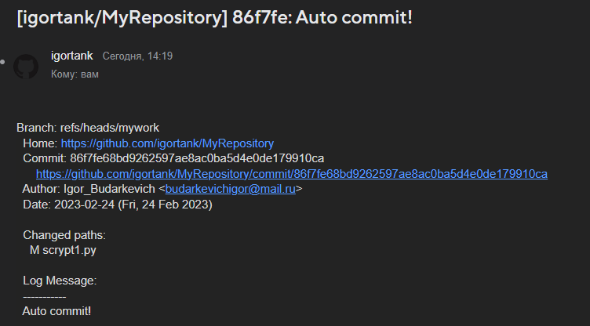

# 03.GIT.Hosting

## URLs repositories

[Github](https://github.com/igortank/MyRepository)

[Gitlab](https://gitlab.com/BudarkevichIgor/myrepository)

## Script

```Python
#!/usr/bin/env python
import os

os.system('git add --all')
os.system('git commit -m "Auto commit!"')

listRepos = os.popen('git remote show').read().split()

print(f'Push repositories: {listRepos}')

for repo in listRepos:
	os.system(f'git push {repo} --all')
```

### Result script

```bush
$ pushrepos
On branch mywork
Your branch is up to date with 'originHub/mywork'.

nothing to commit, working tree clean
Everything up-to-date
Everything up-to-date
Push repositories: ['originHub', 'originLab']
```

## Email


