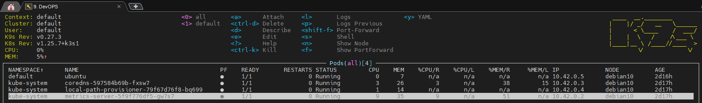
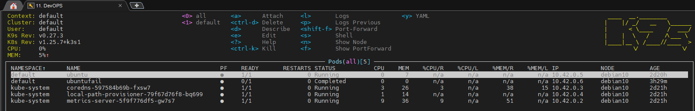
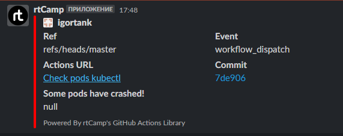

# 09.Kubernetes

## Links

[Github](https://github.com/igortank/MyRepository)

[Github action](https://github.com/igortank/MyRepository/actions/runs/4461250237)

## Version kubectl and K9s

```bush
admin1@igor:~$ kubectl version --short
Flag --short has been deprecated, and will be removed in the future. The --short output will become the default.
Client Version: v1.26.2
Kustomize Version: v4.5.7
Server Version: v1.25.7+k3s1

admin1@igor:~$ k9s version
 ____  __.________
|    |/ _/   __   \______
|      < \____    /  ___/
|    |  \   /    /\___ \
|____|__ \ /____//____  >
        \/            \/

Version:    v0.27.3
Commit:     7c76691c389e4e7de29516932a304f7029307c6d
Date:       2023-02-12T15:19:22Z
```

## Screen of k9s before



## Yaml file

```yaml
name: Check pods kubectl

on: workflow_dispatch

jobs:
  build:
    name: Check pods kubectl
    runs-on: ubuntu-latest
    env:
      report-file: report.log
      report-text:
    steps:
    - name: Connect to k3s host
      run: |
        mkdir ~/.ssh
        eval `ssh-agent -s`
        ssh-add - <<< "${{ secrets.HOST_KEY }}" 
        ssh-keyscan -H ${{ secrets.JUMP_HOST }} >> ~/.ssh/known_hosts
        ssh ${{ secrets.JUMP_USERNAME }}@${{ secrets.JUMP_HOST}} ssh-keyscan ${{ secrets.HOST }} >> ~/.ssh/known_hosts
        ssh -o ProxyCommand="ssh -W %h:%p ${{ secrets.JUMP_USERNAME }}@${{ secrets.JUMP_HOST }}" ${{ secrets.USERNAME }}@${{ secrets.HOST }} \
        kubectl get pods -A > ${{ env.report-file }} 

    - name: check-crashed-pods
      id: check-pods
      run: |
        echo "pods-failed-count=$(cat ${{ env.report-file }} | grep -v Running | wc -l)" >> $GITHUB_OUTPUT

    - name: upload crashed pod's list
      if: steps.check-pods.outputs.pods-failed-count > 1
      uses: actions/upload-artifact@v3
      with:
        path: ${{ env.report-file }}

    - name: Slack notification
      uses: rtCamp/action-slack-notify@v2
      if: steps.check-pods.outputs.pods-failed-count > 1
      env:
        SLACK_CHANNEL: notification_github
        SLACK_COLOR: '#FF0000'
        SLACK_ICON: https://github.com/rtCamp.png?size=48
        SLACK_TITLE: 'Some pods have crashed!'
        SLACK_USERNAME: rtCamp
        SLACK_WEBHOOK: ${{ secrets.SLACK_WEBHOOK }}

```

## Screen of k9s after



## Slack



## report.log

```log
NAMESPACE     NAME                                      READY   STATUS      RESTARTS   AGE
kube-system   coredns-597584b69b-fxsw7                  1/1     Running     0          2d20h
kube-system   local-path-provisioner-79f67d76f8-bq699   1/1     Running     0          2d20h
kube-system   metrics-server-5f9f776df5-gw7s7           1/1     Running     0          2d20h
default       ubuntu                                    1/1     Running     0          2d19h
default       ubuntufail                                0/1     Completed   0          3h8m
```
