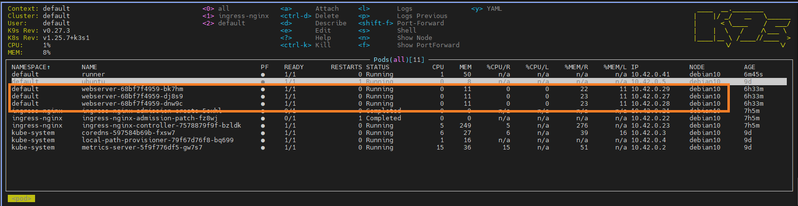
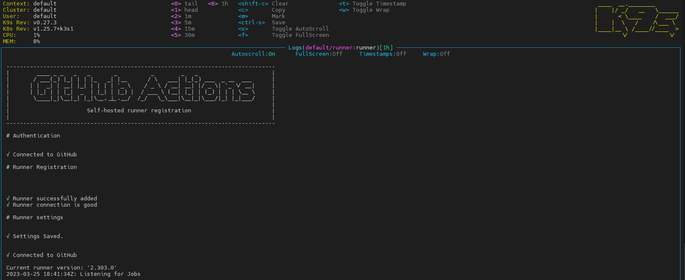
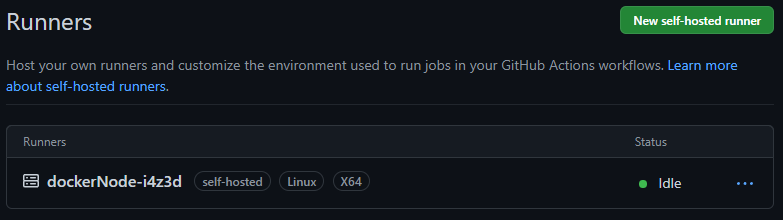

# 11.Kubernetes.Basic objects

## Nginx service



### Nginx deploy yaml

```yaml
---
apiVersion: apps/v1
kind: Deployment
metadata:
  name: webserver
  labels:
    app: simple-web
spec:
  replicas: 3
  strategy:
    type: RollingUpdate
    rollingUpdate:
      maxSurge: 1
      maxUnavailable: 1
  selector:
    matchLabels:
      app: simple-web
  template:
    metadata:
      labels:
        app: simple-web
    spec:
      containers:
      - name: nginx
        image: ubuntu/nginx:latest
        ports:
        - containerPort: 80
        volumeMounts:
        - name: nginx-config-volume
          mountPath: /etc/nginx/nginx.conf
          subPath: nginx.conf
        - name: nginx-config-volume
          mountPath: /srv/www/index.html
          subPath: index.html
        resources:
          requests:
            cpu: 50m
            memory: 50Mi
          limits:
            cpu: 100m
            memory: 100Mi
      volumes:
      - name: nginx-config-volume
        configMap:
          name: nginx-config
          items:
          - key: nginx
            path: nginx.conf
          - key: nginx-site
            path: index.html

---
apiVersion: v1
kind: Service
metadata:
  name: nginx-web-service
  labels:
    run: web-service
spec:
  ports:
  - port: 80
    protocol: TCP
  selector:
    app: simple-web

---
apiVersion: networking.k8s.io/v1
kind: Ingress
metadata:
  name: ingress-sa
  annotations:
    kubernetes.io/ingress.class: nginx
    nginx.ingress.kubernetes.io/server-alias: "nginx-test.k8s-2.sa"
spec:
  rules:
    - host: nginx.k8s-2.sa
      http:
        paths:
          - path: /
            pathType: Prefix
            backend:
              service:
                name: nginx-web-service
                port:
                  number: 80

```

### Browser screen


## Self-hosted github runner

### Runner deploy yaml

```yaml
apiVersion: v1
kind: Pod
metadata:
  name: runner
  labels:
    app: runner
spec:
  containers:
  - name: runner
    image: ghcr.io/igortank/runner:latest
    env:
    - name: GH_OWNER
      value: "account name"
    - name: GH_REPOSITORY
      value: "repository"
    - name: GH_TOKEN
      value: "runner tokern"
  restartPolicy: Never
```

### Screen runner



