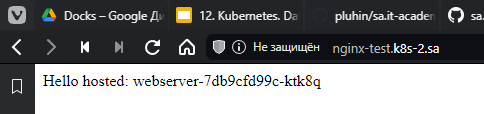
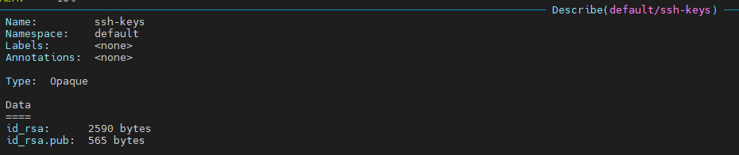
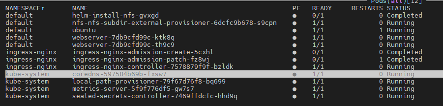

# 12.Kubernetes.Data.Security

## Nginx

### Add Nginx config and nfs share

```yaml
---
apiVersion: v1
kind: ConfigMap
metadata:
  name: nginx-config
data:
  nginx.conf: |
    user www-data;
    worker_processes auto;
    pid /run/nginx.pid;
    events { }
    http {
    server {
    listen 80 default_server;
    listen [::]:80 default_server;
    root /srv/www;
    index index.php;
    server_name _;
    location ~ \.php$ {
    fastcgi_split_path_info ^(.+\.php)(/.+)$;
    fastcgi_pass unix:/var/run/php5-fpm.sock;
    fastcgi_param SCRIPT_FILENAME $document_root$fastcgi_script_name;
    fastcgi_param SCRIPT_NAME $fastcgi_script_name;
    fastcgi_index index.php;
    include fastcgi_params;
    }}}

---
apiVersion: v1
kind: PersistentVolumeClaim
metadata:
  name: app01-pv-claim-app
  labels:
    app: simple-web
spec:
  accessModes:
    - ReadWriteMany
  storageClassName: nfs-app
  resources:
    requests:
      storage: 1Gi
-----------------------
-----------------------
      spec:
      containers:
      - name: nginx
        image: timnn/nginx-php-fpm:latest
        ports:
        - containerPort: 80
        volumeMounts:
        - name: nginx-config-volume
          mountPath: /etc/nginx/nginx.conf
          subPath: nginx.conf
        - name: persistent-storage-app
          mountPath: "/srv/www"
      volumes:
      - name: nginx-config-volume
        configMap:
          name: nginx-config
      - name: persistent-storage-app
        persistentVolumeClaim:
          claimName: app01-pv-claim-app

```

[nfs-subdir-external.yaml](nfs-subdir-external.yaml)

### Result Screen Browser



## Kubeseal

### Install kubeseal on local VM and sealed-secrets-controller

 ```bash
 wget https://github.com/bitnami-labs/sealed-secrets/releases/download/v0.20.2/kubeseal-0.20.2-linux-amd64.tar.gz
 sudo tar -C /usr/local/bin -xzf kubeseal-0.20.2-linux-amd64.tar.gz
 kubeseal --version
 kubectl apply -f https://github.com/bitnami-labs/sealed-secrets/releases/download/v0.20.2/controller.yaml
 ```

### Using kubeseal and hashing our init-secret.yaml file

```yaml
---
apiVersion: v1
kind: Secret
metadata:
  name: ssh-keys
  namespace: default
  type: Opaque
data:
  id_rsa.pub: 
  id_rsa:  
```

```bash
cat init-secret.yaml | kubeseal --format yaml > sealer_secret.yaml
kubectl apply -f sealer_secret.yaml
```

### Screen secrets




## Deployment final file

[nginx-pod-new.yaml](nginx-pod-new.yaml)




```