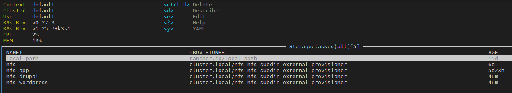
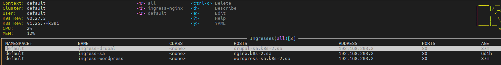

# 13.Kubernetes.Helm

## Main task

Deploy in your K8s cluster the following applications using helm charts from public repositories:

* Wordpress
* Drupal

### Install Helm

[Helm Install](https://helm.sh/docs/intro/install/)

```bash
curl -fsSL -o get_helm.sh https://raw.githubusercontent.com/helm/helm/main/scripts/get-helm-3
chmod 700 get_helm.sh
./get_helm.sh
```

### Add repo bitnami

```bash
helm repo add my-repo https://charts.bitnami.com/bitnami
```

### Yaml file for NFS-provisioner and StorageClass

[StorageClass](nfs-subdir-external.yaml)



### Yaml file for deploy ingress

[Ingress](ingress.yaml)



### Use ansible for create 2 databases

```bash
ansible-playbook -i inv.yaml mar_db.yaml -e name_db=bitnami_wordpress -e user_db=bn_wordpress -e pass_db=bn_wordpress
ansible-playbook -i inv.yaml mar_db.yaml -e name_db=bitnami_drupal -e user_db=bn_drupal -e pass_db=bn_drupal
```

## Deploy Wordpress and Drupal using helm

```bash
 helm install sa-drupal --set mariadb.enabled=false,externalDatabase.host=192.168.201.2,externalDatabase.user=bn_drupal,externalDatabase.password=bn_drupal,externalDatabase.database=bitnami_drupal,global.storageClass=nfs-drupal,drupalUsername=admin,drupalPassword=admin,drupalEmail=igortank2323@gmail.com my-repo/drupal

 helm install sa-wordpress --set mariadb.enabled=false,externalDatabase.host=192.168.201.2,externalDatabase.user=bn_wordpress,externalDatabase.password=bn_wordpress,externalDatabase.database=bitnami_wordpress,global.storageClass=nfs-wordpress,wordpressUsername=wp_admin,wordpressPassword=wp_admin,wordpressEmail=igortank2323@gmail.com my-repo/wordpress
```

### Screen k9s


### Screens browser


