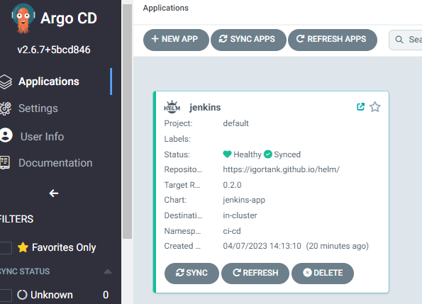
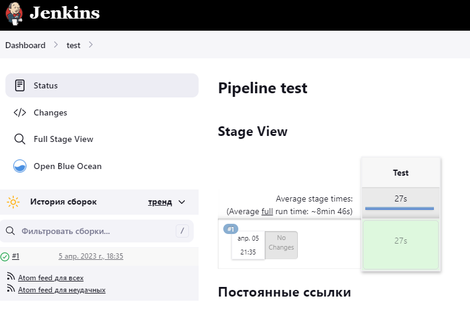

# 14.Kubernetes.ApplicationDeployment

## Create helm package for Jenkins application

### GitHub project for Helm

[GitHub](https://github.com/igortank/helm)

## Additional task: Add as config map several of your Jenkins tasks to the manifests

### Add config.xml to config map

For getting config.xml you need add /config.xml in url job. It should turn out like this http://jenkins.k8s-2.sa/job/test/config.xml

```yaml
---
apiVersion: v1
kind: ConfigMap
metadata:
  namespace: {{ .Values.namespace }}
  name: test
data:
  config.xml: |
    <?xml version='1.1' encoding='UTF-8'?>
        <flow-definition plugin="workflow-job@1289.vd1c337fd5354">
          <actions>
            <org.jenkinsci.plugins.pipeline.modeldefinition.actions.DeclarativeJobAction plugin="pipeline-model-definition@2.2125.vddb_a_44a_d605e"/>
            <org.jenkinsci.plugins.pipeline.modeldefinition.actions.DeclarativeJobPropertyTrackerAction plugin="pipeline-model-definition@2.2125.vddb_a_44a_d605e">
              <jobProperties/>
              <triggers/>
              <parameters/>
              <options/>
            </org.jenkinsci.plugins.pipeline.modeldefinition.actions.DeclarativeJobPropertyTrackerAction>
          </actions>
          <description></description>
          <keepDependencies>false</keepDependencies>
          <properties>
            <com.sonyericsson.rebuild.RebuildSettings plugin="rebuild@1.34">
              <autoRebuild>false</autoRebuild>
              <rebuildDisabled>false</rebuildDisabled>
            </com.sonyericsson.rebuild.RebuildSettings>
          </properties>
          <definition class="org.jenkinsci.plugins.workflow.cps.CpsFlowDefinition" plugin="workflow-cps@3653.v07ea_433c90b_4">
            <script>pipeline {
          agent {
            kubernetes {
                containerTemplate {
                name &apos;curl-test&apos;
                image &apos;pluhin31/wget_curl:latest&apos;
                ttyEnabled true
                command &apos;sleep 180&apos;
                }
          }
          }
          stages {
            stage(&apos;Test&apos;) {
              steps {
                container(&apos;curl-test&apos;) {
                  sh &quot;&quot;&quot;#!/bin/sh
                    curl --version
                        curl https://onliner.by
                        wget -O - https://onliner.by | egrep &quot;https://[0-9a-z]+[.]onliner[.]by&quot; -o | sort -u &gt; tmp.out
                        cat tmp.out
                        curl \$(cat tmp.out) -I | egrep HTTP
                  &quot;&quot;&quot;
                }
              }
            }
          }
        }</script>
            <sandbox>true</sandbox>
          </definition>
          <triggers/>
          <disabled>false</disabled>
        </flow-definition>
```

## Install Jenkins from AgroCD and check Jenkins



