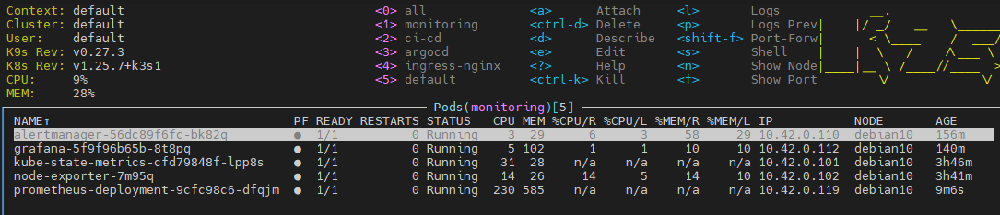
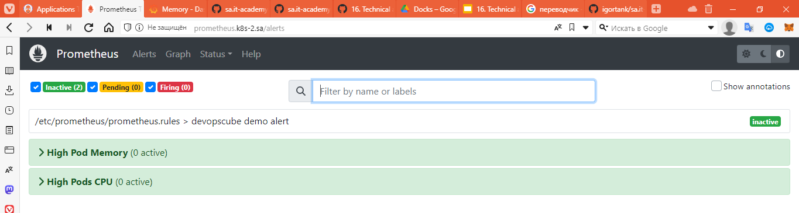
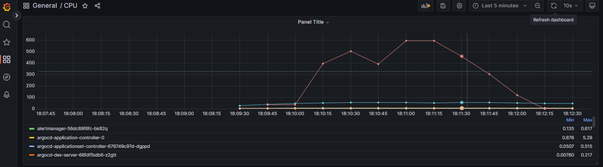
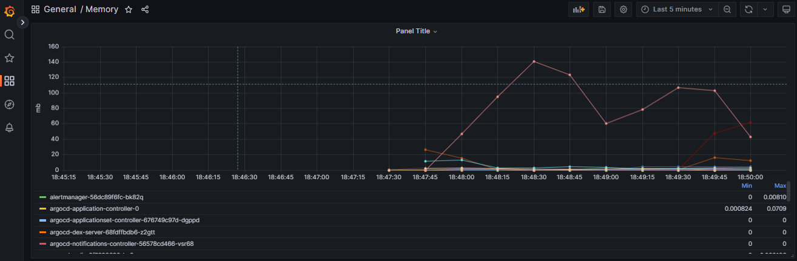
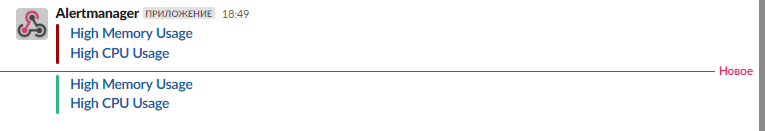

# 16.Monitoring

## Deploy Prometheus + Alert manager + Grafana



## Add alert in Prometheus

```yaml
apiVersion: v1
kind: ConfigMap
metadata:
  name: prometheus-server-conf
  labels:
    name: prometheus-server-conf
  namespace: monitoring
data:
  prometheus.rules: |-
    groups:
    - name: devopscube demo alert
      rules:
      - alert: High Pod Memory
        expr: sum(container_memory_working_set_bytes{container!~"POD|"} / 1024/1024) > 6000
        for: 1m
        labels:
          severity: slack
        annotations:
          summary: High Memory Usage
      - alert: High Pods CPU
        expr: sum(rate(container_cpu_usage_seconds_total[1m]) * 100) > 2000
        for: 1m
        labels:
          severity: slack
        annotations:
          summary: High CPU Usage
```

[Result Prometheus yaml file](prometheus.yaml)

[Alert manager yaml file](alertmanager.yaml)



## Add in Grafana dashboard and start stress test




### Slack notification


