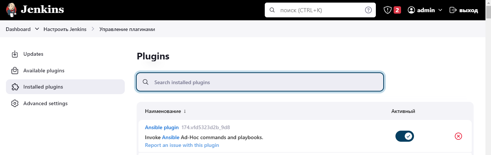
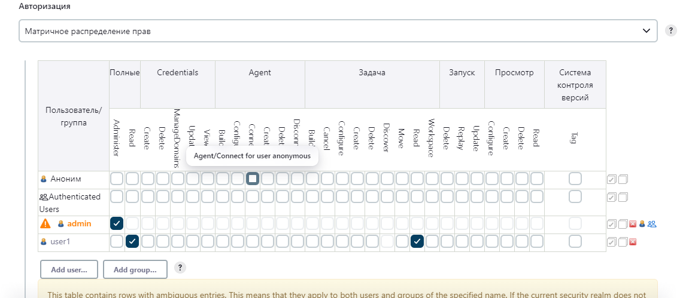
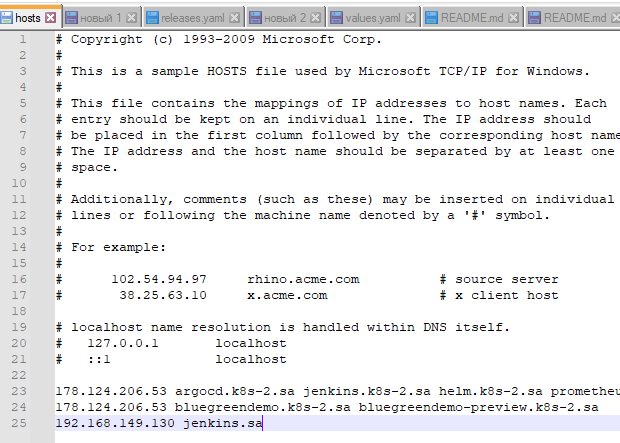
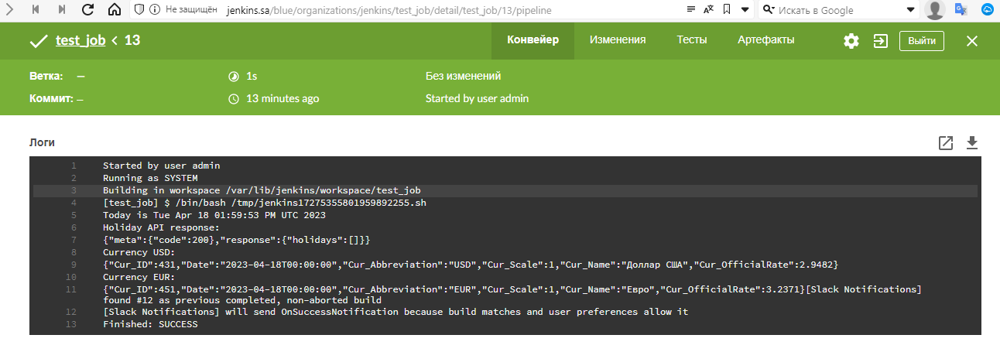
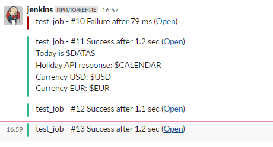

# 19.Jenkins Start

## Install Jenkins

[install](install/script.sh)



### Add restricted user to view Jobs, without any changes inside Jobs and Jenkins settings



### Nginx conf

```conf
server {
    listen 80;
    server_name jenkins.devops.esc.sh;

	location / {
		include /etc/nginx/proxy_params;
		proxy_pass          http://localhost:8080;
		proxy_read_timeout  60s;
        # Fix the "It appears that your reverse proxy set up is broken" error.
        # Make sure the domain name is correct
		proxy_redirect      http://localhost:8080 https://jenkins.devops.esc.sh;
	}
}
```



## Create job to run each day and collect data and send as artefacts to the slack

[config.xml](config.xml)




Artefact file not upload in slack, invalid_auth:
```log
Adding file /var/lib/jenkins/workspace/test_job/result.txt
Slack upload may have failed. Response: {"ok":false,"error":"invalid_auth"}
```