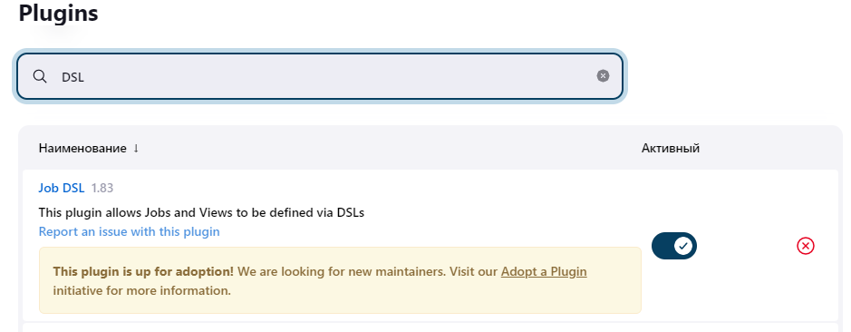
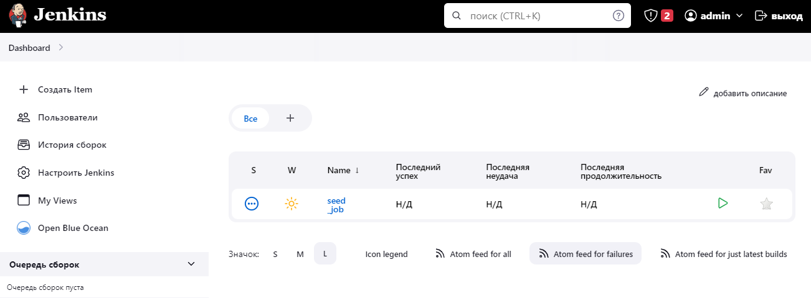
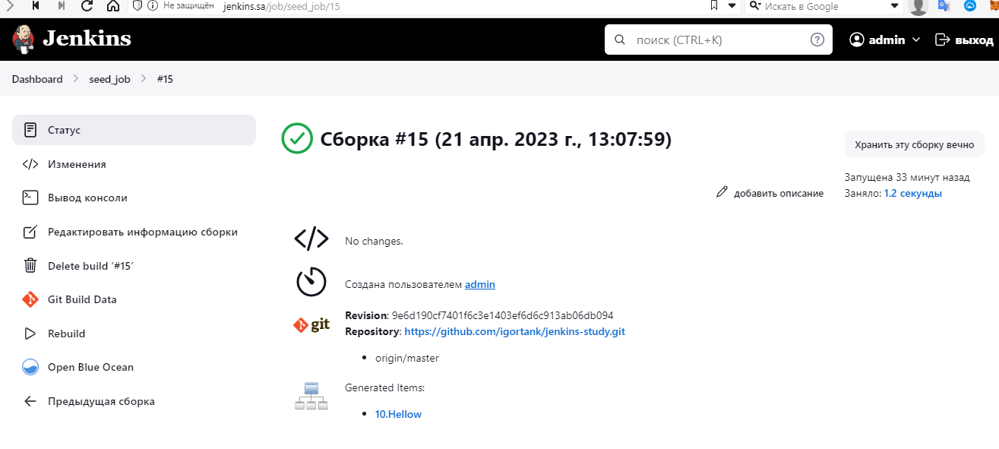
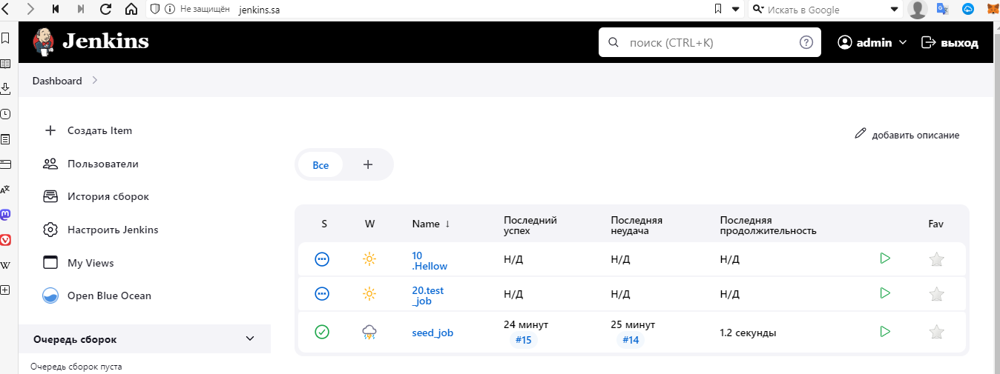

# 20.Jenkins Routine

### Add to your Jenkins job-dsl plugin



### Create repository with jobs from the Jenkins (simple add there folder jobs from Jenkins server)

[GitHub repository](https://github.com/igortank/jenkins-study)

### Included in Jenkins configuration as code file

[casc.yaml](casc.yaml)

#### Job

```
jobs:
  - script: >
      job('seed_job') {
         scm {
           git {
             remote {
               url 'https://github.com/igortank/jenkins-study.git'
             }
             extensions {
               relativeTargetDirectory('jobs')
             }
             branch('master')
           }
         }
         steps {
           shell('''
             rm -rf /var/lib/jenkins/jobs/*0.*
             mv ./jobs/jobs/* /var/lib/jenkins/jobs/
           ''')
           dsl {
             external('./jobs/*.groovy')
           }
         }
      }
```

### Screens Jenkins



