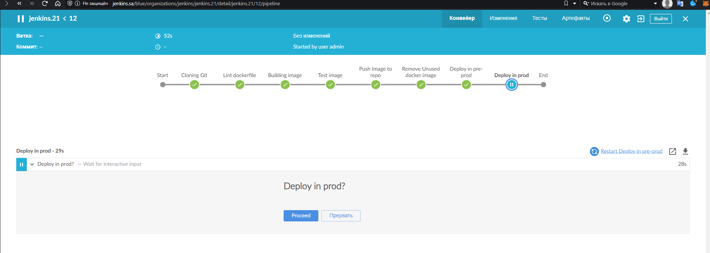
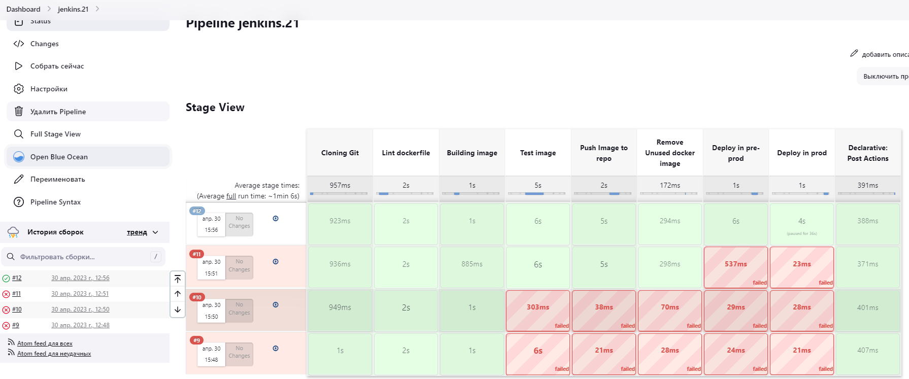
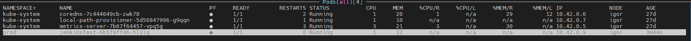
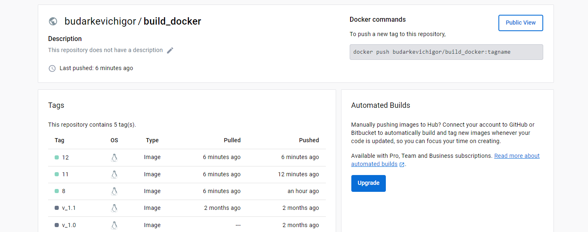
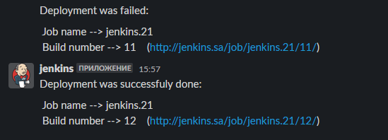

# 21.Jenkins. Docker and Pod

## Task

- Please introduce the following pipeline:
  - Repository content:
    - Dockerfiles with application inside
    - Jenkinsfile with pipeline code
  - Pipeline steps are:
    - Checkout code
    - Validate Dockerfile (https://github.com/hadolint/hadolint)
    - Build image
    - Test image (run and check if webUI of application is accessible)
    - Push image to register (any)
  - Deployment in two namespaces in sequence with manual approve from Jenkins WebUI
    - Deploy in namespace pre-prod
    - Test if deployment done
    - isplay message about status of deployment and approve interface on Jenkins WebUI
    - deploy in namespace prod
    - cleaning: remove deployment from pre-prod
  - Notification

### Repository

[Git Repo](https://github.com/igortank/build-docker)

[DockerHub Repo](https://hub.docker.com/repository/docker/budarkevichigor/build_docker/)

### Jenkins pipeline file

[Jenkinsfile](Jenkinsfile)

### Screens

