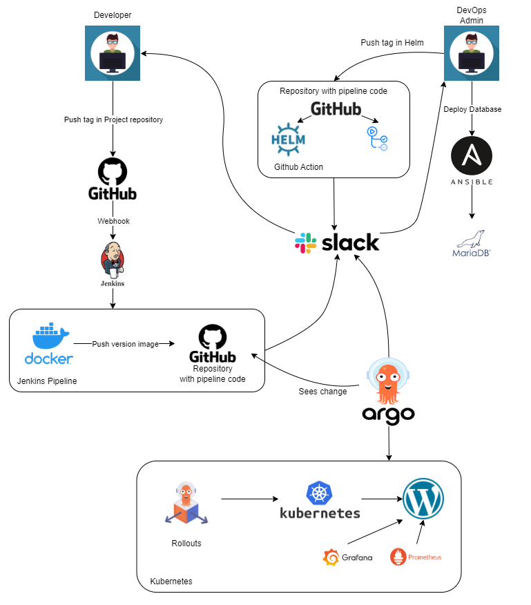

# Final Project

### Project reporter: Igor Budarkevich

### Group number: md-sa2-23-23

---

## Description of applications for deployment

### Application

- **Name of application:** Wordpress
- **Database:** MariaDB
- **Link to repository:**
  - **DockerHub:** [Link here](https://hub.docker.com/repository/docker/budarkevichigor/wordpress/general)
  - **Pipeline repo:** [Link here](https://github.com/igortank/study-project)
  - **Application repo:** [Link here](https://github.com/igortank/wordpress_st)

---

### Technologies which were used in project

- **Orchestration:** Kubernetes
- **Automation tools:** Jenkins, Github Actions, ArgoCD, Argo rollout, Ansible
- **Source Control Management:** GitHub, DockerHub
- **Notification:** Slack
- **Content Managment Systems:** Wordpress
- **Monitoring:** Prometheus, Grafana
- **Virtual machines:**  VMWare Workstation, Virtual Box
- **Other tools:** Docker, Helm , MariaDB, NFS

---

## Pipeline. High Level Design

---

## CI/CD description

**General description:**

- **Application repository:**
By pushing tag with application version Github Webhook was triggered.
- **Jenkins:**
The first pipeline of the clone application repository, save it and tag in memory. Then turns on the second pipeline. The second pipeline cloning repository with pipeline. Then checks Dockerfile with Hadolint. After that, builds image and pushes to DockerHub. At the end of pipeline Jenkins changes version image in ArgoCD Application yaml file, and pushes changed file to repository. Finally sends notification to Slack.

**Deployment:**

- **ArgoCD:**
ArgoCD checks ArgoCD Apllication yaml on GitHub Repo by timer and updates the application if something has changed. In this case, the version docker image. Finally sends notification to Slack.

**Rollback:**

- **Argo rollout:**
We use the Argo rollout canary deployment. Until we promote canary version, you can stay to the stable.
To return to a previous version, we need update image version in ArgoCD Apllication yaml on GitHub Repo.

**Update Helm package:**

- **Github:**
By pushing tag with Helm packege version Github Action was triggered, and check yaml file with kube-linter. Then sends notification to Slack.

---

### Performance testing

|  | **Statistic** | |  |
|---|---|:---:|---|
| 1 | **Action** | **Options** | **Time** |
| 2 | **Pushing changes to git** |  | ~ 5 s |
| 3 | **Jenkins pipeline first** |  | ~ 10 sec |
| 4 | **Jenkins pipeline second** | Build with new image | ~ 1 min |
| 5 | **ArgoCD** | Sync (waiting for git update) | < 3 min |
|  |  | Refresh image | ~ 1 min |
|  |  | Rollback | ~ 1 min |
| - | - | - | - |
|  |  | **TOTAL RESULT** |  |
| 6 | **Total time** |  | ~ 5.5 min |
