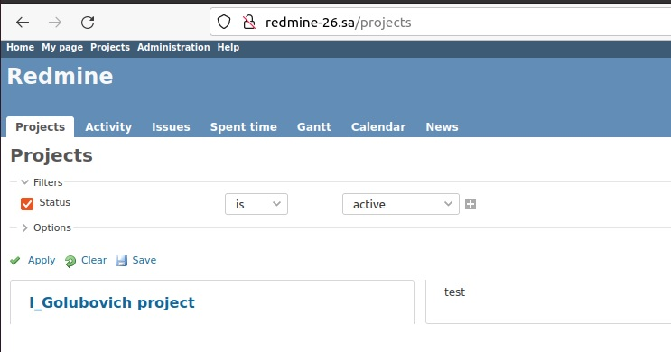

# 08.Ansible.Workshop by Igor Golubovich

## Playbook redmine.yml

```bash
igoz@Ubuntu20:~/Desktop/homework$ ansible-playbook -i inv.yaml redmine.yml -b

PLAY [host11] ****************************************************************************************************

TASK [Gathering Facts] *******************************************************************************************
Вторник 17 мая 2022  15:53:09 +0300 (0:00:00.016)       0:00:00.016 ***********
ok: [host11]

TASK [debug] *****************************************************************************************************
Вторник 17 мая 2022  15:53:12 +0300 (0:00:02.764)       0:00:02.781 ***********
ok: [host11] => {
    "msg": "192.168.201.26"
}

TASK [Install packages] ******************************************************************************************
Вторник 17 мая 2022  15:53:12 +0300 (0:00:00.181)       0:00:02.962 ***********
included: /home/igoz/Desktop/devops_homework/ansible_workshop/homework/install_pack.yml for host11

TASK [Redmine. Install packages] *********************************************************************************
Вторник 17 мая 2022  15:53:12 +0300 (0:00:00.132)       0:00:03.095 ***********
ok: [host11]

TASK [application : Redmine. Clone repository] *******************************************************************
Вторник 17 мая 2022  15:53:14 +0300 (0:00:02.113)       0:00:05.208 ***********
ok: [host11]

TASK [application : Redmine. Change permissions] *****************************************************************
Вторник 17 мая 2022  15:53:15 +0300 (0:00:00.803)       0:00:06.011 ***********
ok: [host11]

TASK [application : Redmine. Change permissions] *****************************************************************
Вторник 17 мая 2022  15:53:16 +0300 (0:00:00.781)       0:00:06.792 ***********
ok: [host11]

TASK [application : Config database] *****************************************************************************
Вторник 17 мая 2022  15:53:16 +0300 (0:00:00.561)       0:00:07.354 ***********
ok: [host11]

TASK [application : Redmine. Setup 01] ***************************************************************************
Вторник 17 мая 2022  15:53:18 +0300 (0:00:01.057)       0:00:08.412 ***********
changed: [host11]

TASK [application : Session store secret generation] *************************************************************
Вторник 17 мая 2022  15:53:22 +0300 (0:00:04.446)       0:00:12.858 ***********
ok: [host11]

TASK [application : Redmine. Setup 02] ***************************************************************************
Вторник 17 мая 2022  15:53:23 +0300 (0:00:00.607)       0:00:13.466 ***********
changed: [host11]

TASK [application : Configuration files for virtualhost] *********************************************************
Вторник 17 мая 2022  15:53:32 +0300 (0:00:09.344)       0:00:22.810 ***********
ok: [host11]

TASK [application : meta] ****************************************************************************************
Вторник 17 мая 2022  15:53:33 +0300 (0:00:01.421)       0:00:24.232 ***********

TASK [sql : MySQL. Create DB] ************************************************************************************
Вторник 17 мая 2022  15:53:33 +0300 (0:00:00.046)       0:00:24.279 ***********
ok: [host11]

TASK [sql : MySQL. Create DB User] *******************************************************************************
Вторник 17 мая 2022  15:53:34 +0300 (0:00:00.930)       0:00:25.210 ***********
ok: [host11]

TASK [Test] ******************************************************************************************************
Вторник 17 мая 2022  15:53:35 +0300 (0:00:00.911)       0:00:26.122 ***********
included: /home/igoz/Desktop/devops_homework/ansible_workshop/homework/test.yml for host11

TASK [Add redmine-26.sa to host file] ****************************************************************************
Вторник 17 мая 2022  15:53:35 +0300 (0:00:00.093)       0:00:26.215 ***********
changed: [host11]

TASK [uri] *******************************************************************************************************
Вторник 17 мая 2022  15:53:36 +0300 (0:00:00.568)       0:00:26.783 ***********
ok: [host11]

TASK [Delete redmine-26.sa to host file] *************************************************************************
Вторник 17 мая 2022  15:53:37 +0300 (0:00:00.833)       0:00:27.616 ***********
changed: [host11]

PLAY RECAP *******************************************************************************************************
host11                     : ok=18   changed=4    unreachable=0    failed=0    skipped=0    rescued=0    ignored=0   

Вторник 17 мая 2022  15:53:38 +0300 (0:00:00.856)       0:00:28.473 ***********
===============================================================================
application : Redmine. Setup 02 --------------------------------------------------------------------------- 9.34s
application : Redmine. Setup 01 --------------------------------------------------------------------------- 4.45s
Gathering Facts ------------------------------------------------------------------------------------------- 2.76s
Redmine. Install packages --------------------------------------------------------------------------------- 2.11s
application : Configuration files for virtualhost --------------------------------------------------------- 1.42s
application : Config database ----------------------------------------------------------------------------- 1.06s
sql : MySQL. Create DB ------------------------------------------------------------------------------------ 0.93s
sql : MySQL. Create DB User ------------------------------------------------------------------------------- 0.91s
Delete redmine-26.sa to host file ------------------------------------------------------------------------- 0.86s
uri ------------------------------------------------------------------------------------------------------- 0.83s
application : Redmine. Clone repository ------------------------------------------------------------------- 0.80s
application : Redmine. Change permissions ----------------------------------------------------------------- 0.78s
application : Session store secret generation ------------------------------------------------------------- 0.61s
Add redmine-26.sa to host file ---------------------------------------------------------------------------- 0.57s
application : Redmine. Change permissions ----------------------------------------------------------------- 0.56s
debug ----------------------------------------------------------------------------------------------------- 0.18s
Install packages ------------------------------------------------------------------------------------------ 0.13s
Test ------------------------------------------------------------------------------------------------------ 0.09s
application : meta ---------------------------------------------------------------------------------------- 0.05s
Playbook run took 0 days, 0 hours, 0 minutes, 28 seconds
```

## Redmine



## Web hook


