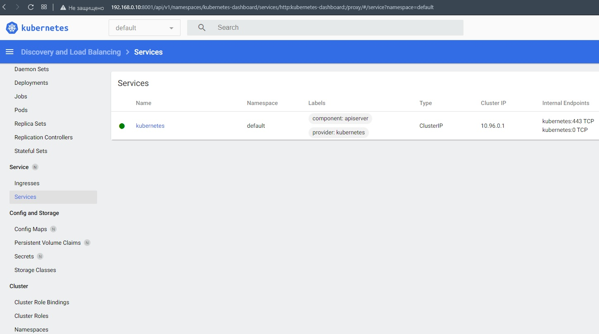

# 10.Kubernetes by Igor Golubovich

## My minikube commands:

```bash
1  minikube version
2  minikube addons list
3  minikube status
4  minikube addons enable ingress
5  minikube start
6  minikube status
7  minikube addons list
8  minikube addons enable ingress
9  minikube addons list
10  minikube stop
11  minikube delete
12  minikube status
23  minikube start --memory 2048 --cpus 2

vagrant@vagrant:~$ minikube addons list
|-----------------------------|----------|--------------|--------------------------------|
|         ADDON NAME          | PROFILE  |    STATUS    |           MAINTAINER           |
|-----------------------------|----------|--------------|--------------------------------|
| ambassador                  | minikube | disabled     | third-party (ambassador)       |
| auto-pause                  | minikube | disabled     | google                         |
| csi-hostpath-driver         | minikube | disabled     | kubernetes                     |
| dashboard                   | minikube | disabled     | kubernetes                     |
| default-storageclass        | minikube | enabled ✅   | kubernetes                     |
| efk                         | minikube | disabled     | third-party (elastic)          |
| freshpod                    | minikube | disabled     | google                         |
| gcp-auth                    | minikube | disabled     | google                         |
| gvisor                      | minikube | disabled     | google                         |
| helm-tiller                 | minikube | disabled     | third-party (helm)             |
| ingress                     | minikube | enabled ✅   | unknown (third-party)          |
| ingress-dns                 | minikube | disabled     | google                         |
| istio                       | minikube | disabled     | third-party (istio)            |
| istio-provisioner           | minikube | disabled     | third-party (istio)            |
| kong                        | minikube | disabled     | third-party (Kong HQ)          |
| kubevirt                    | minikube | disabled     | third-party (kubevirt)         |
| logviewer                   | minikube | disabled     | unknown (third-party)          |
| metallb                     | minikube | disabled     | third-party (metallb)          |
| metrics-server              | minikube | disabled     | kubernetes                     |
| nvidia-driver-installer     | minikube | disabled     | google                         |
| nvidia-gpu-device-plugin    | minikube | disabled     | third-party (nvidia)           |
| olm                         | minikube | disabled     | third-party (operator          |
|                             |          |              | framework)                     |
| pod-security-policy         | minikube | disabled     | unknown (third-party)          |
| portainer                   | minikube | disabled     | portainer.io                   |
| registry                    | minikube | disabled     | google                         |
| registry-aliases            | minikube | disabled     | unknown (third-party)          |
| registry-creds              | minikube | disabled     | third-party (upmc enterprises) |
| storage-provisioner         | minikube | enabled ✅   | google                         |
| storage-provisioner-gluster | minikube | disabled     | unknown (third-party)          |
| volumesnapshots             | minikube | disabled     | kubernetes                     |
|-----------------------------|----------|--------------|--------------------------------|
```

## Dashboard screen:



## IT-ACADEMY environment:

```bash
PLAY RECAP *****************************************************************************************************************
localhost                  : ok=4    changed=0    unreachable=0    failed=0    skipped=0    rescued=0    ignored=0   
node1                      : ok=768  changed=149  unreachable=0    failed=0    skipped=1315 rescued=0    ignored=6   
node2                      : ok=507  changed=94   unreachable=0    failed=0    skipped=772  rescued=0    ignored=2   

Пятница 20 мая 2022  16:20:04 +0300 (0:00:00.077)       0:22:23.604 ***********
===============================================================================
kubernetes/preinstall : Install packages requirements ----------------------------------------------------------------------- 67.10s
download : download_file | Validate mirrors --------------------------------------------------------------------------------- 62.85s
kubernetes/kubeadm : Join to cluster ---------------------------------------------------------------------------------------- 30.85s
download : download_container | Download image if required ------------------------------------------------------------------ 30.15s
download : download_container | Download image if required ------------------------------------------------------------------ 28.71s
download : download_container | Download image if required ------------------------------------------------------------------ 27.90s
download : download_container | Download image if required ------------------------------------------------------------------ 26.39s
kubernetes/control-plane : kubeadm | Initialize first master ---------------------------------------------------------------- 25.43s
bootstrap-os : Assign inventory name to unconfigured hostnames (non-CoreOS, non-Flatcar, Suse and ClearLinux, non-Fedora) --- 21.72s
container-engine/containerd : download_file | Download item ----------------------------------------------------------------- 21.44s
download : download_file | Download item ------------------------------------------------------------------------------------ 18.52s
download : download_file | Download item ------------------------------------------------------------------------------------ 18.39s
download : download_container | Download image if required ------------------------------------------------------------------ 18.34s
download : download_file | Download item ------------------------------------------------------------------------------------ 18.00s
bootstrap-os : Update Apt cache --------------------------------------------------------------------------------------------- 16.39s
container-engine/crictl : download_file | Download item --------------------------------------------------------------------- 15.84s
download : download_container | Download image if required ------------------------------------------------------------------ 15.06s
download : download_container | Download image if required ------------------------------------------------------------------ 14.94s
download : download_container | Download image if required ------------------------------------------------------------------ 13.96s
download : download_container | Download image if required ------------------------------------------------------------------ 13.23s
igoz@Ubuntu20:~/Desktop/devops_homework/k8s/kubespray$
```
