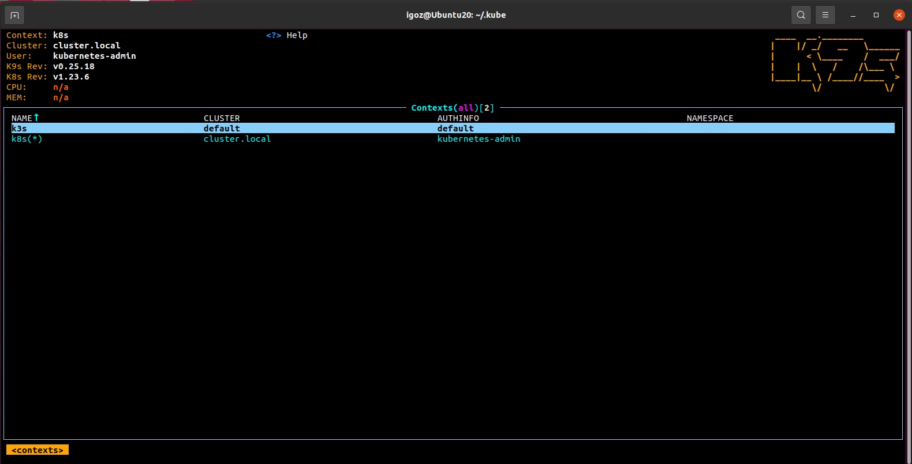
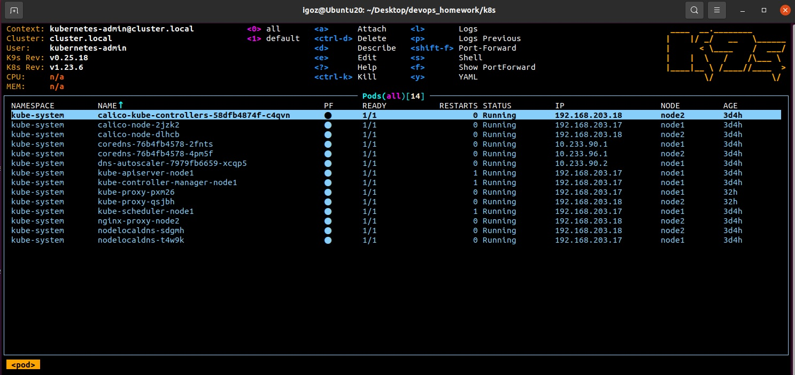

# 11.Kubernetes installation by Igor Golubovich

## k9s screenshots:




## kubectl config use-context:

```bash
igoz@Ubuntu20:~/.kube$ kcgc
CURRENT   NAME   CLUSTER         AUTHINFO           NAMESPACE
          k3s    default         default            
*         k8s    cluster.local   kubernetes-admin 

igoz@Ubuntu20:~$ kcuc k8s

igoz@Ubuntu20:~$ kgno
NAME    STATUS   ROLES                  AGE     VERSION
node1   Ready    control-plane,master   4d17h   v1.23.6
node2   Ready    <none>                 4d17h   v1.23.6

igoz@Ubuntu20:~$ kgpa
NAMESPACE     NAME                                       READY   STATUS    RESTARTS   AGE
kube-system   calico-kube-controllers-58dfb4874f-c4qvn   1/1     Running   0          4d17h
kube-system   calico-node-2jzk2                          1/1     Running   0          4d17h
kube-system   calico-node-dlhcb                          1/1     Running   0          4d17h
kube-system   coredns-76b4fb4578-2fnts                   1/1     Running   0          4d17h
kube-system   coredns-76b4fb4578-4pm5f                   1/1     Running   0          4d17h
kube-system   dns-autoscaler-7979fb6659-xcqp5            1/1     Running   0          4d17h
kube-system   kube-apiserver-node1                       1/1     Running   1          4d17h
kube-system   kube-controller-manager-node1              1/1     Running   1          4d17h
kube-system   kube-proxy-pxm26                           1/1     Running   0          2d21h
kube-system   kube-proxy-qsjbh                           1/1     Running   0          2d21h
kube-system   kube-scheduler-node1                       1/1     Running   1          4d17h
kube-system   nginx-proxy-node2                          1/1     Running   0          4d17h
kube-system   nodelocaldns-sdgmh                         1/1     Running   0          4d17h
kube-system   nodelocaldns-t4w9k                         1/1     Running   0          4d17h

igoz@Ubuntu20:~$ kcuc k3s

igoz@Ubuntu20:~/.kube$ kgno
NAME                                          STATUS   ROLES                  AGE     VERSION
ip-172-31-40-26.eu-north-1.compute.internal   Ready    control-plane,master   2m24s   v1.23.6+k3s1
igoz@Ubuntu20:~/.kube$ kgpa
NAMESPACE     NAME                                      READY   STATUS      RESTARTS   AGE
kube-system   local-path-provisioner-6c79684f77-4vjch   1/1     Running     0          2m31s
kube-system   coredns-d76bd69b-xtdpl                    1/1     Running     0          2m31s
kube-system   helm-install-traefik-crd-gwhg5            0/1     Completed   0          2m31s
kube-system   helm-install-traefik-nmv2q                0/1     Completed   1          2m31s
kube-system   svclb-traefik-4xr9g                       2/2     Running     0          117s
kube-system   metrics-server-7cd5fcb6b7-d2bbh           1/1     Running     0          2m31s
kube-system   traefik-df4ff85d6-9thw5                   1/1     Running     0          117s
```

## kubectl config:

```yaml
apiVersion: v1
clusters:
- cluster:
    certificate-authority-data: *****
    server: https://127.0.0.1:6443
  name: cluster.local
- cluster:
    certificate-authority-data: *****
    server: https://127.0.0.1:6443
  name: default
contexts:
- context:
    cluster: cluster.local
    user: kubernetes-admin
  name: k8s
- context:
    cluster: default
    user: default
  name: k3s
current-context: k8s
kind: Config
preferences: {}
users:
- name: kubernetes-admin
  user:
    client-certificate-data: *****
    client-key-data: *****
- name: default
  user:
    client-certificate-data: *****
    client-key-data: *****
```
