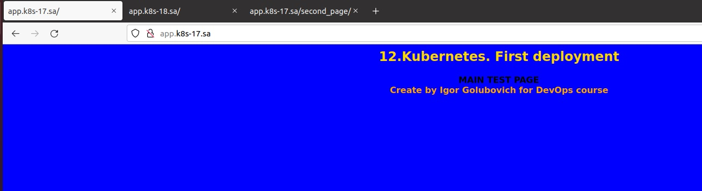
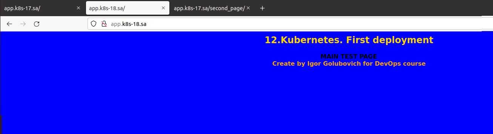
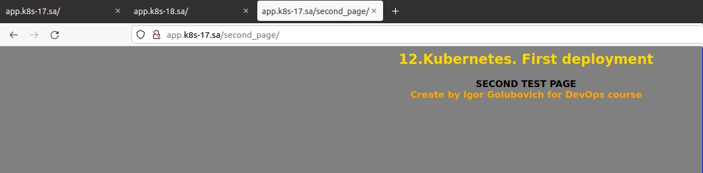

# 12.Kubernetes.First deployment by Igor Golubovich

## screenshots of web pages:





## kubectl report:

```bash
igoz@Ubuntu20:~/12.k8s_deploy$ kubectl get deploy
NAME        READY   UP-TO-DATE   AVAILABLE   AGE
webserver   3/3     3            3           13m

igoz@Ubuntu20:~/12.k8s_deploy$ kubectl get service
NAME                 TYPE        CLUSTER-IP    EXTERNAL-IP   PORT(S)   AGE
kubernetes           ClusterIP   10.233.0.1    <none>        443/TCP   9d
simple-web-service   ClusterIP   10.233.2.93   <none>        80/TCP    13m

igoz@Ubuntu20:~/12.k8s_deploy$ kubectl get pods --all-namespaces
NAMESPACE       NAME                                        READY   STATUS      RESTARTS   AGE
default         webserver-d67bfb9d9-85xp8                   1/1     Running     0          13m
default         webserver-d67bfb9d9-hlvkz                   1/1     Running     0          13m
default         webserver-d67bfb9d9-rl5k7                   1/1     Running     0          13m
ingress-nginx   ingress-nginx-admission-create-fbb5x        0/1     Completed   0          35m
ingress-nginx   ingress-nginx-admission-patch-4b4m7         0/1     Completed   0          35m
ingress-nginx   ingress-nginx-controller-84b85b6b66-svqpc   1/1     Running     0          35m
kube-system     calico-kube-controllers-58dfb4874f-c4qvn    1/1     Running     0          9d
kube-system     calico-node-2jzk2                           1/1     Running     0          9d
kube-system     calico-node-dlhcb                           1/1     Running     0          9d
kube-system     coredns-76b4fb4578-2fnts                    1/1     Running     0          9d
kube-system     coredns-76b4fb4578-4pm5f                    1/1     Running     0          9d
kube-system     dns-autoscaler-7979fb6659-xcqp5             1/1     Running     0          9d
kube-system     kube-apiserver-node1                        1/1     Running     1          9d
kube-system     kube-controller-manager-node1               1/1     Running     1          9d
kube-system     kube-proxy-pxm26                            1/1     Running     0          7d8h
kube-system     kube-proxy-qsjbh                            1/1     Running     0          7d8h
kube-system     kube-scheduler-node1                        1/1     Running     1          9d
kube-system     nginx-proxy-node2                           1/1     Running     0          9d
kube-system     nodelocaldns-sdgmh                          1/1     Running     0          9d
kube-system     nodelocaldns-t4w9k                          1/1     Running     0          9d
```

## k8s manifest:

```yaml
---
apiVersion: apps/v1
kind: Deployment
metadata:
  name: webserver
  labels:
    app: simple-web
spec:
  replicas: 3
  selector:
    matchLabels:
      app: simple-web
  template:
    metadata:
      labels:
        app: simple-web
    spec:
      containers:
      - name: web-server-nginx
        image: nginx
        ports:
        - containerPort: 80
        resources:
          requests:
            cpu: 100m
            memory: 100Mi
          limits:
            cpu: 150m
            memory: 150Mi
        volumeMounts:
        - name: persistent-storage
          mountPath: "/usr/share/nginx/html/"
        - name: test-config-mount
          mountPath: /usr/share/nginx/html/second_page/index.html
          subPath: index.html
      volumes:
      - name: persistent-storage
        persistentVolumeClaim:
          claimName: app01-pv-claim
      - name: test-config-mount
        configMap:
          name: test-config
---
apiVersion: v1
kind: Service
metadata:
  name: simple-web-service
  labels:
    run: simple-web-service
spec:
        #type: LoadBalancer
  ports:
  - port: 80
    protocol: TCP
  selector:
    app: simple-web
---
apiVersion: networking.k8s.io/v1
kind: Ingress
metadata:
  name: ingress-sa
  annotations:
    kubernetes.io/ingress.class: nginx
    nginx.ingress.kubernetes.io/server-alias: "app.k8s-17.sa"
spec:
  rules:
    - host: app.k8s-18.sa
      http:
        paths:
          - path: /
            pathType: Prefix
            backend:
              service:
                name: simple-web-service
                port:
                  number: 80
---
apiVersion: v1
kind: PersistentVolume
metadata:
  name: app01-pv-volume
  labels:
    type: nfs
    name: app-nfs-vol
spec:
  capacity:
    storage: 200Mi
  accessModes:
    - ReadWriteMany
  persistentVolumeReclaimPolicy: Retain
  nfs:
    path: /mnt/IT-Academy/nfs-data/sa2-20-22/Igor_Golubovich/main_page  # Create folder with my initials
    server: 192.168.37.105

---
apiVersion: v1
kind: PersistentVolumeClaim
metadata:
  name: app01-pv-claim
  labels:
    app: simple-web
spec:
  accessModes:
    - ReadWriteMany
  resources:
    requests:
      storage: 200Mi
  selector:
    matchLabels:
      name: app-nfs-vol
      type: nfs
---
apiVersion: v1
kind: ConfigMap
metadata:
  name: test-config
data:
  index.html: |
    <html>
    <body bgcolor="gray">
    <h2><font color="gold"><div><center>12.Kubernetes. First deployment</center></div></font></h2>
    <b><font color="black"><div><center>SECOND TEST PAGE</center></div></font></b>
    <b><font color="orange"><div><center>Create by Igor Golubovich for DevOps course</center></div></font></b>
    </body>
    </html>
```
