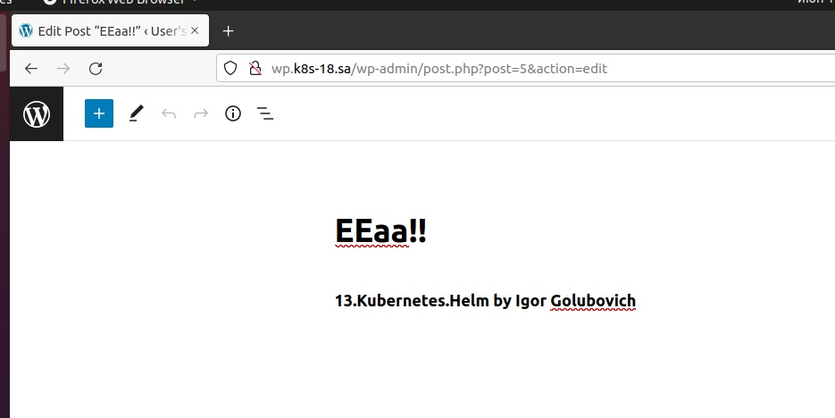
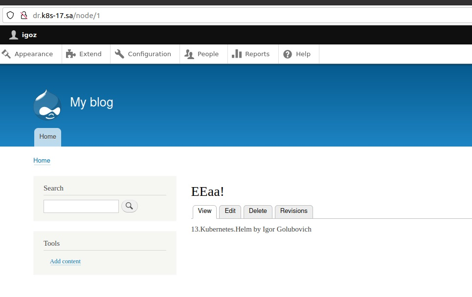

# 13.Kubernetes.Helm by Igor Golubovich

## screenshots of web pages:




## helm report:

```bash
 1989  kubectl get nodes
 1991  helm repo list
 1992  helm repo add bitnami https://charts.bitnami.com/bitnami
 1994  helm repo add nfs-subdir-external-provisioner https://kubernetes-sigs.github.io/nfs-subdir-external-provisioner
 1995  helm repo list
 1996  helm install nfs-subdir-external-provisioner nfs-subdir-external-provisioner/nfs-subdir-external-provisioner --set nfs.server=192.168.37.105 --set nfs.path=/mnt/IT-Academy/nfs-data/sa2-20-22/Igor_Golubovich/
 1997  sudo nano /etc/hosts
 1998  sudo cat /etc/hosts
 2003  helm install bn-wordpress -f wp_values.yaml bitnami/wordpress
 2004  kubectl apply -f wordpress_ingress.yaml
 2006  helm uninstall bn-wordpress
 2007  kubectl delete -f wordpress_ingress.yaml
 2008  kubectl apply -f drupal_ingress.yaml
 2009  helm install bn-drupal -f dp_values.yaml bitnami/drupal
 2010  helm uninstall bn-drupal
 2011  kubectl delete -f drupal_ingress.yaml
```

## *_values.yaml:

```yaml
global:
  storageClass: nfs-client

wordpress/drupalUsername: igoz
wordpress/drupalPassword: igoz
```