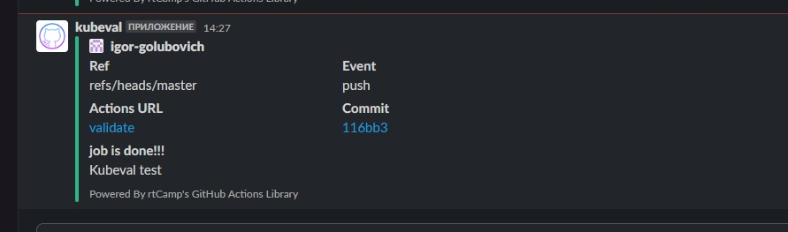

# 17. Testing

## molecule test:
```bash
igoz@Ubuntu20:~/Desktop/devops_homework/17.hw_test/ansible/roles/test$ molecule test
INFO     default scenario test matrix: dependency, lint, cleanup, destroy, syntax, create, prepare, converge, idempotence, side_effect, verify, cleanup, destroy
INFO     Performing prerun...
INFO     Set ANSIBLE_LIBRARY=/home/igoz/.cache/ansible-compat/9f86d0/modules:/home/igoz/.ansible/plugins/modules:/usr/share/ansible/plugins/modules
INFO     Set ANSIBLE_COLLECTIONS_PATH=/home/igoz/.cache/ansible-compat/9f86d0/collections:/home/igoz/.ansible/collections:/usr/share/ansible/collections
INFO     Set ANSIBLE_ROLES_PATH=/home/igoz/.cache/ansible-compat/9f86d0/roles:/home/igoz/.ansible/roles:/usr/share/ansible/roles:/etc/ansible/roles
INFO     Running default > dependency
WARNING  Skipping, missing the requirements file.
WARNING  Skipping, missing the requirements file.
INFO     Running default > lint
INFO     Lint is disabled.
INFO     Running default > cleanup
WARNING  Skipping, cleanup playbook not configured.
INFO     Running default > destroy
INFO     Sanity checks: 'docker'

PLAY [Destroy] *****************************************************************

TASK [Destroy molecule instance(s)] ********************************************
changed: [localhost] => (item=instance1)
changed: [localhost] => (item=instance2)

TASK [Wait for instance(s) deletion to complete] *******************************
ok: [localhost] => (item=instance1)
ok: [localhost] => (item=instance2)

TASK [Delete docker networks(s)] ***********************************************

PLAY RECAP *********************************************************************
localhost                  : ok=2    changed=1    unreachable=0    failed=0    skipped=1    rescued=0    ignored=0

INFO     Running default > syntax

playbook: /home/igoz/Desktop/devops_homework/17.hw_test/ansible/roles/test/molecule/default/converge.yml
INFO     Running default > create

PLAY [Create] ******************************************************************

TASK [Log into a Docker registry] **********************************************
skipping: [localhost] => (item=None) 
skipping: [localhost] => (item=None) 
skipping: [localhost]

TASK [Check presence of custom Dockerfiles] ************************************
ok: [localhost] => (item={'image': 'quay.io/centos/centos:stream8', 'name': 'instance1', 'pre_build_image': True})
ok: [localhost] => (item={'image': 'python:latest', 'name': 'instance2', 'pre_build_image': True})

TASK [Create Dockerfiles from image names] *************************************
skipping: [localhost] => (item={'image': 'quay.io/centos/centos:stream8', 'name': 'instance1', 'pre_build_image': True}) 
skipping: [localhost] => (item={'image': 'python:latest', 'name': 'instance2', 'pre_build_image': True}) 

TASK [Discover local Docker images] ********************************************
ok: [localhost] => (item={'changed': False, 'skipped': True, 'skip_reason': 'Conditional result was False', 'item': {'image': 'quay.io/centos/centos:stream8', 'name': 'instance1', 'pre_build_image': True}, 'ansible_loop_var': 'item', 'i': 0, 'ansible_index_var': 'i'})
ok: [localhost] => (item={'changed': False, 'skipped': True, 'skip_reason': 'Conditional result was False', 'item': {'image': 'python:latest', 'name': 'instance2', 'pre_build_image': True}, 'ansible_loop_var': 'item', 'i': 1, 'ansible_index_var': 'i'})

TASK [Build an Ansible compatible image (new)] *********************************
skipping: [localhost] => (item=molecule_local/quay.io/centos/centos:stream8) 
skipping: [localhost] => (item=molecule_local/python:latest) 

TASK [Create docker network(s)] ************************************************

TASK [Determine the CMD directives] ********************************************
ok: [localhost] => (item={'image': 'quay.io/centos/centos:stream8', 'name': 'instance1', 'pre_build_image': True})
ok: [localhost] => (item={'image': 'python:latest', 'name': 'instance2', 'pre_build_image': True})

TASK [Create molecule instance(s)] *********************************************
changed: [localhost] => (item=instance1)
changed: [localhost] => (item=instance2)

TASK [Wait for instance(s) creation to complete] *******************************
FAILED - RETRYING: [localhost]: Wait for instance(s) creation to complete (300 retries left).
changed: [localhost] => (item={'failed': 0, 'started': 1, 'finished': 0, 'ansible_job_id': '496463904038.8782', 'results_file': '/home/igoz/.ansible_async/496463904038.8782', 'changed': True, 'item': {'image': 'quay.io/centos/centos:stream8', 'name': 'instance1', 'pre_build_image': True}, 'ansible_loop_var': 'item'})
FAILED - RETRYING: [localhost]: Wait for instance(s) creation to complete (300 retries left).
changed: [localhost] => (item={'failed': 0, 'started': 1, 'finished': 0, 'ansible_job_id': '306030952821.8810', 'results_file': '/home/igoz/.ansible_async/306030952821.8810', 'changed': True, 'item': {'image': 'python:latest', 'name': 'instance2', 'pre_build_image': True}, 'ansible_loop_var': 'item'})

PLAY RECAP *********************************************************************
localhost                  : ok=5    changed=2    unreachable=0    failed=0    skipped=4    rescued=0    ignored=0

INFO     Running default > prepare
WARNING  Skipping, prepare playbook not configured.
INFO     Running default > converge

PLAY [Converge] ****************************************************************

TASK [Gathering Facts] *********************************************************
ok: [instance1]
ok: [instance2]

TASK [Include test] ************************************************************

TASK [test : Print OS | Version] ***********************************************
ok: [instance1] => {
    "msg": "OS: CentOS | Version: 8"
}
ok: [instance2] => {
    "msg": "OS: Debian | Version: 11"
}

TASK [test : Print Mount point | capacity | used] ******************************
skipping: [instance1] => (item={'mount': '/etc/resolv.conf', 'device': '/dev/sda5', 'fstype': 'ext4', 'options': 'rw,relatime,errors=remount-ro,bind', 'size_total': 31040933888, 'size_available': 9134039040, 'block_size': 4096, 'block_total': 7578353, 'block_available': 2229990, 'block_used': 5348363, 'inode_total': 1933312, 'inode_available': 1453252, 'inode_used': 480060, 'uuid': 'N/A'})
skipping: [instance1] => (item={'mount': '/etc/hostname', 'device': '/dev/sda5', 'fstype': 'ext4', 'options': 'rw,relatime,errors=remount-ro,bind', 'size_total': 31040933888, 'size_available': 9134039040, 'block_size': 4096, 'block_total': 7578353, 'block_available': 2229990, 'block_used': 5348363, 'inode_total': 1933312, 'inode_available': 1453252, 'inode_used': 480060, 'uuid': 'N/A'})
skipping: [instance1] => (item={'mount': '/etc/hosts', 'device': '/dev/sda5', 'fstype': 'ext4', 'options': 'rw,relatime,errors=remount-ro,bind', 'size_total': 31040933888, 'size_available': 9134039040, 'block_size': 4096, 'block_total': 7578353, 'block_available': 2229990, 'block_used': 5348363, 'inode_total': 1933312, 'inode_available': 1453252, 'inode_used': 480060, 'uuid': 'N/A'})
skipping: [instance1]
skipping: [instance2] => (item={'mount': '/etc/resolv.conf', 'device': '/dev/sda5', 'fstype': 'ext4', 'options': 'rw,relatime,errors=remount-ro,bind', 'size_total': 31040933888, 'size_available': 9134260224, 'block_size': 4096, 'block_total': 7578353, 'block_available': 2230044, 'block_used': 5348309, 'inode_total': 1933312, 'inode_available': 1453254, 'inode_used': 480058, 'uuid': 'N/A'})
skipping: [instance2] => (item={'mount': '/etc/hostname', 'device': '/dev/sda5', 'fstype': 'ext4', 'options': 'rw,relatime,errors=remount-ro,bind', 'size_total': 31040933888, 'size_available': 9134260224, 'block_size': 4096, 'block_total': 7578353, 'block_available': 2230044, 'block_used': 5348309, 'inode_total': 1933312, 'inode_available': 1453254, 'inode_used': 480058, 'uuid': 'N/A'})
skipping: [instance2] => (item={'mount': '/etc/hosts', 'device': '/dev/sda5', 'fstype': 'ext4', 'options': 'rw,relatime,errors=remount-ro,bind', 'size_total': 31040933888, 'size_available': 9134260224, 'block_size': 4096, 'block_total': 7578353, 'block_available': 2230044, 'block_used': 5348309, 'inode_total': 1933312, 'inode_available': 1453254, 'inode_used': 480058, 'uuid': 'N/A'})
skipping: [instance2]

TASK [test : Print RAM capacity | free] ****************************************
ok: [instance1] => {
    "msg": "Total memory: 4927 MB | Free memory: 136 MB"
}
ok: [instance2] => {
    "msg": "Total memory: 4927 MB | Free memory: 127 MB"
}

PLAY RECAP *********************************************************************
instance1                  : ok=3    changed=0    unreachable=0    failed=0    skipped=1    rescued=0    ignored=0
instance2                  : ok=3    changed=0    unreachable=0    failed=0    skipped=1    rescued=0    ignored=0

INFO     Running default > idempotence

PLAY [Converge] ****************************************************************

TASK [Gathering Facts] *********************************************************
ok: [instance2]
ok: [instance1]

TASK [Include test] ************************************************************

TASK [test : Print OS | Version] ***********************************************
ok: [instance1] => {
    "msg": "OS: CentOS | Version: 8"
}
ok: [instance2] => {
    "msg": "OS: Debian | Version: 11"
}

TASK [test : Print Mount point | capacity | used] ******************************
skipping: [instance1] => (item={'mount': '/etc/resolv.conf', 'device': '/dev/sda5', 'fstype': 'ext4', 'options': 'rw,relatime,errors=remount-ro,bind', 'size_total': 31040933888, 'size_available': 9134256128, 'block_size': 4096, 'block_total': 7578353, 'block_available': 2230043, 'block_used': 5348310, 'inode_total': 1933312, 'inode_available': 1453254, 'inode_used': 480058, 'uuid': 'N/A'})
skipping: [instance1] => (item={'mount': '/etc/hostname', 'device': '/dev/sda5', 'fstype': 'ext4', 'options': 'rw,relatime,errors=remount-ro,bind', 'size_total': 31040933888, 'size_available': 9134256128, 'block_size': 4096, 'block_total': 7578353, 'block_available': 2230043, 'block_used': 5348310, 'inode_total': 1933312, 'inode_available': 1453254, 'inode_used': 480058, 'uuid': 'N/A'})
skipping: [instance1] => (item={'mount': '/etc/hosts', 'device': '/dev/sda5', 'fstype': 'ext4', 'options': 'rw,relatime,errors=remount-ro,bind', 'size_total': 31040933888, 'size_available': 9134256128, 'block_size': 4096, 'block_total': 7578353, 'block_available': 2230043, 'block_used': 5348310, 'inode_total': 1933312, 'inode_available': 1453254, 'inode_used': 480058, 'uuid': 'N/A'})
skipping: [instance1]
skipping: [instance2] => (item={'mount': '/etc/resolv.conf', 'device': '/dev/sda5', 'fstype': 'ext4', 'options': 'rw,relatime,errors=remount-ro,bind', 'size_total': 31040933888, 'size_available': 9134256128, 'block_size': 4096, 'block_total': 7578353, 'block_available': 2230043, 'block_used': 5348310, 'inode_total': 1933312, 'inode_available': 1453254, 'inode_used': 480058, 'uuid': 'N/A'})
skipping: [instance2] => (item={'mount': '/etc/hostname', 'device': '/dev/sda5', 'fstype': 'ext4', 'options': 'rw,relatime,errors=remount-ro,bind', 'size_total': 31040933888, 'size_available': 9134256128, 'block_size': 4096, 'block_total': 7578353, 'block_available': 2230043, 'block_used': 5348310, 'inode_total': 1933312, 'inode_available': 1453254, 'inode_used': 480058, 'uuid': 'N/A'})
skipping: [instance2] => (item={'mount': '/etc/hosts', 'device': '/dev/sda5', 'fstype': 'ext4', 'options': 'rw,relatime,errors=remount-ro,bind', 'size_total': 31040933888, 'size_available': 9134256128, 'block_size': 4096, 'block_total': 7578353, 'block_available': 2230043, 'block_used': 5348310, 'inode_total': 1933312, 'inode_available': 1453254, 'inode_used': 480058, 'uuid': 'N/A'})
skipping: [instance2]

TASK [test : Print RAM capacity | free] ****************************************
ok: [instance1] => {
    "msg": "Total memory: 4927 MB | Free memory: 156 MB"
}
ok: [instance2] => {
    "msg": "Total memory: 4927 MB | Free memory: 131 MB"
}

PLAY RECAP *********************************************************************
instance1                  : ok=3    changed=0    unreachable=0    failed=0    skipped=1    rescued=0    ignored=0
instance2                  : ok=3    changed=0    unreachable=0    failed=0    skipped=1    rescued=0    ignored=0

INFO     Idempotence completed successfully.
INFO     Running default > side_effect
WARNING  Skipping, side effect playbook not configured.
INFO     Running default > verify
INFO     Running Ansible Verifier

PLAY [Verify] ******************************************************************

TASK [Example assertion] *******************************************************
ok: [instance1] => {
    "changed": false,
    "msg": "All assertions passed"
}
ok: [instance2] => {
    "changed": false,
    "msg": "All assertions passed"
}

PLAY RECAP *********************************************************************
instance1                  : ok=1    changed=0    unreachable=0    failed=0    skipped=0    rescued=0    ignored=0
instance2                  : ok=1    changed=0    unreachable=0    failed=0    skipped=0    rescued=0    ignored=0

INFO     Verifier completed successfully.
INFO     Running default > cleanup
WARNING  Skipping, cleanup playbook not configured.
INFO     Running default > destroy

PLAY [Destroy] *****************************************************************

TASK [Destroy molecule instance(s)] ********************************************
changed: [localhost] => (item=instance1)
changed: [localhost] => (item=instance2)

TASK [Wait for instance(s) deletion to complete] *******************************
FAILED - RETRYING: [localhost]: Wait for instance(s) deletion to complete (300 retries left).
changed: [localhost] => (item=instance1)
changed: [localhost] => (item=instance2)

TASK [Delete docker networks(s)] ***********************************************

PLAY RECAP *********************************************************************
localhost                  : ok=2    changed=2    unreachable=0    failed=0    skipped=1    rescued=0    ignored=0

INFO     Pruning extra files from scenario ephemeral directory
```

## kubeval test:
```bash
Current runner version: '2.293.0'
Operating System
Virtual Environment
Virtual Environment Provisioner
GITHUB_TOKEN Permissions
Secret source: Actions
Prepare workflow directory
Prepare all required actions
Getting action download info
Download action repository 'actions/checkout@v2' (SHA:7884fcad6b5d53d10323aee724dc68d8b9096a2e)
Download action repository 'instrumenta/kubeval-action@master' (SHA:5915e4adba5adccac07cb156b82e54c3fed74921)
2s
Pull down action image 'garethr/kubeval:latest'
1s
Run actions/checkout@v2
Syncing repository: igor-golubovich/17_gitops_test
Getting Git version info
Temporarily overriding HOME='/home/runner/work/_temp/067e0216-684a-4bf4-a177-fc97871cfda1' before making global git config changes
Adding repository directory to the temporary git global config as a safe directory
/usr/bin/git config --global --add safe.directory /home/runner/work/17_gitops_test/17_gitops_test
Deleting the contents of '/home/runner/work/17_gitops_test/17_gitops_test'
Initializing the repository
Disabling automatic garbage collection
Setting up auth
Fetching the repository
Determining the checkout info
Checking out the ref
/usr/bin/git log -1 --format='%H'
'116bb3774dd2e1dbf8567ff3eaa3a17d8e22e54d'
1s
Run instrumenta/kubeval-action@master
/usr/bin/docker run --name garethrkubevallatest_6d9bb3 --label 72882e --workdir /github/workspace 
--rm -e INPUT_FILES -e INPUT_OUTPUT -e INPUT_VERSION -e INPUT_STRICT -e INPUT_OPENSHIFT 
-e INPUT_IGNORE_MISSING_SCHEMAS -e HOME -e GITHUB_JOB -e GITHUB_REF -e GITHUB_SHA 
-e GITHUB_REPOSITORY -e GITHUB_REPOSITORY_OWNER -e GITHUB_RUN_ID -e GITHUB_RUN_NUMBER 
-e GITHUB_RETENTION_DAYS -e GITHUB_RUN_ATTEMPT -e GITHUB_ACTOR -e GITHUB_WORKFLOW 
-e GITHUB_HEAD_REF -e GITHUB_BASE_REF -e GITHUB_EVENT_NAME -e GITHUB_SERVER_URL 
-e GITHUB_API_URL -e GITHUB_GRAPHQL_URL -e GITHUB_REF_NAME -e GITHUB_REF_PROTECTED 
-e GITHUB_REF_TYPE -e GITHUB_WORKSPACE -e GITHUB_ACTION -e GITHUB_EVENT_PATH 
-e GITHUB_ACTION_REPOSITORY -e GITHUB_ACTION_REF -e GITHUB_PATH -e GITHUB_ENV 
-e GITHUB_STEP_SUMMARY -e RUNNER_OS -e RUNNER_ARCH -e RUNNER_NAME -e RUNNER_TOOL_CACHE 
-e RUNNER_TEMP -e RUNNER_WORKSPACE -e ACTIONS_RUNTIME_URL -e ACTIONS_RUNTIME_TOKEN 
-e ACTIONS_CACHE_URL -e GITHUB_ACTIONS=true -e CI=true -v "/var/run/docker.sock":"/var/run/docker.sock" 
-v "/home/runner/work/_temp/_github_home":"/github/home" -v "/home/runner/work/_temp/_github_workflow":"/github/workflow" 
-v "/home/runner/work/_temp/_runner_file_commands":"/github/file_commands" 
-v "/home/runner/work/17_gitops_test/17_gitops_test":"/github/workspace" 
garethr/kubeval:latest  "-d" "jenkins.yaml" "-o" "stdout" "--strict=true" 
"--kubernetes-version" "master" "--openshift=false" "--ignore-missing-schemas=true"
WARN - Set to ignore missing schemas
PASS - jenkins.yaml contains a valid Namespace (ci-cd-helm)
PASS - jenkins.yaml contains a valid Deployment (ci-cd-helm.jenkins)
PASS - jenkins.yaml contains a valid ConfigMap (ci-cd-helm.basic-security)
PASS - jenkins.yaml contains a valid ConfigMap (ci-cd-helm.jenkins-config)
PASS - jenkins.yaml contains a valid ClusterRoleBinding (ci-cd-helm.jenkins)
WARN - jenkins.yaml containing a Ingress (ci-cd-helm.ingress-jenkins) was not validated against a schema
PASS - jenkins.yaml contains a valid Service (ci-cd-helm.jenkins)
0s
Post job cleanup.
/usr/bin/git version
git version 2.36.1
Temporarily overriding HOME='/home/runner/work/_temp/49e85dec-32e2-4786-8b3a-26e06326f4fe' before making global git config changes
Adding repository directory to the temporary git global config as a safe directory
/usr/bin/git config --global --add safe.directory /home/runner/work/17_gitops_test/17_gitops_test
/usr/bin/git config --local --name-only --get-regexp core\.sshCommand
/usr/bin/git submodule foreach --recursive git config --local --name-only --get-regexp 'core\.sshCommand' && git config --local --unset-all 'core.sshCommand' || :
/usr/bin/git config --local --name-only --get-regexp http\.https\:\/\/github\.com\/\.extraheader
http.https://github.com/.extraheader
/usr/bin/git config --local --unset-all http.https://github.com/.extraheader
/usr/bin/git submodule foreach --recursive git config --local --name-only --get-regexp 'http\.https\:\/\/github\.com\/\.extraheader' && git config --local --unset-all 'http.https://github.com/.extraheader' || :
0s
Cleaning up orphan processes
```

## notification:


