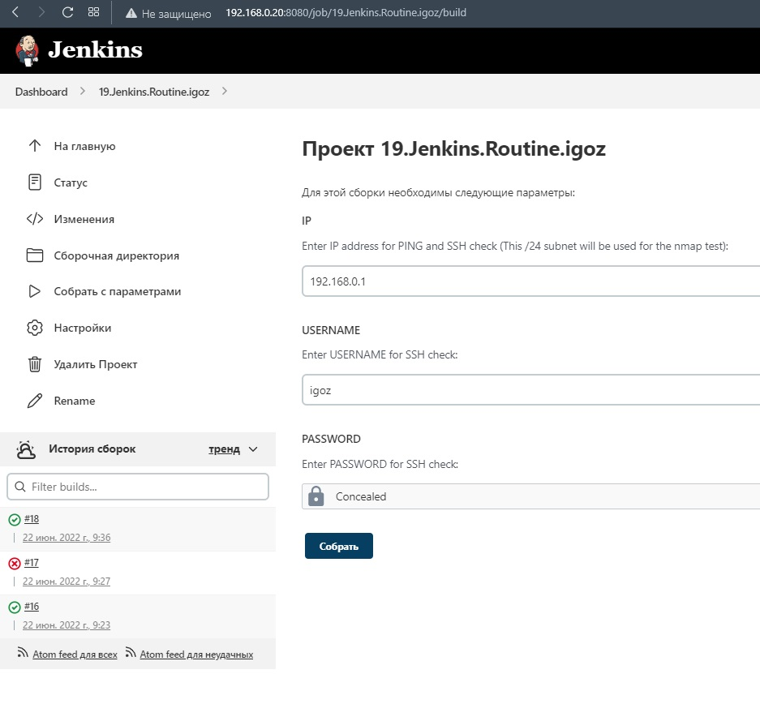

# 19.Jenkins.Routine

## Output of Jenkins task:
```bash
Started by user igoz
Running as SYSTEM
Building in workspace /var/lib/jenkins/workspace/19.Jenkins.Routine.igoz
[19.Jenkins.Routine.igoz] $ /bin/bash /tmp/jenkins17210520125119118603.sh
***Start ping check***
PING 192.168.0.1 (192.168.0.1) 56(84) bytes of data.
64 bytes from 192.168.0.1: icmp_seq=1 ttl=64 time=0.860 ms
64 bytes from 192.168.0.1: icmp_seq=2 ttl=64 time=1.32 ms
64 bytes from 192.168.0.1: icmp_seq=3 ttl=64 time=1.16 ms
64 bytes from 192.168.0.1: icmp_seq=4 ttl=64 time=0.887 ms

--- 192.168.0.1 ping statistics ---
4 packets transmitted, 4 received, 0% packet loss, time 3010ms
rtt min/avg/max/mdev = 0.860/1.058/1.323/0.193 ms
[19.Jenkins.Routine.igoz] $ /bin/bash /tmp/jenkins12395466638475896670.sh
***Start ssh check***
Host is available via ssh
[19.Jenkins.Routine.igoz] $ /bin/bash /tmp/jenkins202964072324550334.sh
***Start installing nmap***
Loaded plugins: fastestmirror
Loading mirror speeds from cached hostfile
 * base: mirror.datacenter.by
 * epel: mirror.datacenter.by
 * extras: mirror.datacenter.by
 * updates: mirror.datacenter.by
Package 2:nmap-6.40-19.el7.x86_64 already installed and latest version
Nothing to do
[19.Jenkins.Routine.igoz] $ /bin/bash /tmp/jenkins16844394718195322606.sh
***Checks all online hosts***

Starting Nmap 6.40 ( http://nmap.org ) at 2022-06-22 09:36 UTC
Nmap scan report for 192.168.0.1
Host is up (0.0082s latency).
Nmap scan report for 192.168.0.20
Host is up (0.00014s latency).
Nmap scan report for 192.168.0.45
Host is up (0.0038s latency).
Nmap scan report for 192.168.0.111
Host is up (0.0062s latency).
Nmap scan report for 192.168.0.113
Host is up (0.080s latency).
Nmap done: 256 IP addresses (5 hosts up) scanned in 2.95 seconds
[19.Jenkins.Routine.igoz] $ /bin/bash /tmp/jenkins15386768974680230454.sh
***Start uninstalling nmap***
Loaded plugins: fastestmirror
Resolving Dependencies
--> Running transaction check
---> Package nmap.x86_64 2:6.40-19.el7 will be erased
--> Finished Dependency Resolution

Dependencies Resolved

================================================================================
 Package        Arch             Version                  Repository       Size
================================================================================
Removing:
 nmap           x86_64           2:6.40-19.el7            @base            16 M

Transaction Summary
================================================================================
Remove  1 Package

Installed size: 16 M
Downloading packages:
Running transaction check
Running transaction test
Transaction test succeeded
Running transaction
  Erasing    : 2:nmap-6.40-19.el7.x86_64                                    1/1 
  Verifying  : 2:nmap-6.40-19.el7.x86_64                                    1/1 

Removed:
  nmap.x86_64 2:6.40-19.el7                                                     

Complete!
[19.Jenkins.Routine.igoz] $ /bin/bash /tmp/jenkins16530679844240945789.sh
***Print list of host***
IP adresses of hosts:
192.168.0.1
192.168.0.20
192.168.0.45
192.168.0.111
192.168.0.113
Finished: SUCCESS
```

## Jenkins Job:
