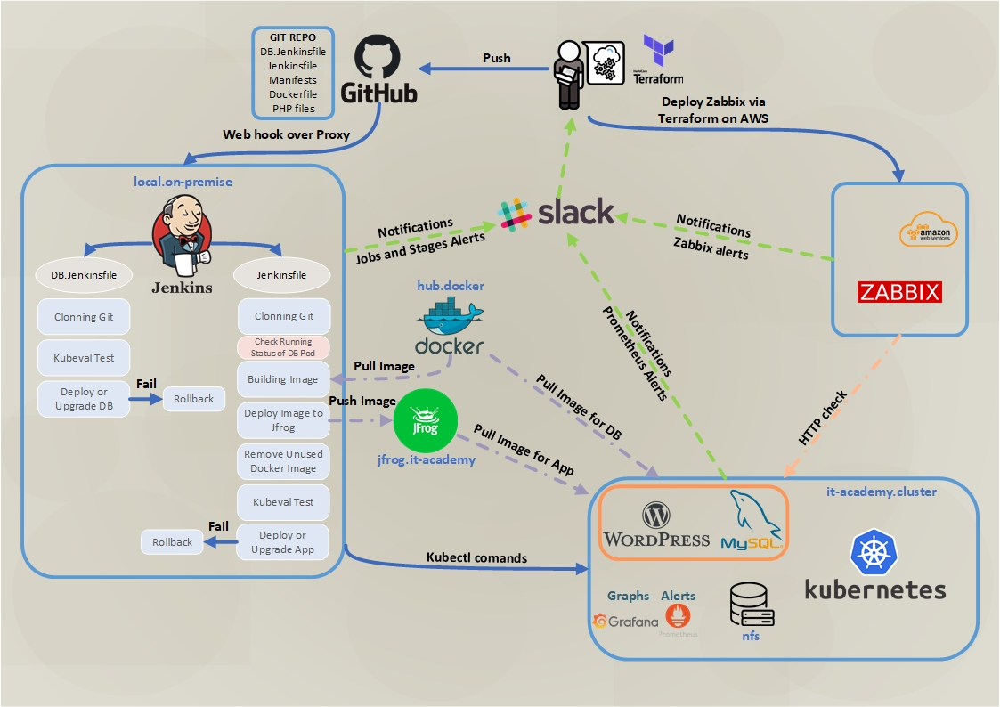

# Project report

### Project's reporter: Igor Golubovich

### Group number: md-sa2-20-22

## Description of application for deployment:
- Application: Wordpress
- Programming language: PHP
- Database: MySQL
- Link on git repository: [Wordpress Official Docker Images](https://github.com/docker-library/wordpress)

## Pipeline. High Level Design:

## Technologies which were used in project:
- Orchestration: Kubernetes.
- Automation tools: GitHub (webhook), Jenkins (on-premise), Terraform.
- Notification: Slack.
- Monitoring: Grafana, Prometheus, Zabbix.
- Other: AWS, Docker, Jfrog.

## Deployment flows short description:

Preparing files for The Wordpress deployment. There are Jenkinsfiles, manifests, dockerfile and php files. Pushing them to GitHub repository. After that GitHub sends webhook to on-premise Jenkins automaticaly. It launches two the pipelines on Jenkins. The first is for the DataBase and the second is for the application. The pipelines clone repository and the job for the application checks "Running" status DB POD on K8s. The application pipeline will continue only when DB POD status is "Running". If DB POD status is not "Running" the deploy or upgrade application won't develop. The app job build image and push it to jfrog.it-academy. Wnen k8s deploys the application it will use new image from the jfrog. The both pipelines perform the Kubeval test for k8s manifests. Two variants of deployments are the Green deployment and the Upgrade for DB and application jobs. The K8s mounts the nfs volumes for both deployments on the server. 

## Rollback flow description and implementation:

If stage "Upgrade" is fail then Jenkins will send commans to k8s for the rollback to previous version of deployment. It implements for the both pipelines. 

## Link

[Project repo](https://github.com/igor-golubovich/final_project)
