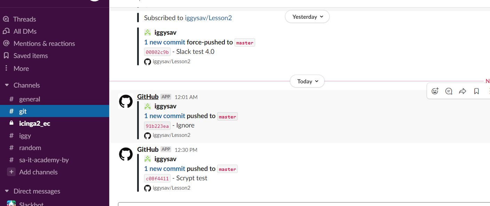

#### Homework 02.Git hosting
***

##### 1. My repository urls

###### Github:

[Github url](https://github.com/iggysav/Lesson2 "Github")


###### Gitlab:

[Gitlab url](https://gitlab.com/iggysav/lesson2 "Gitlab")

###### Bitbucket:

[Bitbucket url](https://bitbucket.org/Iggysav/lesson2/src/master/ "Bitbucket")


##### 2. Script for pushing

###### Script:

```bash
#!/bin/bash
repos=(github gitlab bitbucket)


for i in ${repos[@]}; do
	git push -u $i --all
	echo -e "\033[36;1m**********************$i pushed**********************\033[0m"
	sleep 1
done
```

###### Output:
```bash
user@Iggy-PC MINGW64 /d/sa (master)
$ .work/push.sh
Enumerating objects: 5, done.
Counting objects: 100% (5/5), done.
Delta compression using up to 4 threads
Compressing objects: 100% (3/3), done.
Writing objects: 100% (3/3), 299 bytes | 299.00 KiB/s, done.
Total 3 (delta 2), reused 0 (delta 0), pack-reused 0
remote: Resolving deltas: 100% (2/2), completed with 2 local objects.
To github.com:iggysav/Lesson2.git
   5440820..4803317  master -> master
Branch 'dev' set up to track remote branch 'dev' from 'github'.
Branch 'features/do_one' set up to track remote branch 'features/do_one' from 'github'.
Branch 'hotfix/we_gonna_die' set up to track remote branch 'hotfix/we_gonna_die' from 'github'.
Branch 'master' set up to track remote branch 'master' from 'github'.
**********************github pushed**********************
Enumerating objects: 5, done.
Counting objects: 100% (5/5), done.
Delta compression using up to 4 threads
Compressing objects: 100% (3/3), done.
Writing objects: 100% (3/3), 299 bytes | 299.00 KiB/s, done.
Total 3 (delta 2), reused 0 (delta 0), pack-reused 0
To gitlab.com:iggysav/lesson2.git
   5440820..4803317  master -> master
Branch 'dev' set up to track remote branch 'dev' from 'gitlab'.
Branch 'features/do_one' set up to track remote branch 'features/do_one' from 'gitlab'.
Branch 'hotfix/we_gonna_die' set up to track remote branch 'hotfix/we_gonna_die' from 'gitlab'.
Branch 'master' set up to track remote branch 'master' from 'gitlab'.
**********************gitlab pushed**********************
Enumerating objects: 5, done.
Counting objects: 100% (5/5), done.
Delta compression using up to 4 threads
Compressing objects: 100% (3/3), done.
Writing objects: 100% (3/3), 299 bytes | 299.00 KiB/s, done.
Total 3 (delta 2), reused 0 (delta 0), pack-reused 0
To bitbucket.org:Iggysav/lesson2.git
   5440820..4803317  master -> master
Branch 'dev' set up to track remote branch 'dev' from 'bitbucket'.
Branch 'features/do_one' set up to track remote branch 'features/do_one' from 'bitbucket'.
Branch 'hotfix/we_gonna_die' set up to track remote branch 'hotfix/we_gonna_die' from 'bitbucket'.
Branch 'master' set up to track remote branch 'master' from 'bitbucket'.
**********************bitbucket pushed**********************

```

##### 2. Slack integration

