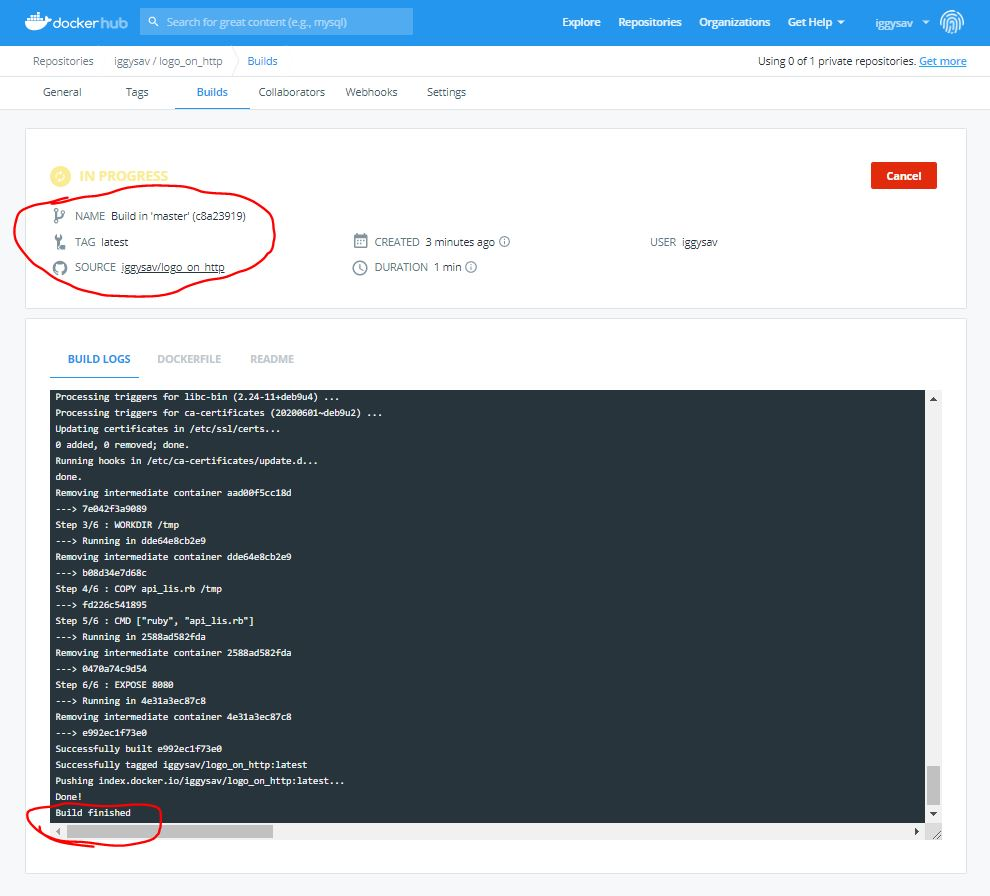
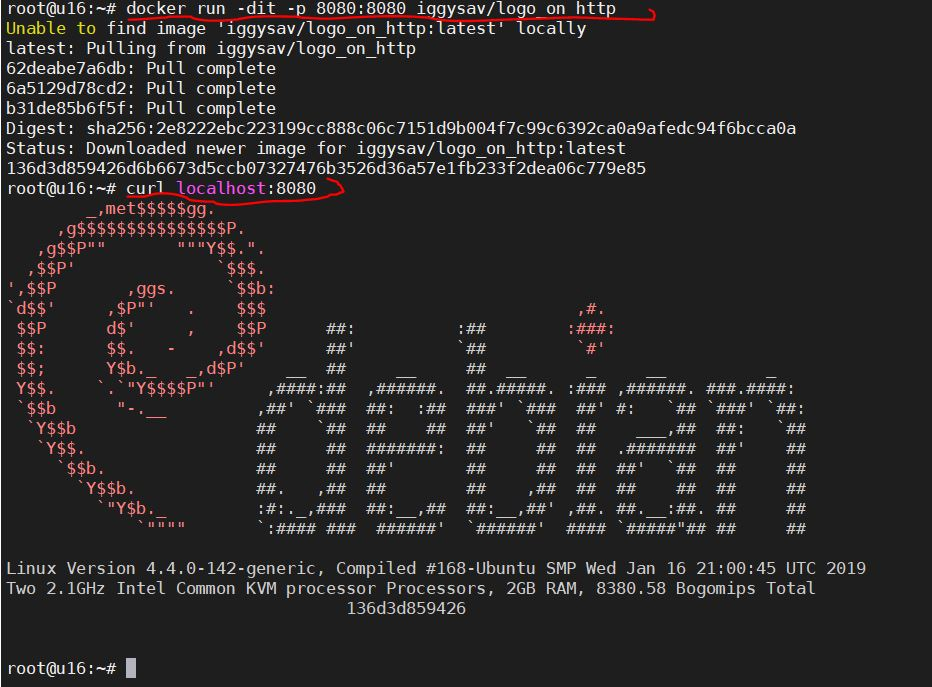

#### Homework 05.Docker
***

##### 1. My url to docker repository in docker hub.

[Docker Hub](https://hub.docker.com/repository/docker/iggysav/logo_on_http "logo_on_http")


##### 2. Dockerfile

```
FROM debian:stretch-slim
RUN apt update \
    && apt install -y ruby linuxlogo
WORKDIR /tmp
COPY api_lis.rb /tmp
CMD ["ruby", "api_lis.rb"]
EXPOSE 8080
```

###### 3. Ruby_script API listner:
```
require 'socket'

port_to_listen_to = 8080

puts "starting to listen to: #{port_to_listen_to}"
server = TCPServer.open(port_to_listen_to)
loop {
  client = server.accept

  puts 'receiving data ' + Time.now.ctime
  puts '--------------------------------------------------------------------------------'
  
  while (a = client.gets) != "\r\n" do
    puts a
  end

  puts '--------------------------------------------------------------------------------'


  client.puts "HTTP/1.1 200 Success"
  client.puts ""
  client.puts `linuxlogo`
  client.close
}
```

##### 4.Logs

###### Docker-Git:



###### Test from CLI:



