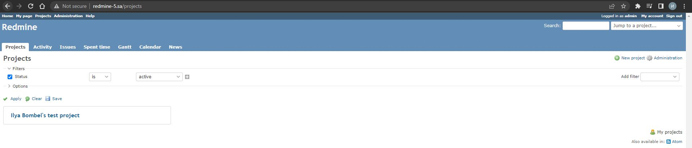

# 08.Ansible.workshop homework
## To do:
* Complete deployment of workshop application
* Split deployment into two independent roles:
- _MySQL deployment/upgrade_
- _Application deployment/upgrade_
* All pre and post task you can put into playbook directly (see structure example below)
* Create any project with initials in application
* Create printscreen of the project in application
* Add this printscreen and ansible project

### My project printscreen


### Playbook

```bash
ansible-playbook -i inventory.yaml redmine.yaml

PLAY [redmine] ****************************************************************************************************************************

TASK [Gathering Facts] ********************************************************************************************************************
Tuesday 17 May 2022  17:15:30 +0000 (0:00:00.022)       0:00:00.022 ***********
ok: [redmine_5]

TASK [debug] ******************************************************************************************************************************
Tuesday 17 May 2022  17:15:32 +0000 (0:00:02.379)       0:00:02.402 ***********
ok: [redmine_5] => {
    "msg": "192.168.201.5"
}

TASK [redmine : Redmine. Install packages] ************************************************************************************************
Tuesday 17 May 2022  17:15:32 +0000 (0:00:00.062)       0:00:02.464 ***********
ok: [redmine_5]

TASK [redmine : Redmine. Clone repository] ************************************************************************************************
Tuesday 17 May 2022  17:15:34 +0000 (0:00:01.994)       0:00:04.458 ***********
ok: [redmine_5]

TASK [redmine : Redmine. Change permissions] **********************************************************************************************
Tuesday 17 May 2022  17:15:35 +0000 (0:00:00.816)       0:00:05.275 ***********
ok: [redmine_5]

TASK [redmine : Redmine. Change permissions] **********************************************************************************************
Tuesday 17 May 2022  17:15:36 +0000 (0:00:00.793)       0:00:06.069 ***********
ok: [redmine_5]

TASK [redmine : Config database] **********************************************************************************************************
Tuesday 17 May 2022  17:15:36 +0000 (0:00:00.636)       0:00:06.705 ***********
ok: [redmine_5]

TASK [redmine : Redmine. Setup 01] ********************************************************************************************************
Tuesday 17 May 2022  17:15:38 +0000 (0:00:01.145)       0:00:07.851 ***********
changed: [redmine_5]

TASK [redmine : Session store secret generation] ******************************************************************************************
Tuesday 17 May 2022  17:15:42 +0000 (0:00:04.669)       0:00:12.520 ***********
ok: [redmine_5]

TASK [redmine : Redmine. Setup 02] ********************************************************************************************************
Tuesday 17 May 2022  17:15:43 +0000 (0:00:00.630)       0:00:13.151 ***********
changed: [redmine_5]

TASK [redmine : Configuration files for virtualhost] **************************************************************************************
Tuesday 17 May 2022  17:15:53 +0000 (0:00:10.011)       0:00:23.163 ***********
ok: [redmine_5]

TASK [redmine : meta] *********************************************************************************************************************
Tuesday 17 May 2022  17:15:54 +0000 (0:00:01.084)       0:00:24.247 ***********

TASK [mysql : MySQL.Install MYSQL] ********************************************************************************************************
Tuesday 17 May 2022  17:15:54 +0000 (0:00:00.048)       0:00:24.296 ***********
ok: [redmine_5]

TASK [mysql : MySQL.Create DB] ************************************************************************************************************
Tuesday 17 May 2022  17:15:56 +0000 (0:00:01.882)       0:00:26.178 ***********
ok: [redmine_5]

TASK [mysql : MySQL.Create DB User] *******************************************************************************************************
Tuesday 17 May 2022  17:15:57 +0000 (0:00:00.802)       0:00:26.981 ***********
ok: [redmine_5]

TASK [add redmine-5.sa to host file] ******************************************************************************************************
Tuesday 17 May 2022  17:15:58 +0000 (0:00:00.819)       0:00:27.800 ***********
changed: [redmine_5]

TASK [uri] ********************************************************************************************************************************
Tuesday 17 May 2022  17:15:58 +0000 (0:00:00.628)       0:00:28.429 ***********
ok: [redmine_5]

TASK [lineinfile] *************************************************************************************************************************
Tuesday 17 May 2022  17:15:59 +0000 (0:00:00.902)       0:00:29.332 ***********
changed: [redmine_5]

PLAY RECAP ********************************************************************************************************************************
redmine_5                  : ok=17   changed=4    unreachable=0    failed=0    skipped=0    rescued=0    ignored=0

Tuesday 17 May 2022  17:16:00 +0000 (0:00:00.792)       0:00:30.124 ***********
===============================================================================
redmine : Redmine. Setup 02 ------------------------------------------------------------------------------------------------------- 10.01s
redmine : Redmine. Setup 01 -------------------------------------------------------------------------------------------------------- 4.67s
Gathering Facts -------------------------------------------------------------------------------------------------------------------- 2.38s
redmine : Redmine. Install packages ------------------------------------------------------------------------------------------------ 1.99s
mysql : MySQL.Install MYSQL -------------------------------------------------------------------------------------------------------- 1.88s
redmine : Config database ---------------------------------------------------------------------------------------------------------- 1.15s
redmine : Configuration files for virtualhost -------------------------------------------------------------------------------------- 1.08s
uri -------------------------------------------------------------------------------------------------------------------------------- 0.90s
mysql : MySQL.Create DB User ------------------------------------------------------------------------------------------------------- 0.82s
redmine : Redmine. Clone repository ------------------------------------------------------------------------------------------------ 0.82s
mysql : MySQL.Create DB ------------------------------------------------------------------------------------------------------------ 0.80s
redmine : Redmine. Change permissions ---------------------------------------------------------------------------------------------- 0.79s
lineinfile ------------------------------------------------------------------------------------------------------------------------- 0.79s
redmine : Redmine. Change permissions ---------------------------------------------------------------------------------------------- 0.64s
redmine : Session store secret generation ------------------------------------------------------------------------------------------ 0.63s
add redmine-5.sa to host file ------------------------------------------------------------------------------------------------------ 0.63s
debug ------------------------------------------------------------------------------------------------------------------------------ 0.06s
redmine : meta --------------------------------------------------------------------------------------------------------------------- 0.05s
Playbook run took 0 days, 0 hours, 0 minutes, 30 seconds
```
