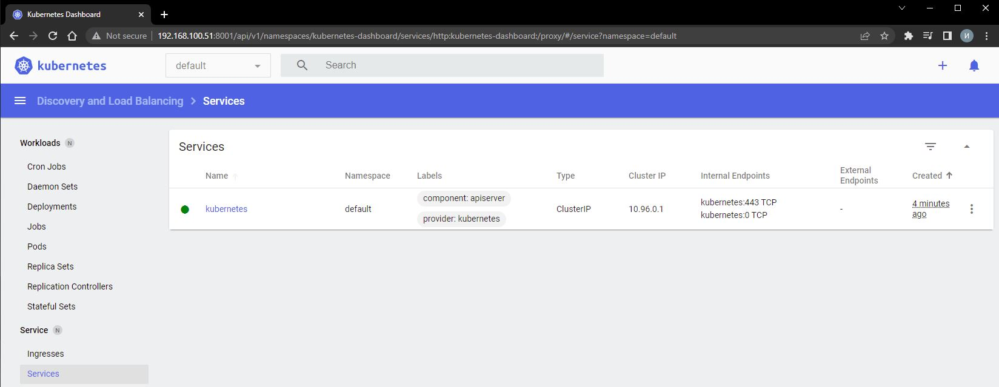

# 10.Kubernetes homework

### Minikube commands (local install)
#### Minikube dashboard and enabling ingress plugin:
```
~$ minikube version
minikube version: v1.25.2
~$ minikube addons enable ingress
  - Using image k8s.gcr.io/ingress-nginx/kube-webhook-certgen:v1.1.1
  - Using image k8s.gcr.io/ingress-nginx/kube-webhook-certgen:v1.1.1
  - Using image k8s.gcr.io/ingress-nginx/controller:v1.1.1
* Verifying ingress addon...
* The 'ingress' addon is enabled
:~$ minikube addons list
|-----------------------------|----------|--------------|--------------------------------|
|         ADDON NAME          | PROFILE  |    STATUS    |           MAINTAINER           |
|-----------------------------|----------|--------------|--------------------------------|
| ambassador                  | minikube | disabled     | third-party (ambassador)       |
| auto-pause                  | minikube | disabled     | google                         |
| csi-hostpath-driver         | minikube | disabled     | kubernetes                     |
| dashboard                   | minikube | disabled     | kubernetes                     |
| default-storageclass        | minikube | enabled ✅   | kubernetes                     |
| efk                         | minikube | disabled     | third-party (elastic)          |
| freshpod                    | minikube | disabled     | google                         |
| gcp-auth                    | minikube | disabled     | google                         |
| gvisor                      | minikube | disabled     | google                         |
| helm-tiller                 | minikube | disabled     | third-party (helm)             |
| ingress                     | minikube | enabled ✅   | unknown (third-party)          |
| ingress-dns                 | minikube | disabled     | google                         |
| istio                       | minikube | disabled     | third-party (istio)            |
| istio-provisioner           | minikube | disabled     | third-party (istio)            |
| kong                        | minikube | disabled     | third-party (Kong HQ)          |
| kubevirt                    | minikube | disabled     | third-party (kubevirt)         |
| logviewer                   | minikube | disabled     | unknown (third-party)          |
| metallb                     | minikube | disabled     | third-party (metallb)          |
| metrics-server              | minikube | disabled     | kubernetes                     |
| nvidia-driver-installer     | minikube | disabled     | google                         |
| nvidia-gpu-device-plugin    | minikube | disabled     | third-party (nvidia)           |
| olm                         | minikube | disabled     | third-party (operator          |
|                             |          |              | framework)                     |
| pod-security-policy         | minikube | disabled     | unknown (third-party)          |
| portainer                   | minikube | disabled     | portainer.io                   |
| registry                    | minikube | disabled     | google                         |
| registry-aliases            | minikube | disabled     | unknown (third-party)          |
| registry-creds              | minikube | disabled     | third-party (upmc enterprises) |
| storage-provisioner         | minikube | enabled ✅   | google                         |
| storage-provisioner-gluster | minikube | disabled     | unknown (third-party)          |
| volumesnapshots             | minikube | disabled     | kubernetes                     |
|-----------------------------|----------|--------------|--------------------------------|
```
#### Run minikube with different options (RAM/CPU)
```
~$ minikube start --memory 2048 --cpus 2
```

### Dashboard screenshot:


### K8s deployment on IT-Academy environment:
```
PLAY RECAP *********************************************************************************************************************************************************
localhost                  : ok=4    changed=0    unreachable=0    failed=0    skipped=0    rescued=0    ignored=0
node1                      : ok=756  changed=87   unreachable=0    failed=0    skipped=1313 rescued=0    ignored=5
node2                      : ok=501  changed=50   unreachable=0    failed=0    skipped=764  rescued=0    ignored=2

Sunday 22 May 2022  21:38:34 +0000 (0:00:00.072)       0:32:52.261 ************
===============================================================================
download : download_file | Validate mirrors ---------------------------------------------------------------------------------------------------------------- 72.39s
kubernetes-apps/ansible : Kubernetes Apps | Lay Down CoreDNS templates ------------------------------------------------------------------------------------- 59.91s
kubernetes-apps/ansible : Kubernetes Apps | Start Resources ------------------------------------------------------------------------------------------------ 41.01s
network_plugin/calico : Calico | Create calico manifests --------------------------------------------------------------------------------------------------- 33.06s
kubernetes/control-plane : kubeadm | Initialize first master ----------------------------------------------------------------------------------------------- 29.26s
policy_controller/calico : Create calico-kube-controllers manifests ---------------------------------------------------------------------------------------- 22.10s
network_plugin/calico : Start Calico resources ------------------------------------------------------------------------------------------------------------- 19.98s
container-engine/containerd : containerd | Remove orphaned binary ------------------------------------------------------------------------------------------ 19.94s
kubernetes/preinstall : Ensure kube-bench parameters are set ----------------------------------------------------------------------------------------------- 17.97s
kubernetes/preinstall : Remove search/domain/nameserver options after block -------------------------------------------------------------------------------- 17.11s
kubernetes-apps/ansible : Kubernetes Apps | Lay Down nodelocaldns Template --------------------------------------------------------------------------------- 16.61s
kubernetes/kubeadm : Join to cluster ----------------------------------------------------------------------------------------------------------------------- 15.20s
kubernetes/preinstall : Create kubernetes directories ------------------------------------------------------------------------------------------------------ 15.17s
etcd : Check certs | Register ca and etcd admin/member certs on etcd hosts --------------------------------------------------------------------------------- 14.95s
etcd : Check certs | Register ca and etcd admin/member certs on etcd hosts --------------------------------------------------------------------------------- 14.72s
policy_controller/calico : Start of Calico kube controllers ------------------------------------------------------------------------------------------------ 12.69s
kubernetes/node : Modprobe Kernel Module for IPVS ---------------------------------------------------------------------------------------------------------- 12.51s
kubernetes/preinstall : Remove search/domain/nameserver options after block -------------------------------------------------------------------------------- 12.41s
container-engine/crictl : download_file | Validate mirrors ------------------------------------------------------------------------------------------------- 12.29s
kubernetes/control-plane : Update server field in component kubeconfigs ------------------------------------------------------------------------------------ 12.27s
```