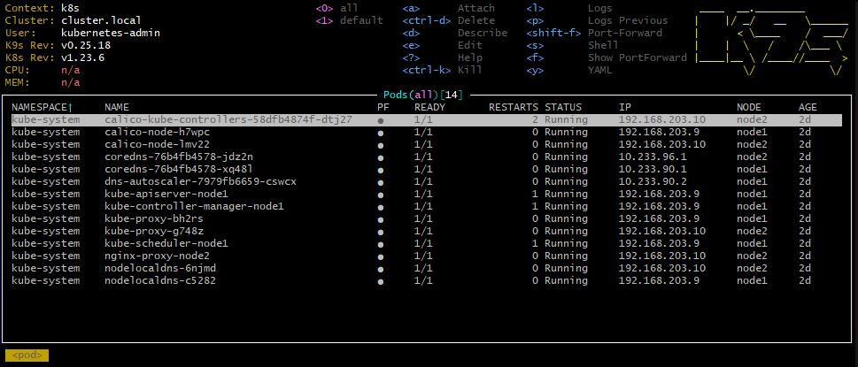

# 11.Kubernetes.Installation homework
### To do:
* Setup kubectl for local run (add aliases of commands)
* Install k9s to maintain cluster
* Make print-screen of k9s with pods in kube-system namespace
* Finish deployment k3s
* Config from k3s add to existing config

#### Print-screen of k9s with pods in kube-system namespace:


#### kubectl config use-context:
```
~$ kcgc
CURRENT   NAME   CLUSTER         AUTHINFO           NAMESPACE
          k3s    default         default
*         k8s    cluster.local   kubernetes-admin
~$ kcuc k8s
Switched to context "k8s".
~$ kgno
NAME    STATUS   ROLES                  AGE     VERSION
node1   Ready    control-plane,master   2d15h   v1.23.6
node2   Ready    <none>                 2d15h   v1.23.6
~$ kgpa
NAMESPACE     NAME                                       READY   STATUS    RESTARTS        AGE
kube-system   calico-kube-controllers-58dfb4874f-dtj27   1/1     Running   2 (2d15h ago)   2d15h
kube-system   calico-node-h7wpc                          1/1     Running   0               2d15h
kube-system   calico-node-lmv22                          1/1     Running   0               2d15h
kube-system   coredns-76b4fb4578-jdz2n                   1/1     Running   0               2d15h
kube-system   coredns-76b4fb4578-xq48l                   1/1     Running   0               2d15h
kube-system   dns-autoscaler-7979fb6659-cswcx            1/1     Running   0               2d15h
kube-system   kube-apiserver-node1                       1/1     Running   1               2d15h
kube-system   kube-controller-manager-node1              1/1     Running   1               2d15h
kube-system   kube-proxy-bh2rs                           1/1     Running   0               2d15h
kube-system   kube-proxy-g748z                           1/1     Running   0               2d15h
kube-system   kube-scheduler-node1                       1/1     Running   1               2d15h
kube-system   nginx-proxy-node2                          1/1     Running   0               2d15h
kube-system   nodelocaldns-6njmd                         1/1     Running   0               2d15h
kube-system   nodelocaldns-c5282                         1/1     Running   0               2d15h
```
### kubectl config:
```
apiVersion: v1
clusters:
- cluster:
    certificate-authority-data: DATA+OMITTED
    server: https://127.0.0.1:6443
  name: cluster.local
- cluster:
    certificate-authority-data: DATA+OMITTED
    server: https://127.0.0.1:6443
  name: default
contexts:
- context:
    cluster: default
    user: default
  name: k3s
- context:
    cluster: cluster.local
    user: kubernetes-admin
  name: k8s
current-context: k8s
kind: Config
preferences: {}
users:
- name: default
  user:
    client-certificate-data: REDACTED
    client-key-data: REDACTED
- name: kubernetes-admin
  user:
    client-certificate-data: REDACTED
    client-key-data: REDACTED
```

#### To merge two config files:
```bash
# Make a copy of your existing config 
$ cp ~/.kube/config ~/.kube/config.bak 
# Merge the two config files together into a new config file 
$ KUBECONFIG=~/.kube/config:/path/to/second/config kubectl config view --flatten > /tmp/config 
# Replace your old config with the new merged config 
$ mv /tmp/config ~/.kube/config 
# (optional) Delete the backup once you confirm everything worked ok 
$ rm ~/.kube/config.bak

# Same in one-line command
$ cp ~/.kube/config ~/.kube/config.bak && KUBECONFIG=~/.kube/config:/path/to/new/config kubectl config view --flatten > /tmp/config && mv /tmp/config ~/.kube/config
```

[Source to kubctl aliases](https://github.com/ohmyzsh/ohmyzsh/blob/master/plugins/kubectl/kubectl.plugin.zsh)