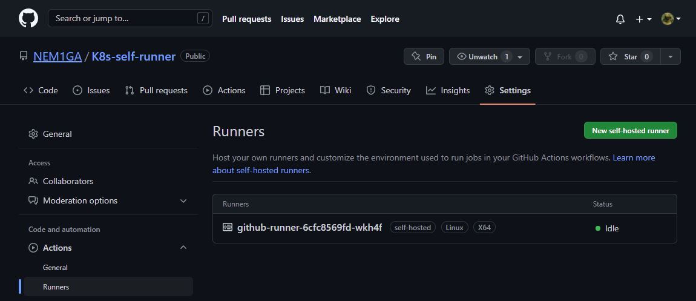

# 12.Kubernetes. First deployment
### To do:
#### Main task. Create deployment of nginx service:
* replicas: 3
* custom index file is mounted inside as configmap
* ingress rule for host name (<NAME_APP>.k8s-<NUMBER>.sa)
#### Additional task:
* deploy pod inside k8s which should be connected to github as self-hosted runner

### Screenshots of webpages:


### kubectl report
```
$ kgd
NAME            READY   UP-TO-DATE   AVAILABLE   AGE
github-runner   1/1     1            1           13m
webserver       3/3     3            3           22h
$ kgs
NAME                 TYPE        CLUSTER-IP      EXTERNAL-IP   PORT(S)   AGE
kubernetes           ClusterIP   10.233.0.1      <none>        443/TCP   7d15h
simple-web-service   ClusterIP   10.233.52.242   <none>        80/TCP    22h
$ kgp --all-namespaces
NAMESPACE       NAME                                        READY   STATUS      RESTARTS        AGE
default         github-runner-6cfc8569fd-wkh4f              1/1     Running     0               14m
default         webserver-79544d4bd8-7kcjk                  1/1     Running     0               22h
default         webserver-79544d4bd8-k82nt                  1/1     Running     0               22h
default         webserver-79544d4bd8-klvt4                  1/1     Running     0               22h
ingress-nginx   ingress-nginx-admission-create-cc6zf        0/1     Completed   0               24h
ingress-nginx   ingress-nginx-admission-patch-g225j         0/1     Completed   0               24h
ingress-nginx   ingress-nginx-controller-84b85b6b66-kz78g   1/1     Running     0               24h
kube-system     calico-kube-controllers-58dfb4874f-dtj27    1/1     Running     2 (7d15h ago)   7d15h
kube-system     calico-node-h7wpc                           1/1     Running     0               7d15h
kube-system     calico-node-lmv22                           1/1     Running     0               7d15h
kube-system     coredns-76b4fb4578-jdz2n                    1/1     Running     0               7d15h
kube-system     coredns-76b4fb4578-xq48l                    1/1     Running     0               7d15h
kube-system     dns-autoscaler-7979fb6659-cswcx             1/1     Running     0               7d15h
kube-system     kube-apiserver-node1                        1/1     Running     1               7d15h
kube-system     kube-controller-manager-node1               1/1     Running     1               7d15h
kube-system     kube-proxy-bh2rs                            1/1     Running     0               7d15h
kube-system     kube-proxy-g748z                            1/1     Running     0               7d15h
kube-system     kube-scheduler-node1                        1/1     Running     1               7d15h
kube-system     nginx-proxy-node2                           1/1     Running     0               7d15h
kube-system     nodelocaldns-6njmd                          1/1     Running     0               7d15h
kube-system     nodelocaldns-c5282                          1/1     Running     0               7d15h
```
### Github as self-hosted runner


#### Credits to GitHub as self-hosted runner:
* [source code in Sander Knape's GitHub repository](https://github.com/SanderKnape/github-runner)
* [Also few steps from Caylent.com](https://caylent.com/blog/aws/github-actions-on-self-hosted-runners-for-kubernetes)