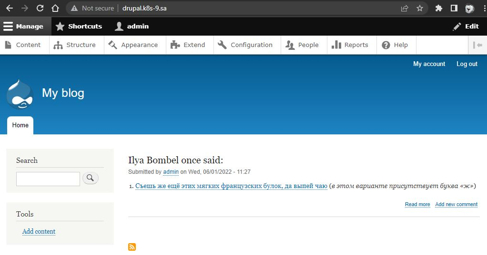

# 13.Kubernetes.Helm homework
### To do:
* Deploy in K8s cluster the following applications using helm charts from public repositories: Wordpress, Drupal
* All these applications should have addresses like http://<APP_NAME>.k8s-xx.sa
* Login to both application and create dummy article with name as title
* History of helm run commands and printscreens of articles put into report

#### Printscreens of articles:



#### History of helm run commands:
```bash
# add bitnami repo
$ helm repo add bitnami https://charts.bitnami.com/bitnami

# install nfc-provisioner
$ helm repo add nfs-subdir-external-provisioner https://kubernetes-sigs.github.io/nfs-subdir-external-provisioner/
$ helm install nfs-subdir-external-provisioner nfs-subdir-external-provisioner/nfs-subdir-external-provisioner \
    --set nfs.server=192.168.37.105 \
    --set nfs.path=/mnt/IT-Academy/nfs-data/sa2-19-22/ilya_bombel/

# create igress for wordpress
$ kubectl apply -f wp.yaml

# install wordpress
$ helm install ib-wordpress  --set global.storageClass=nfs-client,wordpressUsername=admin,wordpressPassword=admin bitnami/wordpress

# create igress for drupal
$ kubectl apply -f dr.yaml

# install drupal
$ helm install ss-drupal  --set global.storageClass=nfs-client,drupalUsername=admin,drupalPassword=admin bitnami/drupal

# list of installed pods
$ kgp
NAME                                               READY   STATUS    RESTARTS      AGE
ib-drupal-65d6c78cd6-z7ccj                         1/1     Running   3 (67m ago)   72m
ib-drupal-mariadb-0                                1/1     Running   1 (68m ago)   72m
ib-wordpress-74fc95bc84-jq2rx                      1/1     Running   0             60m
ib-wordpress-mariadb-0                             1/1     Running   1 (90m ago)   94m
nfs-subdir-external-provisioner-84b658c4bc-gjrb8   1/1     Running   0             21h
```