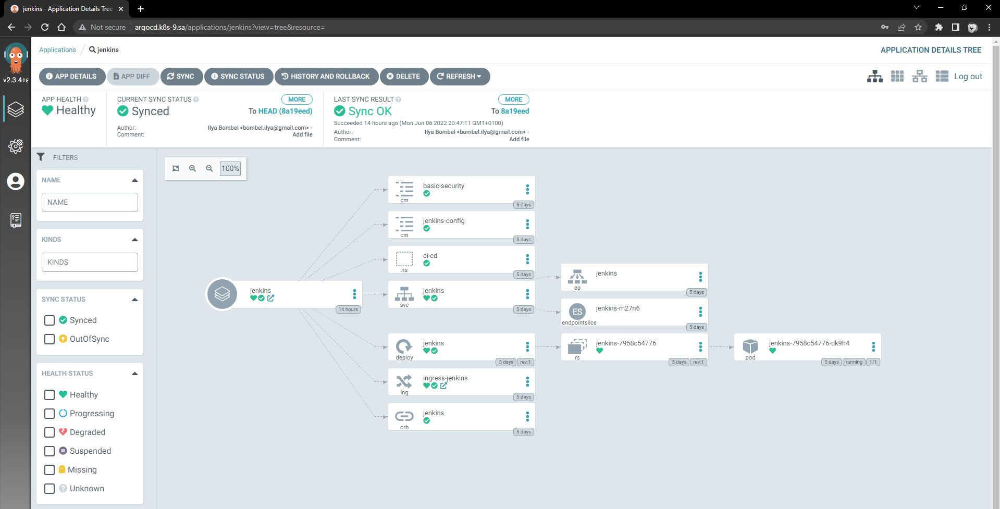
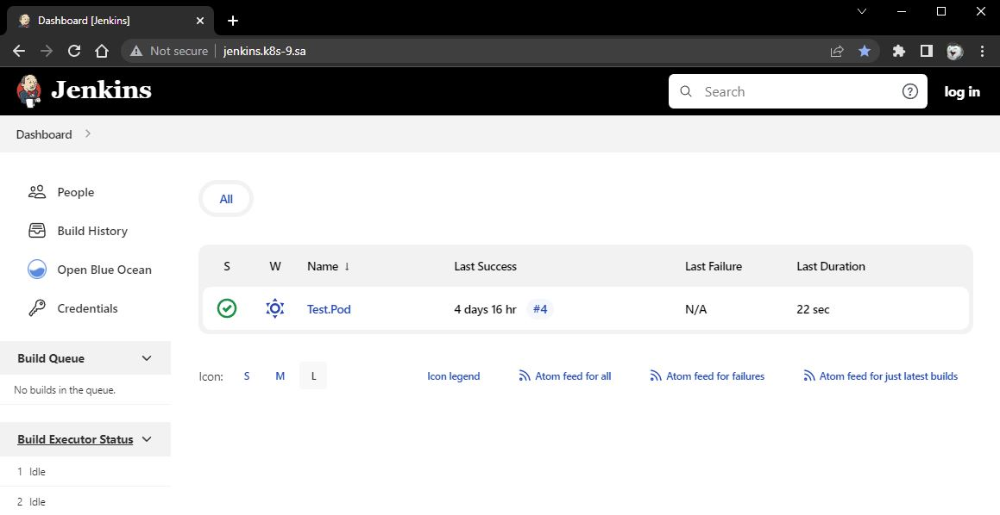

# 14.Kubernetes. Application deployment (workshop)
### To do:
* Finish application deployment
* Create helm package for Jenkins
* Deploy argoCD, add own repository with manifests files as application(s)

#### Printscreens of webpages:



#### arcoCD Jenkins manifest:
```
$ kubectl get application -n argocd jenkins -o yaml
apiVersion: argoproj.io/v1alpha1
kind: Application
metadata:
  creationTimestamp: "2022-06-08T10:51:35Z"
  generation: 29
  name: jenkins
  namespace: argocd
  resourceVersion: "2644263"
  uid: f83f0082-e054-4b90-9c55-c4a46d07b999
spec:
  destination:
    namespace: ci-cd
    server: https://kubernetes.default.svc
  project: default
  source:
    path: ./ci-cd
    repoURL: https://github.com/NEM1GA/jenkins-helm.git
    targetRevision: HEAD
  syncPolicy:
    automated: {}
status:
  health:
    status: Healthy
  history:
  - deployStartedAt: "2022-06-08T10:51:35Z"
    deployedAt: "2022-06-08T10:51:36Z"
    id: 0
    revision: 578ef7c7c990b797df41e57663f878a6ca4893c0
    source:
      path: ./ci-cd
      repoURL: https://github.com/NEM1GA/jenkins-helm.git
      targetRevision: HEAD
  - deployStartedAt: "2022-06-08T11:00:54Z"
    deployedAt: "2022-06-08T11:00:54Z"
    id: 1
    revision: 578ef7c7c990b797df41e57663f878a6ca4893c0
    source:
      path: ./ci-cd
      repoURL: https://github.com/NEM1GA/jenkins-helm.git
      targetRevision: HEAD
  operationState:
    finishedAt: "2022-06-08T11:00:54Z"
    message: successfully synced (all tasks run)
    operation:
      initiatedBy:
        username: admin
      retry: {}
      sync:
        revision: 578ef7c7c990b797df41e57663f878a6ca4893c0
        syncStrategy:
          hook: {}
    phase: Succeeded
    startedAt: "2022-06-08T11:00:54Z"
    syncResult:
      resources:
      - group: ""
        hookPhase: Running
        kind: Namespace
        message: namespace/ci-cd unchanged
        name: ci-cd
        namespace: ci-cd
        status: Synced
        syncPhase: Sync
        version: v1
      - group: ""
        hookPhase: Running
        kind: ConfigMap
        message: configmap/jenkins-config unchanged
        name: jenkins-config
        namespace: ci-cd
        status: Synced
        syncPhase: Sync
        version: v1
      - group: ""
        hookPhase: Running
        kind: ConfigMap
        message: configmap/basic-security unchanged
        name: basic-security
        namespace: ci-cd
        status: Synced
        syncPhase: Sync
        version: v1
      - group: rbac.authorization.k8s.io
        hookPhase: Running
        kind: ClusterRoleBinding
        message: "clusterrolebinding.rbac.authorization.k8s.io/jenkins reconciled.
          reconciliation required create\n\tmissing subjects added:\n\t\t{Kind:ServiceAccount
          APIGroup: Name:default Namespace:ci-cd}. clusterrolebinding.rbac.authorization.k8s.io/jenkins
          configured. Warning: resource clusterrolebindings/jenkins is missing the
          kubectl.kubernetes.io/last-applied-configuration annotation which is required
          by  apply.  apply should only be used on resources created declaratively
          by either  create --save-config or  apply. The missing annotation will be
          patched automatically."
        name: jenkins
        namespace: ci-cd
        status: Synced
        syncPhase: Sync
        version: v1
      - group: ""
        hookPhase: Running
        kind: Service
        message: service/jenkins created
        name: jenkins
        namespace: ci-cd
        status: Synced
        syncPhase: Sync
        version: v1
      - group: apps
        hookPhase: Running
        kind: Deployment
        message: deployment.apps/jenkins configured
        name: jenkins
        namespace: ci-cd
        status: Synced
        syncPhase: Sync
        version: v1
      - group: networking.k8s.io
        hookPhase: Running
        kind: Ingress
        message: ingress.networking.k8s.io/ingress-jenkins unchanged
        name: ingress-jenkins
        namespace: ci-cd
        status: Synced
        syncPhase: Sync
        version: v1
      revision: 578ef7c7c990b797df41e57663f878a6ca4893c0
      source:
        path: ./ci-cd
        repoURL: https://github.com/NEM1GA/jenkins-helm.git
        targetRevision: HEAD
  reconciledAt: "2022-06-08T11:00:54Z"
  resources:
  - kind: ConfigMap
    name: basic-security
    namespace: ci-cd
    status: Synced
    version: v1
  - kind: ConfigMap
    name: jenkins-config
    namespace: ci-cd
    status: Synced
    version: v1
  - kind: Namespace
    name: ci-cd
    status: Synced
    version: v1
  - health:
      status: Healthy
    kind: Service
    name: jenkins
    namespace: ci-cd
    status: Synced
    version: v1
  - group: apps
    health:
      status: Healthy
    kind: Deployment
    name: jenkins
    namespace: ci-cd
    status: Synced
    version: v1
  - group: networking.k8s.io
    health:
      status: Healthy
    kind: Ingress
    name: ingress-jenkins
    namespace: ci-cd
    status: Synced
    version: v1
  - group: rbac.authorization.k8s.io
    kind: ClusterRoleBinding
    name: jenkins
    status: Synced
    version: v1
  sourceType: Directory
  summary:
    externalURLs:
    - http://jenkins.k8s-9.sa/
    images:
    - jfrog.it-academy.by/public/jenkins-ci:ibombel
  sync:
    comparedTo:
      destination:
        namespace: ci-cd
        server: https://kubernetes.default.svc
      source:
        path: ./ci-cd
        repoURL: https://github.com/NEM1GA/jenkins-helm.git
        targetRevision: HEAD
    revision: 578ef7c7c990b797df41e57663f878a6ca4893c0
    status: Synced
```