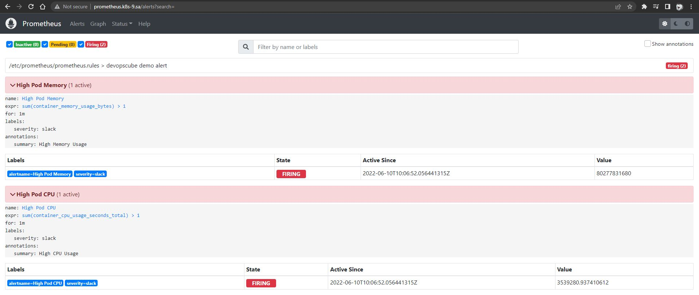
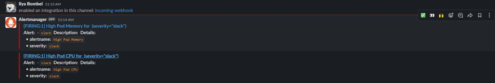
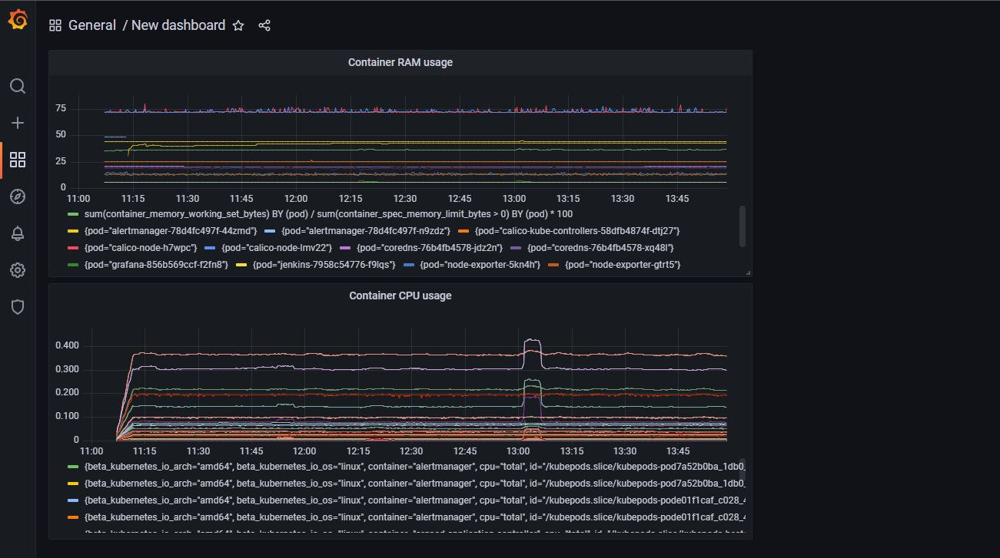

# 15. Technical and service monitoring
### To do:
* Deploy Prometheus + Alert manager
* Setup slack notification for Alert manager (Add alert for CPU overload per pods, Emulate payload to test alert))
* Expose Prometheus web UI
* Deploy Grafana
* Add Prometheus as metrics source
* Create dashboard with CPU and RAM graphs per pods

#### Screenshot of Web Prometeus with alerts:

#### Screenshot of Slack notifications

#### Screenshot of Grafana dashboard
