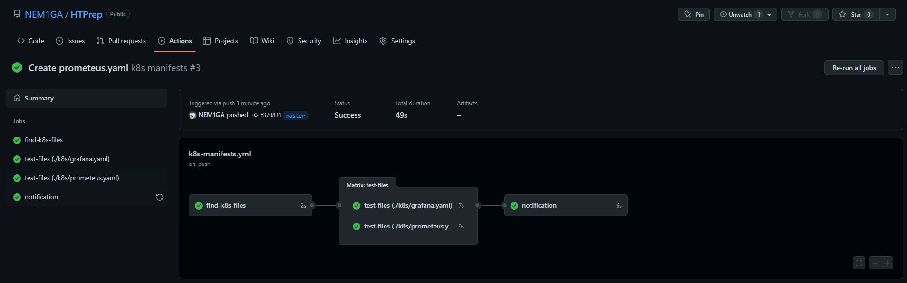
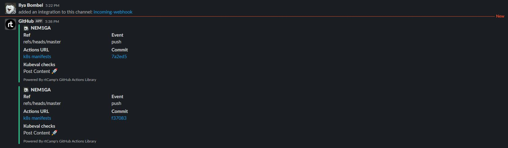

# 17. Testing
### To do:
#### Add molecule test for role using images for: CentOS and Debian
#### Create CI for testing Kubernetes manifests using kubeval
* start on push or create PR to manifests repository
* all tools are inside container/pods
* integrate notification about status of validation

#### Molecule test
```
$ molecule test
INFO     default scenario test matrix: dependency, lint, cleanup, destroy, syntax, create, prepare, converge, idempotence, side_effect, verify, cleanup, destroy
INFO     Performing prerun...
INFO     Set ANSIBLE_LIBRARY=/home/vagrant/.cache/ansible-compat/1a1637/modules:/home/vagrant/.ansible/plugins/modules:/usr/share/ansible/plugins/modules
INFO     Set ANSIBLE_COLLECTIONS_PATH=/home/vagrant/.cache/ansible-compat/1a1637/collections:/home/vagrant/.ansible/collections:/usr/share/ansible/collections
INFO     Set ANSIBLE_ROLES_PATH=/home/vagrant/.cache/ansible-compat/1a1637/roles:/home/vagrant/.ansible/roles:/usr/share/ansible/roles:/etc/ansible/roles
INFO     Running default > dependency
WARNING  Skipping, missing the requirements file.
WARNING  Skipping, missing the requirements file.
INFO     Running default > lint
INFO     Lint is disabled.
INFO     Running default > cleanup
WARNING  Skipping, cleanup playbook not configured.
INFO     Running default > destroy
INFO     Sanity checks: 'docker'

PLAY [Destroy] *****************************************************************

TASK [Destroy molecule instance(s)] ********************************************
changed: [localhost] => (item=instance1)
changed: [localhost] => (item=instance2)

TASK [Wait for instance(s) deletion to complete] *******************************
ok: [localhost] => (item=instance1)
ok: [localhost] => (item=instance2)

TASK [Delete docker networks(s)] ***********************************************

PLAY RECAP *********************************************************************
localhost                  : ok=2    changed=1    unreachable=0    failed=0    skipped=1    rescued=0    ignored=0

INFO     Running default > syntax

playbook: /home/vagrant/tests/ansible_cruise/roles/webserver/molecule/default/converge.yml
INFO     Running default > create

PLAY [Create] ******************************************************************

TASK [Log into a Docker registry] **********************************************
skipping: [localhost] => (item=None)
skipping: [localhost] => (item=None)
skipping: [localhost]

TASK [Check presence of custom Dockerfiles] ************************************
ok: [localhost] => (item={'image': 'centos:7', 'name': 'instance1', 'pre_build_image': True})
ok: [localhost] => (item={'image': 'ubuntu:18.04', 'name': 'instance2', 'pre_build_image': True})

TASK [Create Dockerfiles from image names] *************************************
skipping: [localhost] => (item={'image': 'centos:7', 'name': 'instance1', 'pre_build_image': True})
skipping: [localhost] => (item={'image': 'ubuntu:18.04', 'name': 'instance2', 'pre_build_image': True})

TASK [Discover local Docker images] ********************************************
ok: [localhost] => (item={'changed': False, 'skipped': True, 'skip_reason': 'Conditional result was False', 'item': {'image': 'centos:7', 'name': 'instance1', 'pre_build_image': True}, 'ansible_loop_var': 'item', 'i': 0, 'ansible_index_var': 'i'})
ok: [localhost] => (item={'changed': False, 'skipped': True, 'skip_reason': 'Conditional result was False', 'item': {'image': 'ubuntu:18.04', 'name': 'instance2', 'pre_build_image': True}, 'ansible_loop_var': 'item', 'i': 1, 'ansible_index_var': 'i'})

TASK [Build an Ansible compatible image (new)] *********************************
skipping: [localhost] => (item=molecule_local/centos:7)
skipping: [localhost] => (item=molecule_local/ubuntu:18.04)

TASK [Create docker network(s)] ************************************************

TASK [Determine the CMD directives] ********************************************
ok: [localhost] => (item={'image': 'centos:7', 'name': 'instance1', 'pre_build_image': True})
ok: [localhost] => (item={'image': 'ubuntu:18.04', 'name': 'instance2', 'pre_build_image': True})

TASK [Create molecule instance(s)] *********************************************
changed: [localhost] => (item=instance1)
changed: [localhost] => (item=instance2)

TASK [Wait for instance(s) creation to complete] *******************************
changed: [localhost] => (item={'failed': 0, 'started': 1, 'finished': 0, 'ansible_job_id': '913984839938.23067', 'results_file': '/home/vagrant/.ansible_async/913984839938.23067', 'changed': True, 'item': {'image': 'centos:7', 'name': 'instance1', 'pre_build_image': True}, 'ansible_loop_var': 'item'})
changed: [localhost] => (item={'failed': 0, 'started': 1, 'finished': 0, 'ansible_job_id': '469080094778.23093', 'results_file': '/home/vagrant/.ansible_async/469080094778.23093', 'changed': True, 'item': {'image': 'ubuntu:18.04', 'name': 'instance2', 'pre_build_image': True}, 'ansible_loop_var': 'item'})

PLAY RECAP *********************************************************************
localhost                  : ok=5    changed=2    unreachable=0    failed=0    skipped=4    rescued=0    ignored=0

INFO     Running default > prepare
WARNING  Skipping, prepare playbook not configured.
INFO     Running default > converge

PLAY [Converge] ****************************************************************

TASK [Gathering Facts] *********************************************************
fatal: [instance2]: FAILED! => {***}
ok: [instance1]

TASK [Include webserver] *******************************************************

TASK [webserver : Print OS/Version] ********************************************
ok: [instance1] => {
    "msg": [
        "OS: CentOS",
        "Version: 7.9"
    ]
}

TASK [webserver : Print RAM capacity/free] *************************************
ok: [instance1] => {
    "msg": [
        "Total memory: 976 MB",
        "Free memory: 270 MB"
    ]
}

PLAY RECAP *********************************************************************
instance1                  : ok=3    changed=0    unreachable=0    failed=0    skipped=0    rescued=0    ignored=0
instance2                  : ok=0    changed=0    unreachable=0    failed=1    skipped=0    rescued=0    ignored=0

WARNING  Retrying execution failure 2 of: ansible-playbook --inventory /home/vagrant/.cache/molecule/webserver/default/inventory --skip-tags molecule-notest,notest /home/vagrant/tests/ansible_cruise/roles/webserver/molecule/default/converge.yml
CRITICAL Ansible return code was 2, command was: ['ansible-playbook', '--inventory', '/home/vagrant/.cache/molecule/webserver/default/inventory', '--skip-tags', 'molecule-notest,notest', '/home/vagrant/tests/ansible_cruise/roles/webserver/molecule/default/converge.yml']
WARNING  An error occurred during the test sequence action: 'converge'. Cleaning up.
INFO     Running default > cleanup
WARNING  Skipping, cleanup playbook not configured.
INFO     Running default > destroy

PLAY [Destroy] *****************************************************************

TASK [Destroy molecule instance(s)] ********************************************
changed: [localhost] => (item=instance1)
changed: [localhost] => (item=instance2)

TASK [Wait for instance(s) deletion to complete] *******************************
changed: [localhost] => (item=instance1)
changed: [localhost] => (item=instance2)

TASK [Delete docker networks(s)] ***********************************************

PLAY RECAP *********************************************************************
localhost                  : ok=2    changed=2    unreachable=0    failed=0    skipped=1    rescued=0    ignored=0

INFO     Pruning extra files from scenario ephemeral directory
```

#### CI for testing Kubernetes manifests using kubeval
```
name: k8s manifests

on: [push, pull_request]

jobs:
  find-k8s-files:
    runs-on: ubuntu-latest
    outputs:
      files: ${{ env.files }}
    steps:
      - name: Get k8s files
        uses: actions/checkout@v2
        id: files
      - run: |
              FILES="$(ls -d ./k8s/* | jq -R -s -c 'split("\n")[:-1]')"
              echo "files=`echo -n $FILES`" >> $GITHUB_ENV
  test-files:
    needs: find-k8s-files
    runs-on: ubuntu-latest
    strategy:
      matrix:
        k8s-files: ${{fromJson(needs.find-k8s-files.outputs.files)}}
      fail-fast: false
    steps:
    - uses: actions/checkout@v2 
    - name: Test files with kubeval
      uses: instrumenta/kubeval-action@master
      with: 
       files: ${{matrix.k8s-files}}
  notification:
    needs: test-files
    runs-on: ubuntu-latest
    steps:
    - name: Slack Notification
      uses: rtCamp/action-slack-notify@v2
      env:
        SLACK_CHANNEL: slack-notif
        SLACK_COLOR: ${{ job.status }} # or a specific color like 'good' or '#ff00ff'
        SLACK_ICON: https://github.com/rtCamp.png?size=48
        SLACK_MESSAGE: 'Post Content :rocket:'
        SLACK_TITLE: Kubeval checks
        SLACK_USERNAME: GitHub
        SLACK_WEBHOOK: ${{ secrets.SLACK_WEBHOOK }}
```
#### GitHub actions screenshot


#### Slack notification
